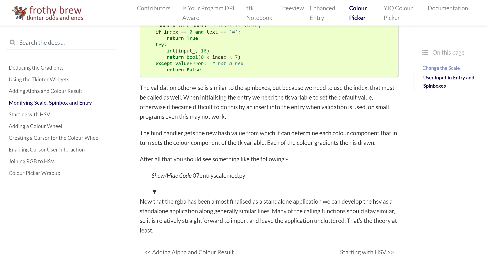
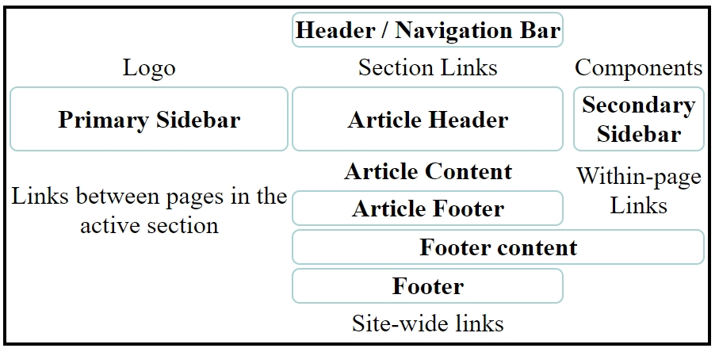

.. _authors:

===========================
Contributors and Navigation
===========================

Edgar Donk, but mainly all those people working on python and Sphinx, 
without whom this would not have been possible.

=======
Contact
=======

Any suggestions or comments please forward to 

edga.donk@gmx.de

Just to anticipate what you are probably thinking - I know it's much too 
long.

Repository
==========

You should find all the python examples and their widget images here.

`frothy-brew! <https://github.com/Edgar-Donk/frothy-brew>`_

Read the Docs
=============

Where you'll find the explanations.

`Read the Docs <https://frothy-brew.readthedocs.io/en/latest/index.html>`_

Navigation
==========

    Example page showing navigation aids

More
====

.. hint:: Try flying the carpet - it's magic afterall!

.. raw:: html

   <head>
   <link rel="stylesheet"
          href="https://fonts.googleapis.com/css?family=Babylonica">

   <link rel="stylesheet" href="_static/imagehover_min.css">
   
   </head>
   <figure class="imghvr-zoom-out-right">
      
         <figcaption>
            Just click on one of the images   
            to get whisked away  on the html magic carpet.
         </figcaption>
   </figure>

Styling with tkinter.ttk
------------------------

.. _style: https://tkinterttkstyle.readthedocs.io/en/latest/index.html

Creating your own theme using Style.

Linking Python to Arduino
-------------------------

.. _ard: https://electronic-python.readthedocs.io/en/latest/index.html

Basics and working with VPython, then create a digital gauge.

Adding dimensions to PIL
------------------------

.. _dims: https://pil-dimensions.readthedocs.io/en/latest/index.html

Add dimensions with either arrows or tailed lines, dashed lines and all
made with antialiasing if required.

