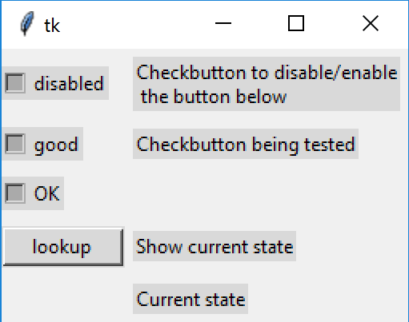

.. _introcheck:

========================
Checkbutton Introduction
========================

    
    Showing Checkbutton States run in the alt Theme 
    
    None of the checkbuttons have been activated, they are all in the 
    alternate mode (tri-state or indeterminate)

The checkbutton (checkbox) is a widget that allows the user to have a two-way
choice, if several checkboxes are present in a group all choices are inclusive,
so normally no selection will prevent the other checkboxes being selected.
The widget is split into an indicator and label that has the text part.

Although a simple widget, the various states that could occur are quite 
numerous, and will need to be closely examined. Using a themed widget, when
none of the checkbuttons in the group are selected they will show as 
``alternate``, which is the tri-state or indeterminate mode. When the 
widget is clicked several different states are
activated in turn. As the mouse hovers over the widget the state changes 
to ``active`` the mouse button is depressed and the state changes to ``pressed``
then shows ``selected``, if the button had already been selected then it
swiches state to ``!selected`` (unselected). When the mouse leaves the widget
it has a chained line around it showing it is in the ``focus`` state, this 
changes from one button to the next depending which was altered last.
So just pressing a button changes the state five times, none of this 
is programmed in the script, it is part of how the widget works.

As seen above there is a state (active) which occurs as the mouse hovers over
the widget, this is a positive feedback to the user showing that they are on a
particular widget or not. This feedback is shown by lightening the widget
colour, for the checkbutton the surrounding rectangle of the 
widget changes from a dark to a light colour. In no way is the checkbutton changed
from alternate, unselected or selected to one of the other states just by 
hovering.

There is another state that has sofar been left untouched, which is ``disabled``.
This is programmed into the script. Whenever disabled is activated the widget 
is greyed out and cannot be selected/unselected by direct action on the widget.
When disabled the widget should show its previous greyed out state, then when
disabled is removed (!disabled) the previous state is restored.

Run the script test_check.py, this will show four checkbuttons, the top one
changes the state of the second widget. When initially opened all four widgets
are in the alternate state, semi greyed out. Move the cursor over one of the
checkbuttons the widget lightens but the indicator does not change. Click the 
topmost checkbutton, it will disable/!disable the second button and print 
the state of the second button. Only disable is being controlled, 
using only disable or !disable, but this results in
('disabled',), ('disabled', 'alternate') or 
('disabled', 'selected') depending on the widget's original state, disabled
by itself occurs when the second widget was unselected. Change the controlled
state from disabled to active using active and !active it then cycles through 
('active',), ('active', 'alternate') and ('active', 'selected'), active 
cannot affect a disabled widget. 

.. note:: Apart from the opportunity to print the widget states and keeping
    the widget in the active state, controlling active should be no 
    different to hovering over the widget with a mouse.

In all this activity the check buttons reacted independantly. 

The following states can be called up or changed directly by a mouse click:

* alternate
* unselected (for want of a better name)
* selected
* active
* active, selected
* active, alternate
* pressed
* pressed selected
* focus

The following states are changed through the script:

* disabled
* disabled, alternate
* disabled, selected

.. container:: toggle

    .. container:: header

        *Show/Hide Code* test_check.py

    .. literalinclude:: ../examples/buttons/test_check.py