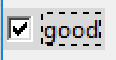

======================
Scaleable Checkbuttons
======================

Drawing the Checkbutton
=======================

    
    Selected and Focused Checkbutton run in the alt Theme

As found out in the dpi awareness chapter checkbuttons made with the alt
theme are not scaleable. There is no simple solution to sizing to be found
in third party themes, because most of these themes  are based on images 
the widgets and all their states. Scaling up would involve duplicating
all the images. However by copying the
methods from these third party themes one can then draw the widgets at the time 
of use. This means that the widget image is first scaled then made tkinter
readable.

Draw the widget in PIL but instead of saving to disk, convert with
ImageTk.PhotoImage then within tkinter create a new theme, using alt as the 
parent. This method is largely based on that used when creating the 
`lime theme <https://tkinterttkstyle.readthedocs.io/en/latest/lime/index-lime.html>`_. 
It is important to determine which states should be included.

First let us determine what the Style options can tell us, open an interactive
python window::

    >>> from tkinter import Tk
    
    >>> from tkinter.ttk import Style, Checkbutton
    
    >>> from pprint import pprint
    
    >>> root = Tk()
    
    >>> s = Style()
    
    >>> s.theme_use('alt')

    >>> pprint(s.layout('TCheckbutton'))
    
    [('Checkbutton.padding',
        {'children': [('Checkbutton.indicator', {'side': 'left', 'sticky': ''}),
                ('Checkbutton.focus',
                 {'children': [('Checkbutton.label', {'sticky': 'nswe'})],
                  'side': 'left',
                  'sticky': 'w'})],
        'sticky': 'nswe'})]
    
    >>> s.element_options('Checkbutton.padding')
    ('padding', 'relief', 'shiftrelief')
    
    >>> s.element_options('Checkbutton.indicator')
    ('background', 'foreground', 'indicatorcolor', 'lightcolor', 'shadecolor', 
        'bordercolor', 'indicatormargin')
        
    >>> s.element_options('Checkbutton.label')
    ('compound', 'space', 'text', 'font', 'foreground', 'underline', 'width',
        'anchor', 'justify', 'wraplength', 'embossed', 'image', 'stipple', 
        'background')
        
    >>> s.element_options('Checkbutton.focus')
    ('focuscolor', 'focusthickness')

As shown before there is no element that can be used to change the widget
size. Since the element names for the indicator are known, we should be able 
to find out the colours used in various states using **s.lookup**, but most
refuse to show or change for the various states. 

Using a screen capture on the alt theme find out the widget shapes, sizes and 
colours for the various states. It will be found that the check and 
radio buttons are relatively small with two borders each one pixel wide.

.. hint:: If the borders appear to be a different size then this is due to
    the screen capture being fooled by the dpi. On my screen the captured
    images were two pixels wide and the size was twice as big as the
    original.

Border colours changed from top left to bottom right, so the borders
will need to be drawn as lines rather than rectangles. There was no attempt 
at antialiasing.

As the widget is scaled up the line becomes wider
and the line positioning also changes, and the original 
positioning no longer suffices. 

.. sidebar:: Test Script

    Make a test script that draws lines just inside the image 
    boundaries, the script will have a scaling factor for the image size 
    and line width. Base the widget drawing on this.

.. topic:: Scalable Thick Lines

    Drawing lines 1 pixel wide around the image edge poses no problems,
    remember that the end point is one less than the width or height::
    
        w, h = 24, 24
        ......
        idraw.line([(0,0), (w-1, 0)], width=1, fill='black') # top
        idraw.line([(0,0), (0, h-1)], width=1, fill='black') # left
        idraw.line([(0,h-1), (w-1, h-1)], width=1, fill='black') # right
        idraw.line([(w-1,h-1), (w-1, h-1)], width=1, fill='black') # bottom
        .........
    
    Increase the line width to 2, both top and left sides displayed 2 width but 
    right and bottom was only 1 wide. Both these need to be pulled in by 1,
    now the number is no longer constant but a function of the line width b::
    
        w, h = 24, 24
        b = 2
        ......
        idraw.line([(0,0), (w-1, 0)], width=b, fill='black') # top
        idraw.line([(0,0), (0, h-1)], width=b, fill='black') # left
        idraw.line([(0,h-b//2-1), (w-1, h-b//2-1)], width=b, fill='black') # right
        idraw.line([(w-1,h-b//2-1), (w-1, h-b//2-1)], width=b, fill='black') # bottom
        .........
    
    Now increase the line width to 3, this time the right and bottom displayed
    correctly but the top and left only showed 2, these need to increase by
    (b-1)//2::
    
        w, h = 24, 24
        b = 3
        ......
        idraw.line([(0,(b-1)//2), (w-1, (b-1)//2)], width=b, fill='black') # top
        idraw.line([((b-1)//2,0), ((b-1)//2, h-1)], width=b, fill='black') # left
        idraw.line([(0,h-b//2-1), (w-1, h-b//2-1)], width=b, fill='black') # right
        idraw.line([(w-1,h-b//2-1), (w-1, h-b//2-1)], width=b, fill='black') # bottom
        .........
    
    Any further increase in line width should now be correct, the changes 
    will work with line thicknesses of 1 and 2 as well.

Once a method has been found to draw a checkbutton, run and store the results
for each of the states, only the colours will be changing from state to state.
With a check button the theme background colour does not need to be drawn,
unless the colour is pulled across as with the pressed state. 
Use dictionaries to store states and colours. The dictionary ``line_colours`` is a
nested dictionary using state as the primary key, each of the inner dictionaries
contain the primary keys **topleft**, **botright**, **intopleft** and 
**inbotright** and their colours. The next dictionary stores the inner 
background colour using state as the primary key.

Store the Pil drawing to a tkinter PhotoImage in a dictionary with state as 
the primary key. After this the widget is displayed as one would with an image
based theme.

Displaying the Checkbutton
==========================

As shown in `Radio and Check Buttons <https://tkinterttkstyle.readthedocs.io/en/latest/bluesky/radio-check.html>`_
make a command for Style to create a theme, that in our case, has alt as the 
parent. Insert the required states, remembering that the compound state 
preceeds the single state (disabled, alternate is directly followed by 
alternate). Style needs to map the background colour when the widget 
is active.

Then display a pair of checkbuttons and add a third to disable/!disable one
of the two checkbuttons. The states for (active, selected) and active seem 
redundant so test the functionality by remarking out these when creating the 
theme. The check buttons worked as expected.

.. container:: toggle

    .. container:: header

        *Show/Hide Code* create_checkbuttons_direct.py

    .. literalinclude:: ../examples/buttons/create_checkbuttons_direct.py