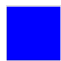

====================
Saving as Postscript
====================

In the documentation there is no obvious save command for
tkinter Canvas. The act of saving is performed by the command ``postscript()``.
File names the destination of the postscript string, otherwise we can use the
output string. ``width`` determines how much of the X size of the canvas is 
to be printed, similarly ``height`` determines how much of the Y size is to be
printed. The default is the visible width and/or height of the canvas. ``x``
and ``y`` are the leftmost and topmost canvas coordinates. ``colormode`` uses
**color** for colour output, **gray** for greyscale and **mono** for black
and white.

    Image copied in IrfanView, original ps was 101 x 101, Ghostscript required

.. container:: toggle

    .. container:: header

        *Show/Hide Code* simple_save.py

    .. literalinclude:: ../examples/canvas/simple_save.py

Few programs can view the ps file amongst which are Adobe Illustrator, Gimp
or the quickest IrfanView - if converted to pdf then there are a lot more 
possibilities. Using a pdf viewer one can see that the file is saved as a 
very verbose vector file. Towards the end of the file saved.ps lie a few 
lines of vector code. Many printers still can use ps.

Depending on the computer setup, when viewing the text, one will see a line 
like *0.6 0.6 scale*,
with a high definition screen it may be *0.75 0.75 scale*, on the graphic 
editors the size showed as 101 x 101 pixels - so scaling seemed to be
ignored.