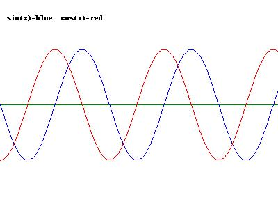

==================
Saving in Parallel
==================

Every drawing action on the tkinter canvas is duplicated in PIL, depending
on your experience it is either straightforward or confusing, as many commands
are similar. The programmer should combine as many functions as possible to
avoid scripting errors.

    The image saved with PIL, the ps drawing should be similar, but is empty.

.. container:: toggle

    .. container:: header

        *Show/Hide Code* parallel_save.py

    .. literalinclude:: ../examples/canvas/parallel_save.py