=============
Sizing Checks
=============

Is it likely that tkinter has similar sizing quirks that were found in PIL?
The answer is probably yes - so they need investigating.

Now that we can create a png file it is easy to scale up and check what is 
really happening. 

.. note:: Canvas borderwidth has a default value of 2 pixels. Expect different
    adjustments when changing the border size. Also all scripts below ran with
    the serial method of saving an image, so the resulting end image was 
    important, other methods would have to be checked to make the correct
    adjustments.

Canvas Circle
-------------

The standard method used in tkinter is similar to PIL, in that a bounding
box is specified using a method that draws ovals/ellipses, and provided the 
width and height are equal we should have a circle. The bounding box 
matches the given values on the top left values and just inside the bottom
right values - see 8.11 `Canvas oval objects <https://anzeljg.github.io/rin2/book2/2405/docs/tkinter/create_oval.html>`_

If we create an oval/circle with the sides just touching the outside lines 
on all four quadrants we create a circle that just goes outside the canvas 
on all four sides.

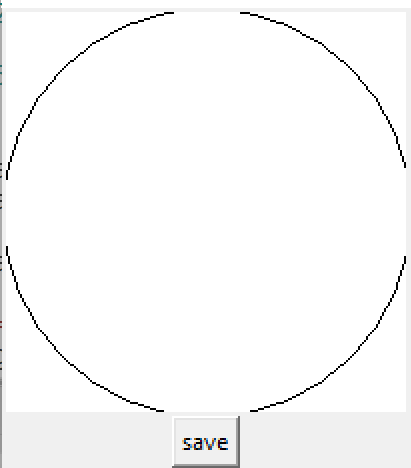

    Circle on a 200x200 canvas.

Check out the saved png - circle_test.png, after scaling up the circle touches
all four sides where it is flattened. The flattened part is 19 pixels on each
side. 

* First the saved image should match the canvas size, 
    this was achieved when the **pagewidth** and **pageheight** were made 
    1 pixel smaller than the canvas width and height::

        ps = canvas.postscript(colormode='color',pagewidth=w-1,pageheight=h-1)

* Remove the uneven white space around the circle,
    it should sit centrally in the png file::

        canvas.create_oval(0, 0, w+4, h+4, outline='black')

* Lastly ensure that the circle is round, 
    the canvas size was changed from 201x201 to 200x200.

.. container:: toggle

    .. container:: header

        *Show/Hide Code* test_circle.py

    .. literalinclude:: ../examples/canvas/test_circle.py

It should now be possible to convert the create_oval to circle based on
radius and centre coordinate. The circle looked as before.

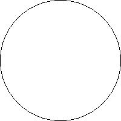

    Circle in a 200x200 image.
    
    Both methods of circle creation, bbox and centre with radius, made
    interchangeable images.

.. container:: toggle

    .. container:: header

        *Show/Hide Code* test_circle_rev.py

    .. literalinclude:: ../examples/canvas/test_circle_rev.py

Arcs are similar to ellipses and circles, they also use bounding boxes and 
additionally require angles to delineate the arc. In many cases it is easier to
determine the centre and radius of an arc rather than give the bounding box.

Canvas Thick Lines
------------------

Draw four lines 1 pixel wide to touch all four sides of the canvas. Run the 
lines from 0,0 to just before the width and height. The result was similar
to the circle above. Only the right and bottom lines showed on the canvas,
but all four could be seen in the saved image.

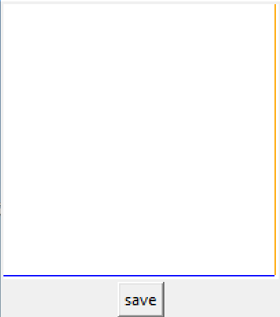

    Lines on a 200x200 canvas.

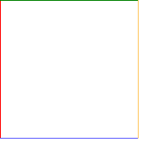

    Lines in a 200x200 image.
    
    Before white space correction

Correct for the white space. When done none of the lines showed in the canvas,
but all four were correctly positioned in the saved image.

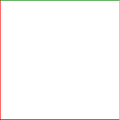

    Lines 1 pixel wide in a 200x200 image.

Change to 2 pixel wide lines. Still nothing showed in the canvas, but the
saved image had 2 pixel wide lines.

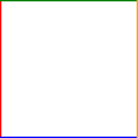

    Lines 2 pixel wide in a 200x200 image.

Change to 3 pixel wide lines. Still nothing showed in the canvas, but in the
saved image the top and left lines were 3 pixel wide lines, the bottom and
right lines were 2 pixels wide. Correct by running the bottom line at h+3
(previously at h+4) and the right line at w+3 (previously w+4). The top and 
left lines did not need to change.

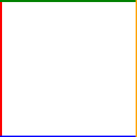

    Uncorrected lines 3 pixel wide in a 200x200 image.

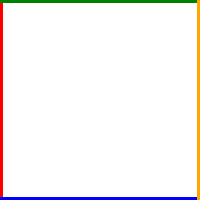

    Corrected lines 3 pixel wide in a 200x200 image.

With 4 pixel wide lines the bottom and right were now correct but the top
and left needed adjustment. The bottom and right started to appear in the
canvas. Move the top line 1 pixel down and the left line 1 pixel right. All
lines were now 4 pixels wide and all lines were just showing in the canvas.

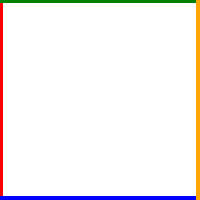

    Uncorrected lines 4 pixel wide in a 200x200 image.

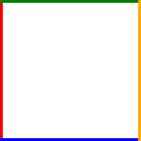

    Corrected lines 4 pixel wide in a 200x200 image.

Using a line width based factor change the displacement of the lines::

    (b-1)//2    # b is the line width

surprisingly although the changes were seen to affect the lines in an 
alternate fashion, when the factor was applied it was best to do so
simultaneously. The displacement factor used for the right an bottom lines 1 
and 2 pixels wide was reinstated.

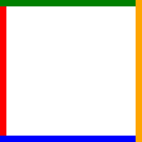

    Corrected lines 9 pixel wide, using a width based factor in a 200x200 image.

.. container:: toggle

    .. container:: header

        *Show/Hide Code* test_linesr.py

    .. literalinclude:: ../examples/canvas/test_linesr.py

Canvas Rectangle
----------------

The canvas rectangle is made with a bounding box similar to that for 
create_oval. It is to be expected that when saving in a serial manner some
of the same corrections are required. Even though the canvas showed no sign 
of the rectangle, the saved image was correct with all four sides just inside
the outer borders.

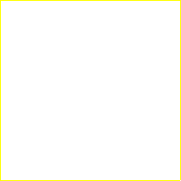

    Rectangle width 1 as seen in a 200x200 image.

Just as seen with the lines working with a 2 pixel wide caused no problems
but the 3 pixel wide rectangle caused the right and bottom sides to display
2 pixel wide, whereas the top and left sides were correct. Add the same
width factor used in the lines above and rerun. The corrections were valid
for 3, 4 and 9 pixel wide rectangles.

Notice how the script is easier to write than with four lines.

.. container:: toggle

    .. container:: header

        *Show/Hide Code* test_rectangle.py

    .. literalinclude:: ../examples/canvas/test_rectangle.py
