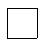

===========
Serial Save
===========

This is probably the easiest method to directly save in a useful format. As
stated in the normal save method if no output file is given, then postscript 
generates a string. PIL can interpret the output once made into byte data.
That said nothing will be saved unless the postscript data is delayed until 
the canvas image is fully generated, hence the use of the button to start
the saving. 

    The image serial saved by PIL after reading the postscript output

.. container:: toggle

    .. container:: header

        *Show/Hide Code* save_io.py

    .. literalinclude:: ../examples/canvas/save_io.py

Check the size of the output images/canvas/save_io.jpg it will be 59x59 but 
the original canvas was sized 60x60. Although pretty foolproof (I managed to
do it) some checks on sizing need to be made, see the next side.