Adding Alpha and Colour Result
==============================

Alpha Selector
--------------

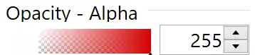

    The Alpha gradient with a red colour and 255 Alpha from paint.net

Let us add the alpha (opacity) to our colour components. As an example look 
at Opacity - Alpha in paint.net. The gradient is different from the RGB
gradients. The alpha gradient starts from white and ends with the selected 
colour. At the white end are blocks of grey and white, while at the coloured 
end the gradient is full colour. The normal method to produce this effect is 
to create two images and combine them using the PIL alpha-composite 
method, as we saw before, using PIL is not so fast, and we can surmise with
so many image manipulations it will be comparitively slow. It would pay to 
work in arrays add them together, then convert to a PPM format and import 
into tkinter. 

.. list-table:: Final Colours Gradient and Chequer
    :widths: 20, 11, 15
    :header-rows: 1
    :stub-columns: 1

    * - Chequered Gradient
      - Light End
      - Coloured End
    * - Gradient
      - White
      - Colour
    * - Dark Chequer
      - Grey
      - Black
    * - Light Chequer
      - White
      - Black

Bare in mind that PPM cannot have an alpha component, so the array 
manipulation has to replicate the effect of having an alpha component. This
means that we have to have a strong showing of the chequer at the gradient 
white end, whilst we want a weak chequer showing at the coloured end of the
gradient. The basic gradient changes from white to the required colour. The
chequer should produce a mid grey at the white end, to zero at the coloured 
end. Remember white is (255,255,255) whereas black is (0,0,0), when 
adding arrays we are adding the contents of each pixel to the corresponding
pixel in the other array. Thus adding black has no effect on the composite 
array (which is probably hard to imagine based on our own painting 
experience).

.. sidebar:: Dark Banding

    Ensure that the values are correctly rounded off when converting to an
    integer, ``int(0.5+127/width*x)`` this rounds all values up or down 
    according to the value of the variable's first significant figure.

This means that our chequer also needs to change in colour, with black being
the end point for both dark and light squares at the coloured end. If  
the dark squares are always black, we need only alter the light squares. 

One way would be to make the light squares white at the white end, then the 
gradient needs to be black at the white end. A second way would be to make 
both the gradient and light chequer squares mid grey, which added together 
with the grey gradient produces white and the dark chequer grey squares at 
the white end (dark chequer square are black but become grey when added to 
the gradient). 

.. list-table:: Actual Colours Gradient and Chequer
    :widths: 20, 11, 15
    :header-rows: 1
    :stub-columns: 1

    * - Chequered Gradient
      - Light End
      - Coloured End
    * - Gradient
      - Grey
      - Colour
    * - Dark Chequer
      - Black
      - Black
    * - Light Chequer
      - Grey
      - Black

Testing both methods, there was not much to choose between them, except it 
was easier to prevent the dark banding when both the chequer and gradient 
were grey at the white end.

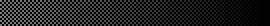

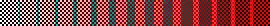

.. table::              Test Results to Produce Alpha Gradient

   ================= ================= ================= 
    Graded Chequer      Red Gradient     Banded Result 
                        and Chequer
      |check|            |rcheck|           |bands|       
   ================= ================= =================

Resulting Colour with Alpha
---------------------------

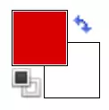

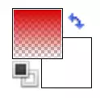

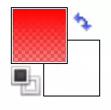
   
.. table::          Resulting Colour Box Changes with Alpha on paint.net

   ================= ================= ================= 
       Full Alpha        Mid Alpha         No Alpha     
       |a255|            |a128|            |a0|       
   ================= ================= =================

With paint.net when the opacity was reduced to zero none of the other 
gradients changed, but the resulting colour box changed from a block colour 
to a vertical grid starting from the bottom. This means that we need a 
vertical colour 
gradient for the resulting colour, which varies with the alpha value, and a
chequer that changes with the alpha value, becoming lighter as the alpha
increases. Look at the mid alpha value, the squares at the lower end are 
coloured whereas they are white and grey when there is no alpha.

We need a slightly more complicated method to replicate this. It borrows 
heavily on the alpha method above. The chequers are no longer static, they 
vary with alpha, such that at full alpha they become black, in effect no
longer to be seen, while at no alpha they become visible in the lower half, 
and vanish in the upper half. The gradient at full alpha is the resulting 
colour throughout, at mid alpha the gradient increases in colour vertically. 
At no alpha there is no colour in the lowest level then increases to full 
colour.

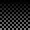
   

   

   

   

   
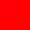
   
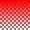
   

   

   
.. table:: Chequers at different alpha values

   ================= ================= ================= 
       Full Alpha        Mid Alpha         No Alpha     
        |vc255|           |vc127|          |vc0|       
   ================= ================= =================

.. table:: Gradients at different alpha values

   ================= ================= ================= 
       Full Alpha        Mid Alpha         No Alpha     
        |vg255|           |vg127|          |vg0|       
   ================= ================= =================

.. table:: Combining chequer and gradient at different alpha values

   ================= ================= ================= 
       Full Alpha        Mid Alpha         No Alpha     
        |vr255|           |vr127|          |vr0|       
   ================= ================= =================

Both chequers and gradient functions need to create a vertically changing
result as opposed to the horizontally changing result used in the alpha
gradient. It was found that the horizontal system has to be transposed, 
which means, it is sufficient to change the variables from the x to the 
y axis in loops. The chequer function shows this transformation process. The 
colour of the chequer squares changes with height. The amount of colour change 
depends on the alpha component as well as the ratio of the y step to height. 
The alpha value has been transformed so that when the alpha is 255 the 
variable is 0, giving a black colour, and when alpha is 0 we have 127, a mid 
grey::

    def vcheck(width,height,alpha,square_size=4):
        # Set check value to grey or black depending on y position and alpha
        al0 = 127 - alpha // 2
        ah0 = al0 / height
        array = np.zeros([height, width, 3], dtype=np.uint8)
        for y in range(height):
            for x in range(width):
                if (x % square_size * 2) // square_size == (y % square_size * 2) \
                    // square_size:
                    array[y, x] = int(0.5 + ah0 * y)
    return array

The gradient function is also transposed, but in a numpy way, at the end of
the numpy instructions we append ``.T``::

    def vgenerate_gradient(to_colour, alpha, height, width):
        al0 = alpha / 255
        res0 = 1 - al0
        from_colour = (int(to_colour[0] * al0 + 127 * res0),
                      int(to_colour[1] * al0 + 127 * res0),
                      int(to_colour[2] * al0 + 127 * res0))  # changing from_colour
        new_ch = [np.tile(np.linspace(to_colour[i], from_colour[i], height,
                                      dtype=np.uint8),
                        [width, 1]).T for i in range(3)]
        return np.dstack(new_ch)

Adding Alpha
------------

Since we wish to place the alpha component directly below the rgb values, it
would be best to move the final result label to just right of the red 
component. Enclose the rgb in a labelframe, place opacity in its 
own labelframe, while we are at it put the final result in its own 
labelframe. Add a check function::

    def check(width,height,square_size=4):
        # Set check value to grey or white depending on x position
        array = np.zeros([height, width,3],dtype=np.uint8) 
        for x in range(width):
            for y in range(height):
                if (x % square_size*2) // square_size == 
                   (y % square_size*2) // square_size:
                    array[y, x] = 127-int(0.5 + 127 / width * x)
        return array

Now that we have a chequers drawing function the gradient drawing needs to 
be changed to include the chequer array with our gradient. A separate 
alpha drawing is made, then it is easy to call this rather than modifying 
the original gradient drawing function::

    def draw_agradient(canvas,c1,c2,steps=256,width=300,height=26):
        arr = generate_gradient(colour1, colour2, height, width)
        arr1 = check(width, height)
        xdata = 'P6 {} {} 255 '.format(
            width, height).encode() + (arr + arr1).tobytes()
        gradient = PhotoImage(width=width, height=height, data=xdata, format='PPM')
        canvas.create_image(0, 0, anchor="nw", image=gradient)
        canvas.image = gradient

Add an alpha tk variable set this to 255. Every rgb component needs to 
redraw the alpha gradient when it changes. At this stage the alpha handle is 
just a placeholder, until we add an alpha component to the resulting colour.

.. container:: toggle

    .. container:: header

        *Show/Hide Code* 04addingalpha.py

    .. literalinclude:: ../examples/colours/04addingalpha.py
        :emphasize-lines: 5,37,55-62,92,114-120,150,171-172,194-195,217-218,
            221,232-237,350-367

.. note:: Only major changes are highlighted, there are changes caused by
    adding labelframes and using these as the widgets parents.

So far the rgb should look like this.

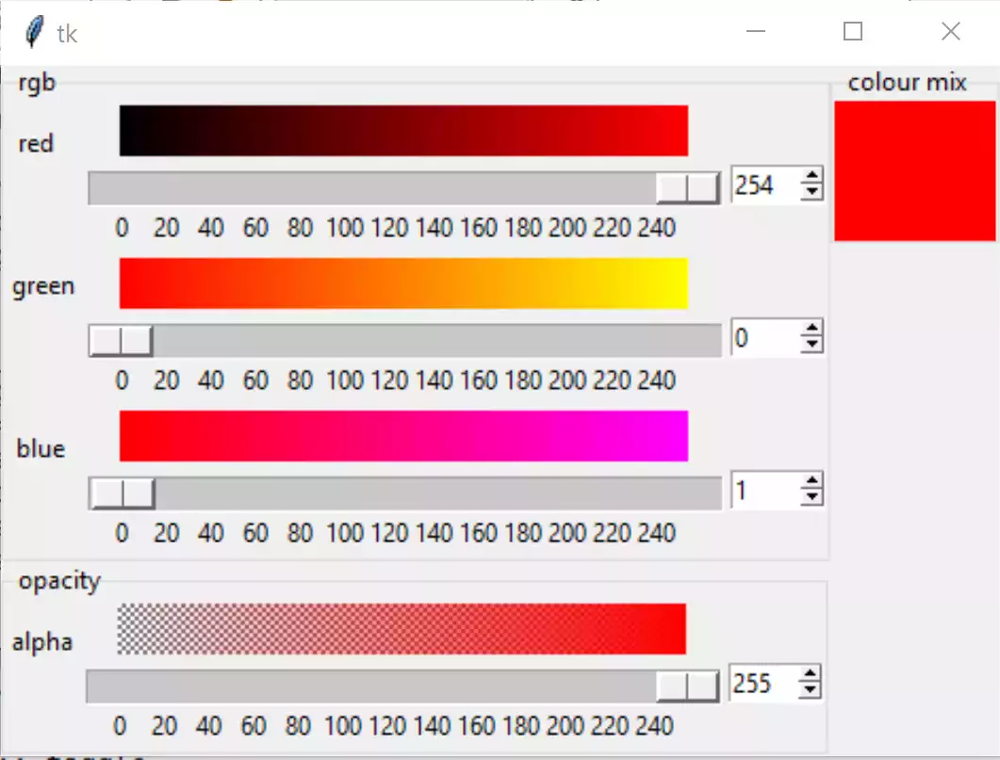
   
   The layout change when alpha is introduced

Adding Alpha to Resulting Colour
--------------------------------

We have already tested the necessary vertical gradient and chequer functions.
As there is no appreciable difference in the resulting colour in the upper
alpha band, we need only draw a background colour when alpha is above 240. 
If this is done using a label the units of size measurement are width in
characters and height in lines, potentially a problem when switching between 
background and image. So the resulting colour is displayed on a canvas, which
always uses the one measurement - pixels.

Our functions to generate vertical chequers and draw a gradient are as we 
have tested above. We require a vertical drawing function::

    def vdraw_gradient(canvas, colour1, alpha=255, width=30, height=30):
        if alpha > 240:
        hash_value = rgbhash(colour1[0], colour1[1], colour1[2])
        canvas['background'] = hash_value
        canvas.background = hash_value
    else:
        arr = vgenerate_gradient(colour1, alpha, height, width)
        arr1 = vcheck(width, height, alpha)
        xdata = 'P6 {} {} 255 '.format(
            width, height).encode() + (arr + arr1).tobytes()
        gradient = PhotoImage(
            width=width,
            height=height,
            data=xdata,
            format='PPM')
        canvas.create_image(0, 0, anchor="nw", image=gradient)
        canvas.image = gradient

Notice that even just giving the canvas a background colour needs an extra 
reference to it or else it is just ignored (garbage collected).

Change all references from the label having a background colour to the new
vertical gradient. Change the label to a canvas.

Since we have a colour mix container, add an entry widget, tie this to a tk
variable to show the colour hash value. This needs to be a string variable 
as we have hexadecimal values. Add an explanatory label.

At the end of build draw all the gradients, so that they appear when we open
the application. On startup show red, which is set at 255 while blue and 
green are 0. Show full alpha, no transparency, so set alpha to 255. 

.. container:: toggle

    .. container:: header

        *Show/Hide Code* 05addingalphatofinalcolour.py

    .. literalinclude:: ../examples/colours/05addingalphatofinalcolour.py
        :emphasize-lines: 3,144,164-173,176,195-205,208,229-244,273,297-298,
            322-323,347-348,362-366,464-477,504-510

This should produce:-

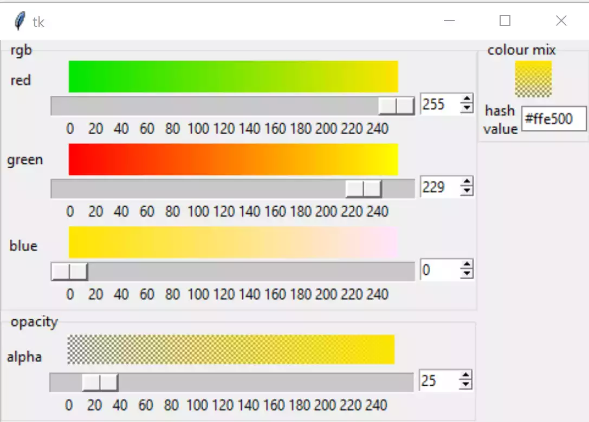
   
   The layout after final colour has alpha

The next part addresses the scale, at last! Also see what does or does not 
happen when the entry or the spinboxes are used.