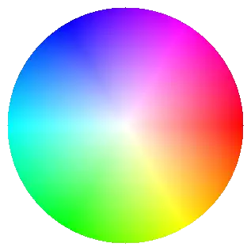

=====================
Adding a Colour Wheel
=====================

    
    Colour Wheel as found in paint.net

There are several methods to show the effects of changing selection, apart
from the final colour in a square. Some involve changing a window with the
selected hue shown as a gradient with varying saturation and value along the
main axes. This does not give an overall colour selection which a
colour wheel does. The wheel shows the changes associated 
with hue and saturation, leaving value to show its own component 
gradient. By keeping the hue constant and varying saturation one can easily
obtain associated colours.

.. _colour-wheel:

The colour wheel probably is relatively slow to construct and need only be 
made once if imported as an image file. For the sake of simplicity leave it 
as a png file with a transparent background. Create a PIL image file then
draw a coloured circle with the pixel colours dependant upon the radial
distance and angle (saturation and hue), which in turn are converted to RGB
all the while keeping ``value`` at 100.

.. container:: toggle

    .. container:: header

        *Show/Hide Code* 09colour_wheel_pil.py

    .. literalinclude:: ../examples/colours/09colour_wheel_pil.py

Next we will add the colour wheel to the basic hsv part, then create 
a moving cursor, test that these work together, then add the rgba part and 
ensure that the two parts interreact.