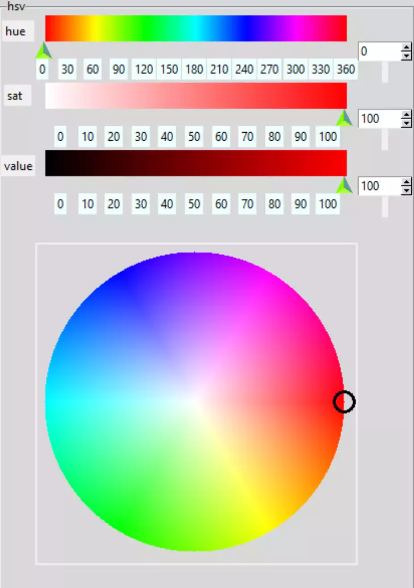

================================
Enabling Cursor User Interaction
================================

    Cursor on HSV Wheel at Red

As we stated before we need to bind the cursor to the mouse buttons::

    canHsv.bind('<Button-1>',self.Click_ring) 
    canHsv.tag_bind('ring','<B1-Motion>',self.Drag_ring)

Since we are operating within the class of HsvSelect the event handlers will 
be part of this class. Make sure that we import the necessary math functions
to enable the polar conversions. The events use the coordinates of the 
cursor when the mouse is clicked then translated into coordinates 
relative to the wheel centre. Make sure that the coordinates are within the
colour wheel. When we are clicking in the wheel we need to find the ring, 
then move it to the new position - we are actually moving the rectangle of 
the ring image. Find the hue and saturation values and update the tk variables, 
then call the function to draw the gradients.

.. code-block:: python
   :emphasize-lines: 10

    def click_ring(self, event):
        X = event.x
        Y = event.y
        ring_radius = self.ring_radius

        cx = self.wheel_w // 2
        dx, dy = X - cx, Y - cx
        rad = self.wheel_iw // 2
        if (dx)**2 + (dy)**2 < rad**2:
            for search in self.can_hsv.find_withtag("ring"):
                self.can_hsv.coords(search, X - ring_radius, Y - ring_radius,
                                    X + ring_radius, Y + ring_radius)

        hue, sat = cart2polar(X, Y, self.wheel_w, self.wheel_iw)
        self.hvar.set(hue)
        self.svar.set(sat)
        ring = hue, sat
        self.door_bell(ring)
        
    def drag_ring(self, event):
        X = event.x
        Y = event.y
        ring_radius = self.ring_radius

        cx = self.wheel_w // 2
        dx, dy = X - cx, Y - cx
        rad = self.wheel_iw // 2

        if (dx)**2 + (dy)**2 < rad**2:
            self.can_hsv.coords(self.ring, X - ring_radius, Y - ring_radius,
                                X + ring_radius, Y + ring_radius)

        hue, sat = cart2polar(X, Y, self.wheel_w, self.wheel_iw)
        self.hvar.set(hue)
        self.svar.set(sat)
        ring = hue, sat
        self.door_bell(ring)
        
A function is used to draw the saturation and value gradients::        
        
    def door_bell(self, ring):
        # calls from bind
        hue, sat = ring
        value = self.vvar.get()
        from_colour = hsv_to_rgb(*(hue, 0, value))
        to_colour = hsv_to_rgb(*(hue, 100, value))
        draw_gradient(self.scan, from_colour, to_colour,
                      width=self.canvas_w, height=self.canvas_h)
        from_colour = hsv_to_rgb(*(hue, sat, 0))
        to_colour = hsv_to_rgb(*(hue, sat, 100))
        draw_gradient(self.vcan, from_colour, to_colour,
                      width=self.canvas_w, height=self.canvas_h)

Let's clean up some of those magic numbers, the colour wheel image size, the
colour wheel size and ring radius and width.

Move the Ring using Scale
--------------------------

At present the ring changes hue and saturation, we now need to reverse the 
process so that these components change the ring position, obviously value 
has no effect. Add the following code to both the handle functions for hue
and saturation::

    X, Y = polar2cart(hue, sat, self.wheel_w, self.wheel_iw)
        ring_radius = self.ring_radius
        for i in self.can_hsv.find_withtag("ring"):
            self.can_hsv.coords(
                i,
                X - ring_radius,
                Y - ring_radius,
                X + ring_radius,
                Y + ring_radius)

After those changes our user can move the ring either by clicking on it and 
dragging or else clicking in the colour wheel. Also the ring should change 
in position whenever the hue or saturation scale or spinbox is altered. 
There  is a bit of difficulty in starting to drag the ring, maybe a bit of
feedback is required to show that the ring is ready. If we add 
``activeoutline`` we can see the ring change in colour when the mouse cursor
passes over the ring, what is apparent is that the centre is not activated
only when the mouse passes over the ring itself.

.. container:: toggle

    .. container:: header

        *Show/Hide Code* 11user2ring.py

    .. literalinclude:: ../examples/colours/11user2ring.py

Now that the HSV part is operational we can join it to the RGB part, 
modifying some of the original functions as necessary.