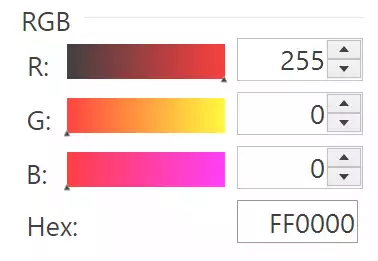
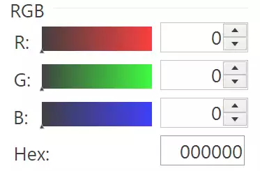
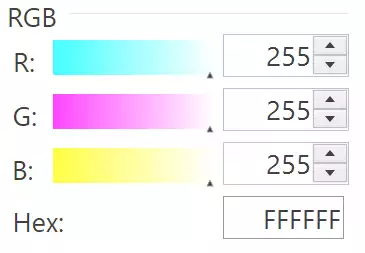

Deducing the Gradients
======================

If we start off with RGB values then we only need the straightforward 
change to hexadecimal to display in tkinter. The first problem is how to 
determine the start and finishing colours of each gradient, related to this 
is how each component interacts with the other components. 

    Gradients when Red is Showing

Open the colourpicker in paint.net or another application, and see what the 
effect is on the gradients when the colour is changed. In particular move to 
the extreme conditions. If the red value is 255 and the other two are 0, we 
see that the red gradient is changing from black to red. Both green and red 
start from red and change to yellow and magenta respectively. 

When all the components are 0 then all gradients start from black and finish 
at their respective colour. When the red scale is adjusted the red gradient 
remains unchanged, but the other two gradients change. From this we can see 
that the red scale has an R value that starts at 0 and finishes at 255. 

    Gradients when Black is Showing

.. sidebar:: Interactive Gradients

    We shall be using similar methods for  gradients in other colour
    systems, in that the gradient for a component starts at its lower limit
    and finishes at its upper limit, whilst the other two components are at 
    their current settings.

Now see what happens with green and blue - they react in a similar fashion. 
Each RGB component starts with 0 and ends with 255 in their own gradient - 
the only variable components are from the other two components. In other
words red starts with (0, G, B) and finishes with (255, G, B), so when all
components are 0 the gradients change from black to their respective colour,
and when all are 255 they start from their complementary colour and change to
white at the finish. (The complementary colours are cyan, magenta and yellow
for for red, green and blue). 

    Gradients when White is Showing