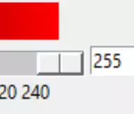
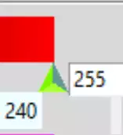
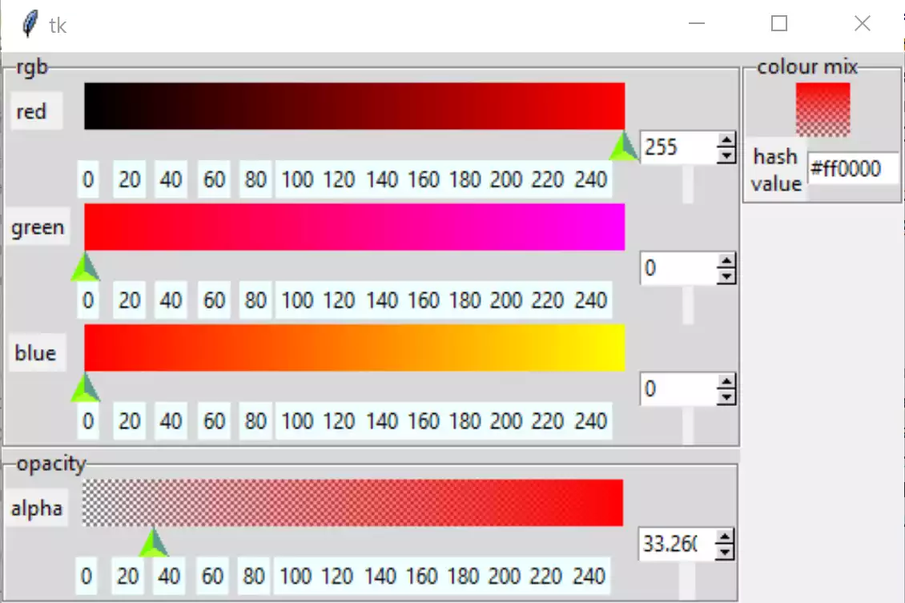

Modifying Scale, Spinbox and Entry
==================================

Change the Scale
----------------

At present the scale has that stuck on feeling, it does not sit in with the
application. There are two real choices, we could either go the whole hog 
and change the scale to a canvas which combined the gradient and cursor, or 
we could just change the appearance of the cursor using a theme. The first 
choice would slow down the whole application, by how much is not really 
known until tested on the full application when rgb is combined with hsv. 
The second choice allows a scale to operate just as we already have. When 
switching to a themed scale we will have to make provision to display the 
range values which weres already part of the tkinter widget. 

Changing the Scale Cursor
^^^^^^^^^^^^^^^^^^^^^^^^^^

.. table::              Change to Scale Cursor

    ============ ============
       tkinter    styled ttk 
    scale cursor scale cursor
    ============ ============
       |oldc|      |newc|
    ============ ============

.. sidebar:: Themed Widgets

    If the concept of changing the appearance of a themed widget is all new 
    to you, look up 
    `Linking style with State <https://tkinterttkstyle.readthedocs.io/en/latest/03style_with_state.html>`_

Create a small class for our scale, purely so that we can use 
inheritance. First of all let's create a cursor on an invisible trough, 
a bit like those in paint.net, but larger so that it is easier to click on 
thecursor. Use state to changes its appearance when 
pressed. Place this in the __init__ of RgbSelect we can 
change the ttk scale and make changes to entry and spinboxes as required::

    img=Image.new("RGBA",(16,10),'#00000000')
    trough=ImageTk.PhotoImage(img)
    # constants for creating upward pointing arrow
    WIDTH = 17
    HEIGHT = 17
    OFFSET = 5
    ST0 = WIDTH // 2, HEIGHT - 1 - OFFSET
    LIGHT = 'GreenYellow'
    MEDIUM = 'LawnGreen'
    DARK = '#5D9B90'
    
    # normal state
    im = Image.new("RGBA", (WIDTH, HEIGHT), '#00000000')
    rdraw = ImageDraw.Draw(im)
    rdraw.polygon([ST0[0], ST0[1], 0, HEIGHT - 1,
                   WIDTH - 1, HEIGHT - 1], fill=LIGHT)
    rdraw.polygon([ST0[0], ST0[1], ST0[0], 0, 0, HEIGHT - 1], fill=MEDIUM)
    rdraw.polygon([ST0[0], ST0[1], WIDTH - 1,
                   HEIGHT - 1, ST0[0], 0], fill=DARK)
    slider = ImageTk.PhotoImage(im)

    #pressed state
    imp = Image.new("RGBA", (WIDTH, HEIGHT), '#00000000')
    draw = ImageDraw.Draw(imp)
    draw.polygon([ST0[0], ST0[1], 0, HEIGHT - 1,
                  WIDTH - 1, HEIGHT - 1], fill=LIGHT)
    draw.polygon([ST0[0], ST0[1], ST0[0], 0, 0, HEIGHT - 1], fill=DARK)
    draw.polygon([ST0[0], ST0[1], WIDTH - 1,
                  HEIGHT - 1, ST0[0], 0], fill=MEDIUM)
    sliderp = ImageTk.PhotoImage(imp)

    style = Style()
    style.theme_settings('default', {
        'Horizontal.Scale.trough': {"element create":
                                    ('image', trough,
                                     {'border': 0, 'sticky': 'wes'})},
        'Horizontal.Scale.slider': {"element create":
                                    ('image', slider,
                                     ('pressed', sliderp),
                                     {'border': 3, 'sticky': 'n'})}})

PIL has been loaded for the Scale cursor drawing, this will only affect the 
start-up time.

Checking out our requirements for the scale, note that the length of the 
Scale is the movement length of the cursor plus the cursor width, plus any
trough borders. The external trough length is the actual Scale length. The
centre of the cursor should correspond to the measurement on the range. If 
the calculations are correct then when the cursor is at its minimum, ``from_``,
it should show 0 and the corresponding ``to`` value at its maximum.

Adding Range Values
^^^^^^^^^^^^^^^^^^^^

As usual I'm indebted to some clever programmer for the method `in stackoverflow 
<https://stackoverflow.com/questions/47200625/how-to-make-ttk-scale-behave-more-like-tk-scale>`_
that can be used in our application. We only require a 
horizontal scale where the range is in positive integers, so after 
simplification it becomes more manageable. It would be nice to pass the 
tick_interval to the widget since we require an easy way to change the range
appearance whenever different ranges are being used. Possibly ``digits`` 
may be useful (the number of digits passed to the tk variable). 

We are taking over the following Scale options:- 
    * parent
    * from\_ 
    * to
    * command
    * length
    * orient
    * variable
    
We are using the following from the old style scale:-
    * digits
    * tickinterval
    * sliderlength

This should give us::

    class TtkScale(Scale):
        def __init__(self, parent, from_=0, to=255, length=300, orient='horizontal',
                 variable=0, digits=None, tickinterval=None, sliderlength=16,
                 command=None):
            self.from_=from_
            self.to=to
            self.variable=variable
            
            super().__init__(parent, length=length + sliderlength,
                         variable=variable, from_=from_, to=to, command=command)

            self.digits=digits
            self.length=length
        
            self.build(parent,from_,to,sliderlength,tickinterval, length)

As we wish to position the range values just below the trough, it is 
probably best to build them as part of the scale widget and use the ``place``
layout manager, so these act as a built-in feature of the widget::

    def build(self, parent, from_, to, sliderlength, tickinterval, length):
        # create ticks
        scRange = to-from_
        
        if tickinterval:
            for i in range(from_, to + 2, tickinterval):
                item = Label(parent, text=i, bg='#EFFEFF')
                item.place(in_=self, bordermode='outside',
                           relx=sliderlength / length / 2 + i /
                           sc_range * (1 - sliderlength / length),
                           rely=1, anchor='n')

The first tick value is positioned just below the centre of the slider when
it is hard up against the left hand border, whilst the final tick should
be below the centre of the slider when it is hard up against the right hand 
border. This means that the first tick is half a slider length inside the 
border, and the last tick is half a slider length inside the opposite border.
Other ticks are equally spaced between these two extremes.

``relx`` is an x scale relative to the
parent size, and ranges from 0 to 1, hence the need to normalise the values.

Now change all the Scales to TtkScale, altering any attributes as necessary.

After the scale range values are made, notice that they are mostly hidden by 
the canvas. Place empty labels one row below the Spinboxes to give the values 
enough space to show - do not use
pady in the grid as we want the scale and canvas to abut. Lower widgets have 
to be shifted down 
to accommodate these labels. 

As the cursor is not showing try placing the style information in the ``main``
part. That's better, but it is obvious that the gradients are too short.
Reinstate the 30 pixels subtracted in __init__ of RgbSelect. Better, now 
remove the border and highlightthickness from the alpha canvas. Wait until
after hsv has been installed before changing the labels to ttk type, so we
can easily see the empty labels. 

.. container:: toggle

    .. container:: header

        *Show/Hide Code* 06scalemod.py

    .. literalinclude:: ../examples/colours/06scalemod.py

.. note:: Only major changes have been highlighted, grid changes have not 
    been shown.

This should produce:-

   
   The layout after modifying scale

.. _mod-entry:

User Input in Entry and Spinboxes
---------------------------------

User validation on both entry and spinboxes is necessary to ensure that 
input is correct, spinboxes allow integer input up to 3 figures with an 
upper and lower limit, whereas entry deals with a hash and hexadecimal input.
When we add validation to both the entry and spinboxes we lose some of our
automatic adjustment, this means that it is advisable to add a bind to each
of these widgets, so that any changes in values are reflected in our 
gradients and shown value in entry::

    def sb_okay(action, text, input):  # '%d', '%P','%S'
        if action == "1":
            if input.isdigit():
                return bool(0 <= int(text) <= 255)
            return False
        return True

Each spinbox requires to register the above function, which is the same for
each colour component RGBA. We are validating on keystroke, and using the
action, current input and the text before validation. The bind handler is 
common for the colour components RGB, and slightly less complicated for the 
alpha component, since we are only updating the final colour, whereas a standard
component must update all the other component gradients, the alpha component
and the final colour and its hash value. As these changes occur during user
input to the entry or spinbox, speed is not so critical, whenever possible 
use common validation and handler functions.

.. sidebar:: Hexadecimal Validation.

    Creating the final format does not always fall into your lap, so I have
    a commented out my first working attempt.

The validation for the entry is a bit more complicated. We first of all
check that the first character is a hash, then all the subsequent input is 
checked to be hexadecimal. Finally we limit it to 6 hexadecimal units using 
a bool function in the return clause of the try clause, which is equivalent
to our range checking::

    def isOkay(index, text, input_):  # '%i','%P','%S'
        # hash cannot be removed, hex check on input after hash
        index = int(index)  # index is string!
        if index == 0 and text == '#':
            return True
        try:
            int(input_, 16)
            return bool(0 < index < 7)
        except ValueError:  # not a hex
            return False

The validation otherwise is similar to the spinboxes, but because we need to 
use the index, that must be called as well. When initialising the entry we 
need the tk variable to set the default value, otherwise it became difficult 
to do this by an insert into the entry when validation is used,  
on small programs even this may not work. 

The bind handler gets the new hash value from which it can determine each 
colour component that in turn sets the colour component of the tk variable. 
Each of the colour gradients then is drawn. 

After all that you should see something like the following:-

.. container:: toggle

    .. container:: header

        *Show/Hide Code* 07entryscalemod.py

    .. literalinclude:: ../examples/colours/07entryscalemod.py

Now that the rgba has been almost finalised as a standalone application we
can develop the hsv as a standalone application along generally similar lines.
Many of the calling functions should stay similar, so it is relatively 
straightforward to import and leave the 
application uncluttered. That's the theory at least.