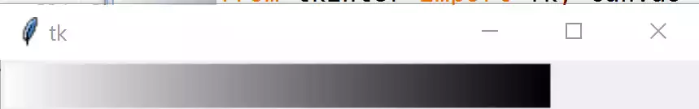
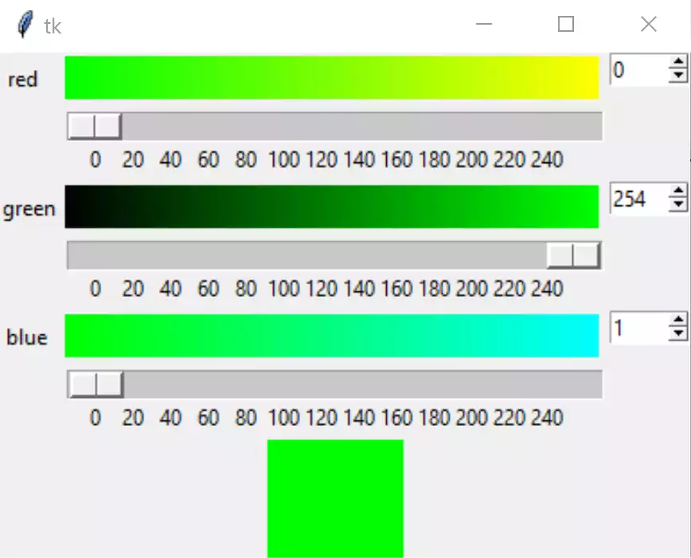
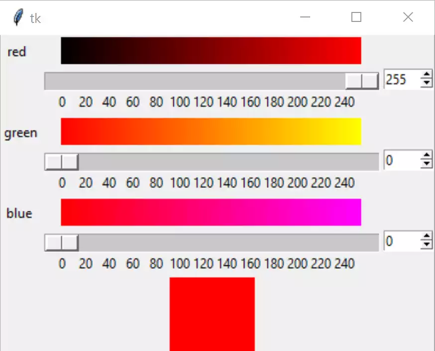

Using the Tkinter Widgets
=========================

You might be thinking - "Hang on a minute, drawing gradients is not so 
simple". Rest assured we have most of the necessary tools at our fingertips,
we have already drawn gradients when making our themes in `Putting on the 
Style! <https://tkinterttkstyle.readthedocs.io/en/latest/08down_to_earth.html>`_
at the section on Gradients. As we are displaying our results in the Canvas
widget, it would seem sensible to first draw the gradient on the canvas, 
rather than drawing in PIL then importing the image into tkinter and putting
it into the canvas. To do this we need to have a modified Lerp function (
linear interpolation) which interperpolates in RGB and makes a hash value for
the result, 

Let's make a simple gradient, with a canvas size of 300 x 26, and
start with white finishing with black::

    def LerpHex(colour1, colour2, fraction):
    # colour1 start colour, colour2 end colour, fraction 0 to 1
    # convert to hex
    return '#%02x%02x%02x' % (int(colour1[0] + (colour2[0] - colour1[0]) * fraction),
                              int(colour1[1] + (colour2[1] - colour1[1]) * fraction),
                              int(colour1[2] + (colour2[2] - colour1[2]) * fraction))

The lerp function is called whilst drawing the gradient, and colours each 
small rectangle with a slightly differing colour at each step within a loop.

We can then include these as follows:-

.. container:: toggle

    .. container:: header

        *Show/Hide Code* 01gradient_canvas.py

    .. literalinclude:: ../examples/colours/01gradient_canvas.py

.. sidebar:: Drawing Rectangles in Canvas

    We need to supply both the fill and the empty outline, in PIL we only 
    needed to define fill.

and see the following:-

    Simple Gradient Drawn on Canvas

Now create the Scale and Spinbox linked to IntVar for each of the 
colours. If we use tkinter widgets, as opposed to the themed widgets, there 
are more options available. Note how 
the logic needs to work. Change the gradient into a function, so that it can 
be called for each of the components. When creating the scales and spinboxes 
they need to be tied to the intvars, additionally the command option redraws 
the gradient whenever an intvar changes. The resulting colour can be 
displayed on a Label.

Each pair of Scales and Spinboxes have a common command function, red uses 
the function rhandle(). each each command function need only redraw
the relevant gradients. Only the 
gradients of the component not being changed need to be updated - so if red 
changes the red gradient remains unchanged but the blue and green gradients 
will change. Whenever a command function is called it first must find out 
the actual value of each tk variable. Since each tk variable needs to 
communicate directly with various 
functions and widgets it makes sense that they are all in one class.

.. container:: toggle

    .. container:: header

        *Show/Hide Code* 02all3colours.py

    .. literalinclude:: ../examples/colours/02all3colours.py

and see the following:-

    Three Components of Colour

Try moving the scale on all three components, the gradients should change as
with your color picker example. Try changing the Spinboxes, the arrows 
change the slider position and change the gradients as with the scale, but 
if you enter a number the corresponding scale slider changes its position but
there is no corresponding change in the gradient. The variable has changed 
but the command has not been triggered.

The numbers below the scale correspond to the scale position, but the 
canvas needs to align with the cursor in the scale. The default slider 
length is 30 pixels, so either the Scale should be enlarged or the canvas 
should be reduced. As the canvas is reduced we need to add ``width=270`` to 
both the canvases and the draw_gradient function.

.. topic:: Multiple Widgets

    As the widgets are created in a distinct repeatable pattern we can use a
    loop and lists to make the widgets. Using groups of three is a borderline
    case, so when making the scripts for the rgb and hsv colour picker there
    has been no grouping, as it is easier to see what is happening, later on
    the yiq uses loops and lists.
    
    When first creating the scripts the normal method is easier, but once the
    patterns are created the loop and lists are simple to institute. They 
    make it easier to maintain the scripts, as only a single reference need
    be altered rather than multiple references. 

Timing Gradient Drawing
-----------------------

Before progressing let's check out the comparative speeds to draw rectangles
and lines when making a gradient. So as to give comparable test conditions
we'll use timeit functions with a decorator, then we can create a made-up
function that contains all the drawing elements to make gradients. At the 
end of the test we should have times for different methods to draw a gradient 
on a canvas. 

Our timeit function::

    def timefunc(f):
        def f_timer(*args, **kwargs):
            start = time.time()
            result = f(*args, **kwargs)
            end = time.time()
            print (f.__name__, 'took', end - start, 'time')
            return result
        return f_timer

Create a timing function::

    @timefunc
    def exp():
        arr=draw_gradient(canvas,(0,0,0),(255,255,255),26,270)
    return 'testing rectangles!'

used on the gradient function::

    def draw_gradient(canvas,c1,c2,steps=256,width=300,height=26):
        for i in range(steps):
            x0 = int((width * i)/steps)
            x1 = int((width * (i+1))/steps)
            canvas.create_rectangle((x0, 0, x1, height),
                fill=LerpHex(c1,c2,i/(steps-1)),outline='')

show the result::

    result = exp()

this can then be compared to drawing directly with lines::

    def draw_gradient2(canvas,c1,c2,steps=256,width=300,height=26):
        for i in range(steps):
            canvas.create_line((i, 0, i, height),
                fill=LerpHex(c1,c2,i/(steps-1)))

According to some sources PIL should be quicker than drawing directly to
canvas. The actual drawing part probably is quicker, but we have to have a 
final image loaded and converted to tkinter before it can be displayed on the
canvas::

    def draw_gradient3(rcan,c1,c2,steps=256,width=300,height=26):
        image = Image.new("RGB", (width, height), "#FFFFFF")
        draw = ImageDraw.Draw(image)
        for i in range(steps):
            x0 = int(float(width * i)/steps)
            x1 = int(float(width * (i+1))/steps)
            draw.rectangle((x0, 0, x1, height),fill=LerpColour(c1,c2,i/(steps-1)))
        gradient=ImageTk.PhotoImage(image)
        rcan.create_image(0, 0, anchor="nw", image=gradient)
        rcan.image=gradient

.. note:: The image reference is repeated otherwise it vanishes.

::

    rcan.create_image(0, 0, anchor="nw", image=gradient)
    rcan.image=gradient

First of all drawing with a line is marginally faster than with rectangles, 
while using PIL took longer, probably due to the image manipulation::

    def draw_gradient3(rcan,c1,c2,steps=256,width=300,height=26):
        image = Image.new("RGB", (width, height), "#FFFFFF")
        draw = ImageDraw.Draw(image)
        for i in range(steps):
            draw.line([i,0,i,height],fill=LerpColour(c1,c2,i/(steps-1)))
    gradient=ImageTk.PhotoImage(image)
    rcan.create_image(0, 0, anchor="nw", image=gradient)
    rcan.image=gradient

This led me onto numpy, after all it's meant to be the bee's knees in 
speed. Numpy can create an array of pixels, which is captured in PIL and 
converted to an image then loaded into tkinter before being displayed::

    def generate_gradient(from_color, to_color, height, width):
        new_ch=[np.tile(np.linspace(from_color[i], to_color[i],width,
        dtype=np.uint8),[height, 1]) for i in range(len(from_color))]
        return np.dstack(new_ch)

.. note:: numpy works in reverse order with width and height.

::

    def exparr():
        graddata=generate_gradient((0,0,0),(255,255,255),26,270)
        graddata=Image.fromarray(arr)
        gradient=ImageTk.PhotoImage(graddata)
        rcan.create_image(0, 0, anchor="nw", image=gradient)
        rcan.image=gradient
        return 'testing numpy!'
    
Still not quite so fast as drawing directly. 

Before giving up, one last shot. Still using the numpy array convert 
it directly into a PPM image file. All we need create is a header 
``P6 270 26 255`` that has the code P6 indicating that we have byte data, 
270 26 (width and height), followed by 255 showing the colour depth. The 
array is converted to bytes, then loaded directly into 
PhotoImage as a PPM image::

    def exparr():
        arr=generate_gradient((0,0,0),(255,255,255),26,270)
        xdata = b'P6 270 26 255 ' + arr.tobytes()
        gradient = PhotoImage(width=300, height=26, data=xdata, format='PPM')
        rcan.create_image(0, 0, anchor="nw", image=gradient)
        rcan.image=gradient
        return 'testing PPM!'

This took about a third of the time that it took to draw directly in tkinter.
We have saved loading the array data into PIL, which in turn loads the 
image into Tkinter, compared to just loading the array data directly into 
Tkinter.

.. topic:: What is this PPM?

    PPM is a relatively old format, developed to send images by emails.

    PPM can have data in ASCII or byte format. The header section is in ASCII
    and shows the data type, P3 is used in ASCII, P6 for byte. It requires 
    three bytes per pixel (RGB). Bytes generate a smaller file than the same
    information in ASCII. 
    
    As there is no compession, there is no extra work required to create or
    read the file. So a simple image 192x128 in PPM would require 73,848 
    bytes, allowing a small extra for the header, whereas a png file could 
    store the same data in 166 bytes. That is why we can create the image 
    directly from an array, then load into tkinter at such fast speeds as
    the compression and extraction steps are eliminated.

Make Some Changes
-----------------

    Using PPM to make Gradients

We are now in a position to change 02all3colours.py to 03all3coloursPPM.py,
not forgetting the width changes and importing numpy and PhotoImage. Add 
initial settings for our tk variables. Whenever we have height, length and
width replace by the variables ``self.scale_l, self.canvas_w or self.canvas_h``.
When creating the PPM image, rather than using constant sizes. use the string 
format method to be able to adjust the sizes::

    xdata = 'P6 {} {} 255 '.format(width, height).encode() + arr.tobytes()

This will give the image the capability of resizing.

.. container:: toggle

    .. container:: header

        *Show/Hide Code* 03all3coloursPPM.py

    .. literalinclude:: ../examples/colours/03all3coloursPPM.py
        :emphasize-lines: 3-4,7,25-31,34,54-58

.. note:: Methods or Functions

    In general decide whether a function should be a method or not by its
    content. A function that acts as a procedure or builds widgets would be a
    method candidate. A function that converts would stay as an external
    function. If all the local function variables can be defined by its 
    attributes, without further reference to variables prefixed by **self.**, 
    then the function can be external .
