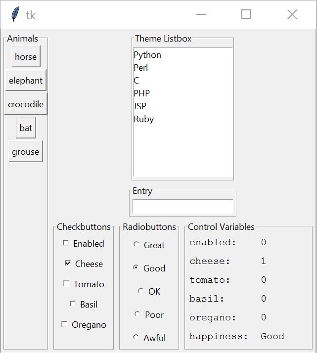
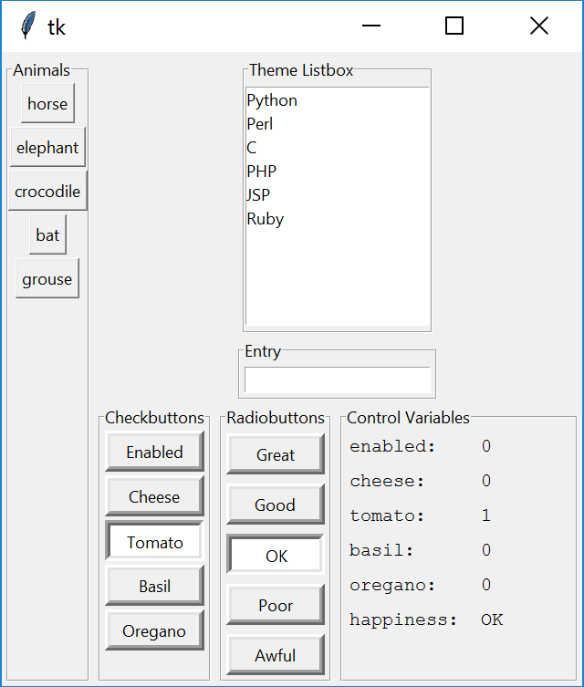

======================
Widely Used tk Widgets
======================

.. tabularcolumns:: |>{\centering\arraybackslash}\X{1}{5}|>{\centering\arraybackslash}\X{1}{5}

.. list-table::
    :header-rows: 1

    * - DPI unaware tk widgets
      - DPI aware tk Widgets

    * - .. figure:: ../figures/dpi/tk_widg_py.png

      - .. figure:: ../figures/dpi/tk_widg_th.png

A medley of widgets - buttons, check buttons, radio buttons, labels and 
label frames with a list box and entry thrown in for good measure. On the 
left is the original on the right as shown by a DPI aware program (Thonny).
The program was almost pure script, with a function to help show the selected
variables. The two resulting images are almost comparable in size, the text
hasn't changed much but the left-hand has heavier (darker) lettering. The 
shadow effect is more pronounced when DPI unaware. The biggest difference is
the size of the check boxes and radio button indicators, where the DPI aware 
program has really small indicators.

Apply DPI awareness and scale the widgets.

   
   The same script but now DPI aware and scaled

Applying scaling made no discernable change to the DPI aware output, 
the sizes remained much the same. See what happens when 
the check and radio buttons are changed by setting the indicatoron attribute to 0.
This will change the indicators to a push-push button, 
the borderwidth attribute was increased to make the state more obvious.

   The same DPI aware script, scaled and check and radio buttons no indicators
   with increased borderwidth

Scale and Scrollbar
-------------------

.. tabularcolumns:: |>{\centering\arraybackslash}\X{1}{5}|>{\centering\arraybackslash}\X{1}{5}

.. list-table::
    :header-rows: 1

    * - DPI unaware additional tk widgets
      - DPI aware additional tk widgets

    * - .. figure:: ../figures/dpi/tk_widg_etc_py.png

      - .. figure:: ../figures/dpi/tk_widg_etc_th.png

Another script was made that displayed scales and scrollbars. Since the scales
do not directly support scrollbars a canvas was added. Remember to make root
expandable a label frame was placed outside the canvas and became the parent
of canvas and the two scrollbars. Tie the scrollbars to the canvas bothways.
Create a frame within canvas that has a scrollregion to find all objects within 
canvas. This widget is placed inside canvas using the ``create_window`` option.
The scales and spinboxes use the scrollable_frame as their parent.

Although the screen sizes matched the scale tick intervals did not match when
the IDE was DPI aware. The vertical scale displayed ticks at 20 intervals, 
whilst the horizontal scale the numbers overwrote each other. The trough was
half the width of the DPI unaware output.

Apply DPI awareness and scale the widgets. The resulting window is smaller
than the DPI aware output. The scrollbars seem to be the same size as the 
DPI unaware output, but the scales although improved slightly need to be 
improved. If anything the spinboxes have shrunk. 

The length of the scales should be made constant in both DPI aware and unaware
modes. If we apply points we have a factor of 72/96, that is 3/4, to the pixel
size. The widths of the scale troughs can also be improved, so try 12 points
and lastly the spinboxes should have larger arrows, set the font size which
changes the height, try 10 points.

.. tabularcolumns:: |>{\centering\arraybackslash}\X{1}{5}|>{\centering\arraybackslash}\X{1}{5}

.. list-table::
    :header-rows: 1

    * - DPI aware additional tk widgets with scaling
      - DPI aware additional tk widgets with scaling plus

    * - .. figure:: ../figures/dpi/tk_widg_etc_dpi.png

      - .. figure:: ../figures/dpi/tk_widg_etc_dpi_plus.png
