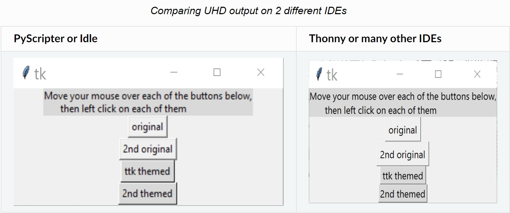
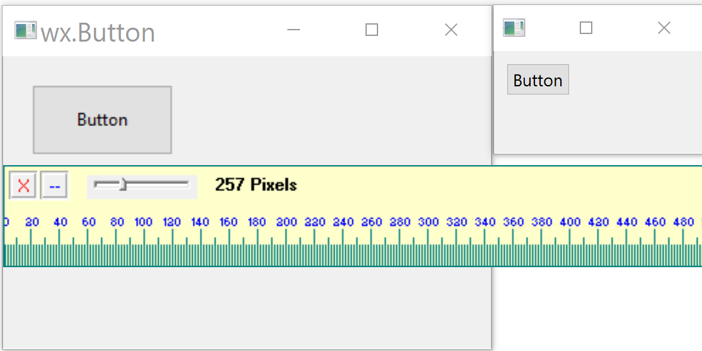
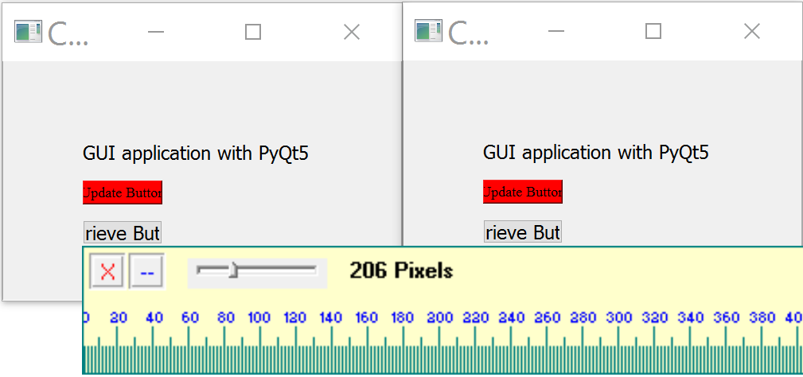

=========================
Is Your Program DPI Aware
=========================

    
    tkinter buttons, same sizes differing highlight and shadow

Many programs are not DPI (dots per inch) aware, and users may realize 
something has changed but are not sure what is happening and how to correct
for the effect. 

The most obvious change is that older programs may appear smaller on many
IDEs, but look as normal when started from the operating system, Idle or
PyScripter, at
least that is the case for Windsows programs with an Ultra High Definition 
(UHD) monitor working on tkinter. You may
see a change to the font being less bold in the new setup. Some widgets may
appear to have less pronounced highlighting and shadows and the broken lines
showing which button was last activated can be hard to see.

Older monitors changed size and aspect ratios using the same pixel size, or
at least not different enough to be a problem. When monitors increased
their resolution, by decreasing the pixel size, changes in the software have
become necessary. As you are probably aware in many graphical programs the
pixel has been the default measurement and any dimension shown as an integer 
will display as a pixel. 

.. sidebar:: Tkinter Dimensions

    Tkinter has other dimensional units which are centimetres, inches, 
    millimetres and points (1/72 inches), these are shown as a string with
    an integer followed by ``c``, ``i``, ``m``, ``p`` respectively. 

As fonts are sized in points they should stay constant in size no matter 
which monitor is used, whereas a drawing with line width and length in 
pixels can change from monitor to monitor. To complicate matters different
IDEs may or may not interreact automatically with the monitor. The
first priority is to check whether a GUI and IDE work as expected, in a
manner that suits your application. Most standard widgets add any writing 
after they are created, so there is no major problem when the widget expands 
to accommodate the lettering, however when custom widgets have lettering and
drawing then expect major difficulties. Also with some widgets, such as the 
scrollbars, it may be difficult to see their arrows or bars as they have 
shrunk in size. Some widgets such as the Treeview need to have their line
spacing adjusted for both the font and whether the IDE is DPI aware, but it
only seems to adjust when the theme is ``Vista`` on my Windows machine.

It would appear that running in DPI aware mode ensures that the results are 
the same between the OS and IDE which means that many older scripts the 
output will shrink in size. We can force dpi awareness by inserting the
statement ``SetProcessDpiAwareness(1)`` into the script. Other than small 
scripts, most things on the canvas need to be enlarged and the widths 
increased, in my 
case about 2.25 times. Remember text remains unchanged due to it being point 
as opposed to pixel based. To compensate for the shrinking, either the pixel 
count is increased, or the pixels are changed to a length (points). There 
may be a loss in speed as the pixel count is increased - 
so you may have to optimize. Some configurations are difficult to change to 
a length based systems, such as an image import. 

When increasing the size with the call to tk.scaling the text changed along 
with canvas size. The rate of change was not the same, so the text size 
changed more than the canvas. Since the text remain unchanged whether dpi 
aware or not this was of no use. ``tk.scaling`` can only be used if the text 
is not scaled and created before the call to tk.scaling.  

When applying a factor to the application it is useful to know the size of 
the monitor. We can
confirm from the OS settings, in my case a UHD monitor has 3840x2160 pixel
size. When querying the screen size Idle/Windows command shows 1707x960 pixels
when not dpi aware (default mode) but shows 3840x2160 pixels when 
SetProcessDpiAwareness is switched on. Screen sizes were obtained by using the 
tkinter inbuilt functions ``winfo_screenwidth()`` and ``winfo_screenheight()``.
The difference in the monitor widths and heights gives the 
scaling factor that can be applied. 

.. sidebar:: Determining Window Size

    Use tkinter inbuilt functions ``winfo_screenwidth()`` and 
    ``winfo_screenheight()``.
    
    If using pyautogui.size() or win32api.GetSystemMetrics(0) and 
    win32api.GetSystemMetrics(1) will tell you the OS setting and not how 
    Idle interperets the size. 

Let's compare simple widgets using WX or QT5. Button widgets and its text 
in tkinter were 
the same size in different IDEs, but shadows and highlights in the widget 
were not so easy to see in Thonny. WX gave different sized buttons, but the 
text stayed the same size, text weight was lighter in Thonny. 
QT5 made both button sizes as though they were dpi aware, whilst the font 
size became smaller than originally intended. All this means that 
the original sizes of older scripts cannot be seen unless one uses an
older monitor or run with PyScripter, or Idle or directly from the OS, using
either tkinter or WX. 

.. note:: 
    Click on arrow to show the code, which can be hidden by clicking again 
    on the arrow.
    
    The ruler shows the old scale of pixels (96 dpi), whereas there are 
    210 dpi on my monitor, this means that 100 pixels shows as 45 on this 
    ruler.

.. divider

.. container:: toggle

    .. container:: header

        *Show/Hide Code* 04nb_adjust.py

    .. literalinclude:: examples/01two_buttons.py

.. divider

    
    tkinter buttons, same sizes differing highlight and shadow

.. divider

.. container:: toggle

    .. container:: header

        *Show/Hide Code* wxbutton.py

    .. literalinclude:: examples/wxbutton.py

.. divider

    wx buttons, left PyScripter, right Thonny

.. divider

.. container:: toggle

    .. container:: header

        *Show/Hide Code* qtbutton.py

    .. literalinclude:: examples/qtbutton.py

.. divider

    
    qt5 buttons, left PyScripter, right Thonny, same size

Thonny IDE with later versions of python, had problems with the locale when 
running WX, Error: Unable to set default locale: 'unsupported locale setting'. 
In PyScripter WX ran with no error.
Thonny also had a problem running QT5, which showed an error qt.qpa.fonts: 
Unable to open default EUDC font: "C:\\Windows\\FONTS\\EUDC.TTE", at least
that was the case with Windows. This error could be corrected in QT5 for
PyScripter by adding::

    import ctypes
    ctypes.windll.user32.ShowWindow(ctypes.windll.kernel32.GetConsoleWindow(), 0)

