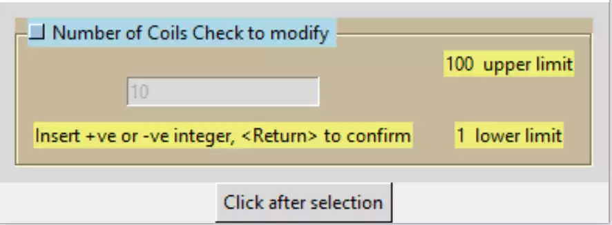
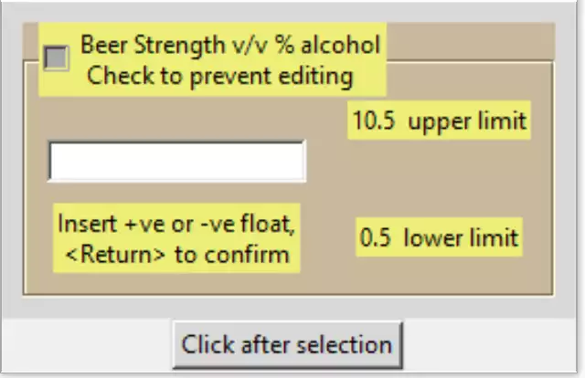

Adding Entries
==============

Adding the Integer Entry
------------------------

Create a new integer class based on the previous StringEntry class. Special 
consideration is needed for the additional passed attributes and changed 
methods. If a method remains unaltered we need not restate it, therefore
to reuse the make_entry method include ``'%S'`` even though we are only 
using ``'%P'``. Base the class IntegerEntry on :ref:`11integerfunction.py<integer-function>`.

The trickiest part is the init function. The class IntegerEntry inherits from
StringEntry, that is ``class IntegerEntry(StringEntry):``, the passed 
attributes are complete for IntegerEntry, give the self aliases to all the
attributes found in IntegerEntry then create an init line for StringEntry
with its attributes, but without its default values 
``StringEntry.__init__(self,parent,lf_text,mess_text,def_text,colour,mod)``. 
Now give the self aliases for the new attributes l_limit and u_limit.

Proceed with the style colours, not forgetting those for lower and upper 
limits. Continuation calls are inserted into the construct method and a new
method that makes the labels for the limits, another continuation call is
needed for make_entry. The methods end_input and is_okay need to be rewritten,
otherwise the methods in StringEntry will be used.

.. container:: toggle

    .. container:: header

        *Show/Hide Code* entry_class_2.py

    .. literalinclude:: ../examples/entry/entry_class_2.py

Adding The Float Entry
----------------------

The next class is based on 09float_function.py. The new class inherits from
IntegerEntry, so there are no new passed arguments, therefore there is no
call to ``IntegerEntry.__init__ ....``. The methods ind_input and is_okay 
need to be rewritten, otherwise the methods in IntegerEntry
and by proxy StringEntry will be used. If all the colour and the style 
configuration are copied to the method construct in StringEntry
the size becomes even smaller. 

When running IntegerEntry the display breaks up but both StringEntry and
FloatEntry behave well. In reality there is too much feedback information, 
in a larger application the user instructions could have been made once 
outside the enhanced entry widget. Experimenting with split lines makes the 
feedback information even more overpowering.

.. container:: toggle

    .. container:: header

        *Show/Hide Code* entry_class_3.py

    .. literalinclude:: ../examples/entry/entry_class_3.py