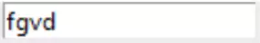
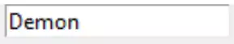

Basic Entries
=============

As a start create an Entry with validation that checks whether the input is
alphabetic or not. We require both options ``validate`` and ``validatecommand``.
Validate is using ``'key'`` which means that after every keyboard entry the 
callback function ``is_okay`` runs and checks the input, Entry then displays 
this input if allowed. The validatecommand needs to know the callback 
function and options being used, in this case ``'%P'`` which
is the allowed text. As the input is entered the contents of ``'%P'`` 
increases with each correct keystroke, which is shown in the print output. 
The callback function ``is_okay`` needs to be registered using the hook 
``vcmd`` before it can be used. As root is the parent widget it is used for
registration in this example, later on we can use other widgets such as a
Frame::

    from tkinter import Tk
    from tkinter.ttk import Entry, Style
    
    root = Tk()
    s = Style()
    s.theme_use('default')
    
    def is_okay(text):
        print(text)
        if text.isalpha():
            return True
        else:
            return False
    
    vcmd = root.register(is_okay)
    
    ent0 = Entry(root, validate='key', validatecommand=(vcmd, '%P'))
    ent0.pack()
    
    root.mainloop()

.. note:: When creating the callback function the first few examples will 
    have explicit ``else:`` clauses to show the True and False return logic.
    This is stylistically wrong, but I found it helped me in formulating the
    conditions.

Try using different characters, numbers, punctuation marks and a space or 
two - anything other than characters will not show, The operation of validation 
is immediate so all the user requires to know is what is allowed. Now try to 
correct the first letter. 

When judging whether an input is correct or not and can be validated, we need 
to use more criteria than just whether the text is acceptable or not, to this 
end tkinter (tcl/tk) 
has provided eight special substitutions to help validating
command, to start with concentrate on the four that we shall be using, %P, 
%S, %i and %d (text if allowed, input, index and action). Find the official
documentation here `Link to the Widget Specifications and Validation 
<https://www.pythontutorial.net/tkinter/tkinter-validation/>`_.

.. topic:: A Little Demo

    .. figure:: ../figures/ent_demo.webp
        :width: 327
        :height: 233
        :alt: demonstration tk validate
        :align: center        

    If you are new to this run the validate_demo program. The original was 
    posted by Bryan Oakley in Stackoverflow, as the various inputs are added 
    we can see how the inputs change the values of the substitutes.

    .. container:: toggle

        .. container:: header

            *Show/Hide Code* 00validate_demo.py

        .. literalinclude:: ../examples/entry/00validate_demo.py

When dealing with strings the first character is normally capitalised, 
thereafter characters, numbers and simple punctuation, so  
we need to know the current indexed position before the current input, 
``'%S'``, can be accurately checked. 

The first character is restricted to a capital letter, but if wrong it needs 
to be corrected, in fact the input should be able to be corrected anywhere.
Sometimes the normal ``if ... elif`` clauses can give unexpected 
results, so think in terms of progressive queries such that the next query 
is only true if all previous queries are satisfied. In general start with 
the widest ranging query and progressively narrow it down to the last query.

It also makes sense to deal with the queries in the order that they are 
displayed, particularly when they have disparate conditions such as the 
first and subsequent characters of strings. Here it is often useful to have 
consequetive queries rather than nest them.

One complication is to find the right criterion for the query. Are we
checking the complete text or only the input, unfortunately there is no hard
and fast rule, other than if it works it probably is right.

In this example use both ``text`` and ``input``:: 

    def is_okay(text, input): # %P, %S
        if input.isupper() and len(text)==1:
            return True
        elif input in (",", ".", "'", " ") and len(text)>1:
            return True
        elif input.isalnum() and len(text)>1:
            return True
        else:
            return False
    
    ....
    ent0 = Entry(root, validate='key', validatecommand=(vcmd, '%P', '%S'))
    ....

Add a check for an empty input to enable corrections by the user. Do not 
use a single nested set of queries, as the 
the first character has a different condition to the following characters::

    def is_okay(input, action):
    ....
        elif text == "":
            return True
    ...

.. topic:: String Validation Function
    
    First check whether the first character is a capital
    letter or not. Then there are two queries that check whether the input
    is an alpha numeric character or one of a set of punctuation options.
    
    Although the logic can be followed, the fact that at every query apart
    from the first, has an elif or else query should raise a warning flag. As 
    it stands the validation function is doing its job but there is room
    for improvement.
    
    Without peeking see if you can improve on the validation function, 
    remember the first letter is capitalalised, thereafter characters, or some
    prescribed punctuation. If at any time a character such as **%** can be 
    inserted then the validation is no longer working. After making your changes
    test it with pylint, if the score is more than 9.5 and it works - well done!

.. container:: toggle

    .. container:: header

        *Show/Hide Code* 02entry_str.py

    .. literalinclude:: ../examples/entry/02entry_str.py
        :emphasize-lines: 25-34, 38

Test this out, is it alright or not? We can delete the first letter which 
has to be a capital, we can add different letters and figures, plus the 
special characters. Did you try deleting - went well didn't it until the 
second position. It is possible to change the first character before other 
characters were added - a case of the Eric Morecombe's - all the right notes
just not necessarily in the right order as in `Andre Preview <https://www.youtube.com/watch?v=uMPEUcVyJsc>`_.
Once the input becomes longer deleting the first character is no longer 
possible.
 
If we are honest there was no real need to test the length of %P, it's
better to use the built in function %i, also we are not using %P elsewhere. 
We need a better test for deleting, try using %d the action option. Use
it to test that we are inserting, apply all the normal criteria, then
change the last ``else`` to ``return True`` which allows deletions. This
option highlights the fact that the query can have two correct answers, just 
that we tackle the first answer by a nested set of queries to check the input,
while the second option shows we are not inserting but deleting.

.. container:: toggle

    .. container:: header

        *Show/Hide Code* 02entry_str_better.py

    .. literalinclude:: ../examples/entry/02entry_str_better.py
        :emphasize-lines: 28-39, 43

.. note:: All Validating Substitutes are Strings

    Whenever using action %d or index %i use quoted numbers, or change the 
    substitute variable to an integer.

It is better in that the expected behaviour is happening, but stylistically 
it isn't optimal::

    index = int(index)
    if action == '1':
        if input.isupper() and index == 0:
            return True
        if input in (",", ".", "'", " ") and index > 0:
            return True
        if input.isalnum() and index > 0:
            return True
        else:
            return False
    else:
        return True

.. topic:: Better String Validation Function

    First ensure that the index is an integer to allow valid comparisons. 
    All the string validation queries are dependant on the fact that we are
    inserting, so these are nested. The elif clauses were replaced by if 
    clauses, which at first glance may not seem logically equivalent, but
    they work as the queries are independant from each other. 

Integer Entry
-------------

Integer entry in some ways is simpler than a set of characters. There are no 
spaces, punctuation or letters, therefore the entire entry can only be 
integers with maybe a minus at the beginning.

First change the callback function, using only '%P'. Now make a test on 
whether the input is an integer or not::

    def is_okay(text):
        if int(text):
            return True
        else:
            return False
    
    .....
    
    ent0 = Entry(root, validate='key', validatecommand=(vcmd, '%P'))

Test this and you should find that neither a minus sign is allowed nor a 
correction can be made. Change the second line of the callback function to 
test against ``isdigit``::

    if text.isdigit():

It is just as restrictive as ``int``, but notice anything different? You
should notice that no warnings were generated when a decimal point was tried,
which allows validation process to continue. We still have the problem of 
trying to change the first integer, use a similar solution to that 
for characters. 

It would also be useful to have a  method that prevents input beyond upper 
and lower limits, so try ``range`` to provide the limits::

    if text.isnumeric(): # int(inp):
        ## do not use range, change 1 to 11 and test ##
        if int(text) in range(1, 63):
            return True
        else:
            return False
        return True
    elif text == "":
        return True
    else:
        return False

As it stands this is only applicable to positive integers, and our test for 
an empty first entry is tacked on. The limits work but the user does 
not know the reason why an input is not accepted - the simplest solution is 
to provide labels showing the limits - an alternative solution would provide 
feedback. 

Now change the lower range value from 1 to 11, no input is allowed. To 
overcome this problem one needs to either check the input and use limits only
after the entry is completed or separate out the limit checking as will be
done later see 07layout_integer.py :ref: `Layout Integer`.

Now enable minus integers::

    elif text in ("", "-"):

Only using "%P" fails since isnumeric does not recognise negative numbers, 
(by the way it fails with isdigit and isdecimal as well). As seen before, 
using int() with the ``if`` conditional construct produces errors that stops 
validating. This can be solved by using a ``try`` and ``except`` construct 
with ``int()`` for negative integers, only use an ``if`` construct with 
isnumeric and positive integers.

.. container:: toggle

    .. container:: header

        *Show/Hide Code* 03entry_isnumeric.py

    .. literalinclude:: ../examples/entry/03entry_isnumeric.py
        :emphasize-lines: 24-34, 38

The try construct::

    def is_okay(text):
        print(text)
        if text in("", "-"):
            return True
        try:
            int(text) 
        except ValueError:
            return False
        return True

.. topic:: Integer Validation Function

    Before checking that the input is an integer or not, first of all validate
    the input required to write the first character when making an integer. 
    This can only be an integer, a minus sign or empty. Since we are looking 
    at the first character one could use either the text ``%P`` or the input 
    ``%S``, but as we want to check whether the first character is empty or 
    not it is best to use text. The outcome
    of either of these options is **True**, but it is not necessarily 
    **False** if it is not one of these options. 
    
    In the second part of the validation check whether it is an integer or not.
    Once starting to insert a single integer either by itself or combined
    with a minus sign, is accepted by the integer validation.
    
    Both parts are independant, in that if it does not satisfy the first part
    it could still be valid for the second part. Therefore use sequential 
    rather than nested queries.

.. container:: toggle

    .. container:: header

        *Show/Hide Code* 04entry_negative_integers.py

    .. literalinclude:: ../examples/entry/04entry_negative_integers.py
        :emphasize-lines: 24-30

Float Entry
------------

Float entry should be similar to integer, with negative numbers and decimal 
points. As suspected, unless special provision is made for these two inputs,
it will create an error and not be read into the entry. To be consistent 
"-." is also a special case. 

As there is no equivalent to ``isdigit`` for testing float we need to use 
``float()`` within a ``try`` construct, (otherwise the validation stops 
working if an error is generated)::

    def is_okay(text):
        print(text)
        if text in ("", "-", ".", "-."):
            return True
        try:
            float(text)
        except ValueError:
            return False
        return True

.. topic:: Float Validation Function

    The float validation runs along similar lines to the integer validation.
    The main differences being that we are checking for a float, and there 
    are more options for the first character or two, as there can be a decimal
    point or a minus sign and a decimal point. Otherwise it is just a copy
    of the integer validation.

It may be useful to make the entry font bold, even though Entry is a themed
widget, changes to the font are made directly in its options rather than
using Style. This also applies to the themed Combobox and Spinbox::

    from tkinter import Tk, font
    .....
    def_font = font.nametofont('TkHeadingFont')
    font_family = def_font.actual()['family']
    font_size = def_font.actual()['size'] + 2
    ......
    ent0 = Entry(....font=(font_family,font_size,'bold'))
    .....

If limits are required then it is best to separate these from the 
validation, and have a labelframe to enclose the limit labels and entry (see 
later :ref:`09float_function.py<float-function>` ).

.. _entry-float:

|

.. container:: toggle

    .. container:: header

        *Show/Hide Code* 05entry_float.py

    .. literalinclude:: ../examples/entry/05entry_float.py
        :emphasize-lines: 19-21, 36-42, 47