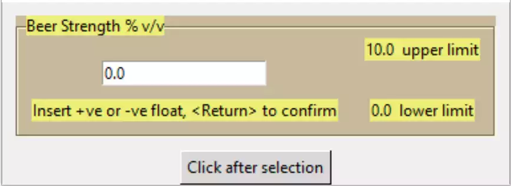
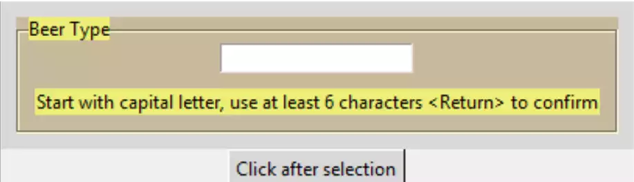
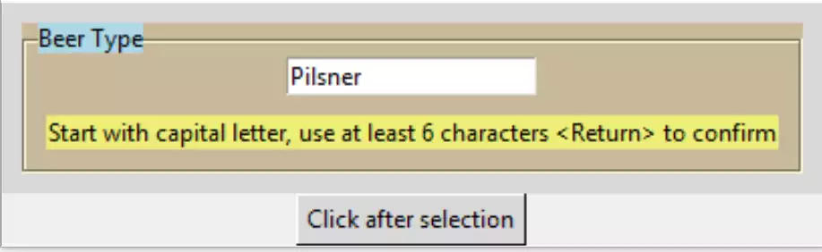

Class or Function?
==================

.. sidebar:: Script Formatting

    Most of the scripts should conform reasonably well with the strictures 
    of **pylint**, that is why the variables in **main** become constants.
    The names of the function/class attributes should be different to the 
    declared inputs.

That works well, so now we can decide whether to make it into a function
or class. Since the script is fairly small and uncomplicated create three 
separate functions, however as an exercise convert all three to a 
class, using the principles of `Sammy the Shark
<https://www.digitalocean.com/community/tutorials/how-to-construct-classes-and-define-objects-in-python-3>`_ 
From now on the validation function will also be made less verbose, after 
each change ensure that the function still works as expected. 

The function can be made in a similar fashion to tree_function.py, check out 
how to obtain the output after the input is finished::

    from tkinter import Tk, font, StringVar, DoubleVar
    ....
    def entry_float(parent,lf_text,l_limit,u_limit, mess_text, out_var):
    
    ......
    mess_lbl['text'] = "That's OK"
    ov = out_var.set(float(ensv.get()))
    ....
    if __name__ == "__main__": 
        root = Tk()
        fra0 = Frame(root)
        fra0.grid()
        LFTEXT = 'Beer Strength % v/v'
        LLIMIT = 0.0
        ULIMIT = 10.0
        out_var1 = DoubleVar()
        MESSTEXT = 'Insert +ve or -ve float, <Return> to confirm'
        
        entry_float(fra0,LFTEXT,LLIMIT,ULIMIT, MESSTEXT, out_var1)
        
        b2 = Button(root, text='Click after selection', 
                    command=lambda:print(out_var1.get()))
        b2.grid(row=1, column=0)
        root.mainloop()

Create a DoubleVar outside the widget, put its handle on the widget calling
arguments, then set the outside variable from within the program. The value
can then be picked up by a button and printed out. 

.. _float-function:

.. container:: toggle

    .. container:: header

        *Show/Hide Code* 09float_function.py

    .. literalinclude:: ../examples/entry/09float_function.py

Similar changes can be made with 06layout_string.py and 07layout_integer.

.. topic:: Validation String Function

    Moving on from the validation in 06layout_string.py we have two queries
    that depend upon being in the first position and two queries that operate
    on subsequent positions. Combine the pairs using an ``or`` 
    construct. Previously the else clause returned *False*, by inserting a
    **bool** function the else clause tests the second pair creating a *True* or
    *False* result. As the pairs of queries are independant the first pair
    must return *True* when valid, so this cannot be used for the bool function,
    therefore the requirement for ``else``.
    
    OK - how many lines did you end up with when trying to rewrite the 
    original string validation?

|

.. _integer-function:

|

.. container:: toggle

    .. container:: header

        *Show/Hide Code* 10string_function.py

    .. literalinclude:: ../examples/entry/10string_function.py
        :emphasize-lines: 72-75

.. container:: toggle

    .. container:: header

        *Show/Hide Code* 11integer_function.py

    .. literalinclude:: ../examples/entry/11integer_function.py

Entry Class
-----------

Using the three functions build up into a class. As the string function is 
slightly simpler we can start with this then build upon this with the other 
two functions.

Change 10string_function.py into a class. Group the clauses by their common 
task and make into a method. The __init__ function contains the interchange 
variables and style clauses. The labelframe and feedback label can be 
grouped as one method, the entry becomes another method. As the StringVar 
**entsv** will change according to entry type put this in the init function, 
rename entsv to **out_var** as this will be used to communicate with the calling 
program::

    class StringEntry:
        def __init__(self, parent,lf_text,mess_text):
            self.parent = parent
            self.lf_text = lf_text
            self.mess_text = mess_text
        
            self.out_var = StringVar()
        ....
        if len(self.out_var.get()) > 5:
        .......
        b2 = Button(root, text='Click after selection', 
                    command=lambda:print(v.out_var.get()))

Remember to include the linking calls to the new methods, then 
prove it works.

.. container:: toggle

    .. container:: header

        *Show/Hide Code* entry_class_0.py

    .. literalinclude:: ../examples/entry/entry_class_0.py

Class with Added Functionality
^^^^^^^^^^^^^^^^^^^^^^^^^^^^^^

Now include some additional functionality. All these will have default 
values, so should always be placed at the end of our class attributes. Start
with a default input **def_text**, use the empty character as the defult 
value as this causes no problem for any of our three types::

    def __init__(self, parent, lf_text, mess_text, def_text="", colour='brown',
                 mod=False):
    ....
    self.out_var.set(def_inp)
    ....
    DEF_INP = 'Pilsner'
    v = StringEntry(fra0, LF_TEXT, MESS_TEXT, DEF_TEXT, COLOUR)

Add some colour coding to the labelframe label. The default colour is 
the existing brown and yellow 
combination. The labelframe background remains brown, only the label 
background is going to be changed to blue, green or pink. Using these in the
attribute, some additional style options needs to be generated, with brown as 
the default::

    def __init__(self, parent,lf_text,mess_text,def_inp="",colour='brown'):
    ....
        self.farbe = farbe = {'blue': 'light blue', 'brown': '#EDEF77', 
                              'green': 'light green', 'pink': '#EAAFBF'}
            
        colour = colour if colour in farbe else 'brown'
            
        self.colour = colour
        .......
        style.configure(colour+'.TLabelframe',background='#C9B99B')
        style.configure(colour+'.TLabelframe.Label',background=farbe[colour])
        ....
        self.lf0 = Labelframe(self.fr0, text=self.lf_text,
                         style=self.colour+'.TLabelframe')

The widget might be disabled and then enabled by the user. Place 
a checkbutton in the label position of the labelframe. This is a
bit more complicated than either of the other two changes. The message shown
in the label part of label frame is now taken over by the checkbutton, as is
the background colour.

Use ``mod`` as the passed argument with a default argument of **False**, if we 
wish to use the option use **True**. Add a colour 
style for the checkbutton, then within the make_entry function test whether 
``mod`` has been selected. Create a new function ``modify`` to create 
the checkbutton together with the states of the checkbutton (selected or 
not) and entry (disabled or not) and the associated checkbutton text. Just 
after the checkbutton is created, tie it into the labelframe by using its 
label widget option, (this is only called if ``mod`` has been selected).

The checkbutton has a command option tied to the function ``toggle_opt`` which
toggles the select state of the checkbutton, the disabled state of entry
and the message of the checkbutton:: 

    from tkinter.ttk import Entry, Style, Label, Labelframe, Button, Frame, Checkbutton
    ....
    style.configure(colour+'.TCheckbutton',background=farbe[colour])
    ....
    if self.mod in (True, False):
            self.modify()
        
    def modify(self):
        # entry disabled until checkbox is ticked
        self.cb_opt = Checkbutton(self.lf0, command=self.toggle_opt,
                            style=self.colour+'.TCheckbutton') 
        self.lf0['labelwidget'] = self.cb_opt
        if self.mod:
            self.ent0.state(['!disabled'])
            self.cb_opt.state(['!selected'])
            self.cb_opt['text'] = lf_text+' Check to prevent editing '
        else:
            self.ent0.state(['disabled'])
            self.cb_opt.state(['selected'])
            self.cb_opt['text'] = lf_text+' Check to modify '
        #print('mod',self.mod,self.cb_opt.state())
        
    def toggle_opt(self):
        # state of entry controlled
        # by the state of the check button in Option frame label widget
        #print(self.cb_opt.state())
        if self.cb_opt.instate(['selected']):
            print('selected state')
            self.ent0.state(['disabled'])  
            self.cb_opt['text'] = lf_text+' Check to modify '
        else:
            print('unselected state')
            self.ent0.state(['!disabled']) # enable option
            self.cb_opt['text'] = lf_text+' Check to prevent editing '

See how this all works together.

.. container:: toggle

    .. container:: header

        *Show/Hide Code* entry_class_1.py

    .. literalinclude:: ../examples/entry/entry_class_1.py