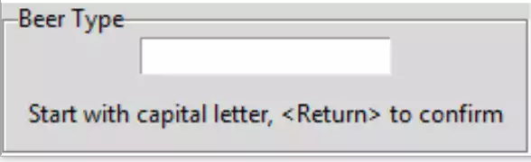
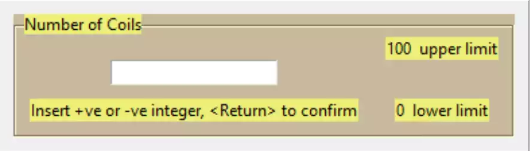
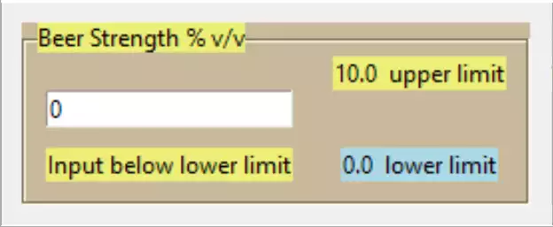

Entry Layouts
=============

Layout String
-------------

The Entry widget is going to be placed within a Labelframe that will contain
labels for user information and two optional labels for limits. This allows 
us to use it as a standalone class or function, which can be used as an 
enhanced entry. We need to know when the user is finished with input, which 
can be tied into an event such as the Return key. 

Import the extra widgets StringVar, Labelframe and Label. Set up the
Labelframe with the text giving the entry a title. Create the function 
end_input that is bound to the Return key, use a simple length check to 
ensure the input has been made. The callback function remains unaltered. 
Tie the StringVar to the entry widget and give the entry focus. Add a message 
label with a starting text, this will be altered by the event function. 

Run the program trying a full length input and a short input::

    from tkinter import Tk, font, StringVar
    from tkinter.ttk import Entry, Style, Label, Labelframe
    ....
    LF_TEXT = 'Beer Type'
    lf0 = Labelframe(root, text=LF_TEXT)
    lf0.grid(column=0, row=0)

    def end_input(evt):
    print('evt', entsv.get())
    if len(entsv.get()) > 5:
        mess_lbl['text'] = "That's OK"
    else:
        mess_lbl['text'] = "Should be at least 6 characters long"
    ......
    entsv = StringVar()
    ent0 = Entry(lf0, validate='key', validatecommand=(vcmd, '%P', '%S'),
                 textvariable=entsv)
    ent0.bind("<Return>", endinput)
    ent0.grid(row=1, column=0, padx=10)
    ent0.focus()

    mess_lbl = Label(lf0, text='Start with capital letter, <Return> to confirm')
    mess_lbl.grid(row=2, column=0, pady=10, padx=10)

.. topic:: Layout String Validation Function

    Building on the better string validation if we remove the check on 
    whether we are deleting or not, we have instead a check whether the text
    is empty or not. In the integer and float validation we could combine
    this last check with the special character checking, but string has to
    check the special characters with input rather than text. So now we have
    a flat set of queries rather than a nested set of queries.

.. container:: toggle

    .. container:: header

        *Show/Hide Code* 06layout_string.py

    .. literalinclude:: ../examples/entry/06layout_string.py
        :emphasize-lines: 2,3,9-11,13,25-29,31,47-56,61-63,67,68

Layout Integer
--------------

.. sidebar:: Using Compound Greater than or Less than Queries

    When testing the input falls within our limits with::
    
        if l_limit < int(entsv.get()) < u_limit:
    
    If outside the limits it is tested by::
    
        elif l_limit >= int(entsv.get()):
    
    The compound query acts as though we had used ``<=`` rather than ``<``

In concept it is similar to our string layout, but now the widget title may
contain units (as appropriate), upper and lower limits may be present that
affect the logic of the event function. First define the lower limits,
then alter the event function to confirm the value and show when the limit
has been exceeded. The rest of the script is the same as 
04entry_negative_integers.py :ref:`Float Entry` ::

    L_LIMIT = 0
    U_LIMIT = 100
    
    def end_input(evt):
        print('evt',ensv.get())
        if L_LIMIT < int(ensv.get()) < U_LIMIT:
            mess_lbl['text'] = "That's OK"
        elif L_LIMIT >= int(ensv.get()):
            mess_lbl['text'] = "Input below lower limit"
        else:
            mess_lbl['text'] = "Input above upper limit"

This works but the user has no idea of limits, so the limits will be shown 
in two separate labels, (just after the limit definition)::

    ulab = Label(lf0, text=str(U_LIMIT)+"  upper limit")
    ulab.grid(row=0, column=1, padx=10)
    llab = Label(lf0, text=str(L_LIMIT)+"  lower limit")
    llab.grid(row=2, column=1, padx=10)

The enhanced widget looks rather grey with black lettering, colour it 
up a bit. Make the labelframe pale brown and the labels pale yellow::

    s.configure('brown.TLabelframe',background='#C9B99B')
    s.configure('brown.TLabelframe.Label',background='#EDEF77')
    s.configure('brown.TLabel',background='#EDEF77')
    ....
    lf0 = Labelframe(root, text=lftext, style='brown.TLabelframe') 
    ...
    ulab = Label(lf0, text=str(U_LIMIT)+"  upper limit", style='brown.TLabel')
    ...
    llab = Label(lf0, text=str(L_LIMIT)+"  lower limit", style='brown.TLabel')
    ...
    mess_lbl = Label(lf0,text='Start with capital letter, <Return> to confirm', style='brown.TLabel')

It should be relatively easy to add warning colours to the limits, trigger
these when the limit is exceeded. Keep the warning colour there until the
**Return** event, when we can reset the warning colours before retesting::

    s.configure('lowr.TLabel', background='lightblue')
    s.configure('upr.TLabel', background='red')
    ....
    def end_input(evt):
        print('evt',ensv.get())
        ulab['style'] = 'brown.TLabel'
        llab['style'] = 'brown.TLabel'
        if L_LIMIT < int(ensv.get()) < U_LIMIT:
            mess_lbl['text'] = "That's OK"
        elif L_LIMIT >= int(ensv.get()):
            mess_lbl['text'] = "Input below lower limit"
            llab['style'] = 'lowr.TLabel'
        else:
            mess_lbl['text'] = "Input above upper limit"
            ulab['style'] = 'upr.TLabel'

That seems to function properly and gives the user a good feedback to the 
user.

.. container:: toggle

    .. container:: header

        *Show/Hide Code* 07layout_integer.py

    .. literalinclude:: ../examples/entry/07layout_integer.py

Layout Float
------------

    
    Float Entry, Lower Limit Activated

Use most of the new construct from 07layout_integer.py, only needing
to change to float and copying the feedback function from 05entry_float.py
:ref:`entry-float` ::

    if L_LIMIT < float(ensv.get()) < U_LIMIT:
    ...
    elif L_LIMIT > float(ensv.get()):
    ...
    def isOkay(text):
        print(text)
        if text in ("", "-", ".", "-."):
            return True
        try:
            float(text)
        except ValueError:
            return False
        return True

.. container:: toggle

    .. container:: header

        *Show/Hide Code* 08layout_float.py

    .. literalinclude:: ../examples/entry/08layout_float.py

