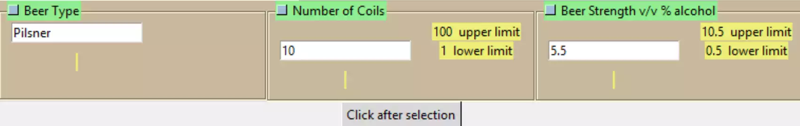

Working with Class
==================

Trimming Down
-------------

.. figure:: ../figures/ent_int_less.png
    :width: 314
    :height: 154
    :alt: tkinter entry integer validation with less feedback
    :align: center
    
    When a message does not show there is an annoying yellow bar showing
    where a message would be. Blend the Label into the background leaving
    only the foreground colours to show, or hide the Label.

First move the colour style clauses from the init function to the construct
method in StringEntry remembering to add the lower and upper limit 
colours, then remove the same clauses in IntegerEntry and FloatEntry.

Remove the feedback information for cb_opt in modify and toggle_opt. Remove
the passed argument **mess_text**, but still keep **mess_lbl** as it provides 
confirmation that the input has succeeded. 

The method **end_input**, found in IntegerEntry, ``int(self.out_var.get())``
is not needed as out_var has been changed to an IntVar, the same applies to
``float(self.out_var.get())`` in FloatEntry, **end_input** is now duplicated 
and can now be removed. 

The limits method has been changed to tie in with labelframe rather than parent::

    class StringEntry:
        def __init__(self, parent,lf_text,def_text="",colour='brown',mod=False):
    ....
        #self.mess_text = mess_text
    ....
        self.construct(colour)
        
    def construct(self,colour): 
    ## insert colour style clauses ##
    .........
    self.mess_lbl = Label(self.lf,style='brown.TLabel')
    .....
    self.cb_opt['text'] = lf_text # +'\n Check to prevent editing '
    ....
    self.cb_opt['text'] = lf_text # +'\n Check to modify '
    ....
    class IntegerEntry(StringEntry):
        def __init__(self,parent,lf_text,l_limit,u_limit,def_text="",colour='brown',mod=False):
    .......
        StringEntry.__init__(self,parent,lf_text,def_text,colour,mod)
    ....
    if self.l_limit < self.out_var.get() < self.u_limit:
    ....
    elif self.l_limit > self.out_var.get():
    ....
    class FloatEntry(IntegerEntry):
        def __init__(self,parent,lf_text,l_limit,u_limit,def_text="",colour='brown',mod=False):
    ......
    # remove method end_input

.. container:: toggle

    .. container:: header

        *Show/Hide Code* entry_class_4.py

    .. literalinclude:: ../examples/entry/entry_class_4.py

Adding Class Inheritance to Base Class
--------------------------------------

.. figure:: ../figures/ent_str_colour.webp
    :width: 458
    :height: 141
    :alt: tkinter entry validation string,integer,float
    :align: center

Use the LabelFrame class as the parent class for StringEntry with a 
touch of the supers thrown in for good measure. In essence we inherit all
the methods and parameters from LabelFrame, where the hook 
``self.lf`` was used just becomes ``self``, LabelFrame no longer needs to be 
called in the construct method. Parameters already 
incorporated in the three super calls can be deleted (commented out to show 
immediate changes). To enable the style changes a call to ``self['style']`` 
is made just after configure in the construct method.

As you can see, the original composition call to LabelFrame has been changed
to an inheritance call, in other words our widget changed from a "has a" to 
a "is a" type of relationship with the LabelFrame widget. As it stands it is
still a LabelFrame widget hence it can be displayed using normal layout 
management within our *main* part or from a calling program.

Within an application it would be better if the widgets all appeared the 
same size. Call the dimensions from the widgets themselves within
__main__. Just from this application we can see how more complex widgets 
might be created.

.. container:: toggle

    .. container:: header

        *Show/Hide Code* entry_class_5.py

    .. literalinclude:: ../examples/entry/entry_class_5.py

