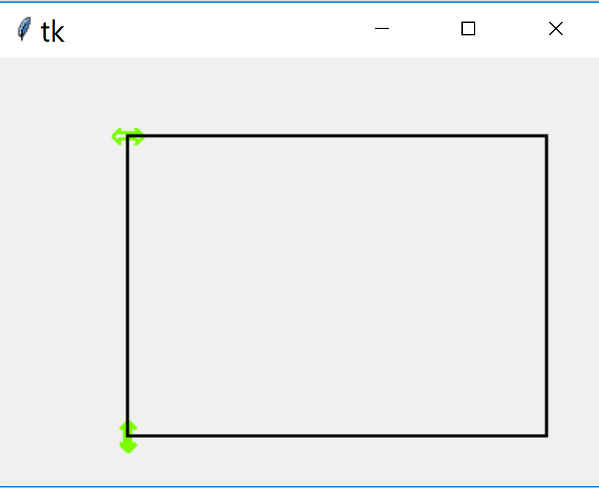

.. _foamy-brew:

===========
Frothy Brew
===========

.. topic:: What to Expect

    Before inspecting individual tkinter widgets a quick word about modern
    monitor resolutions and how it affects widgets and their applications.

    An overview of the tkinter themed widgets notebook, treeview, entry and
    scale. An explanation of moving objects in canvas prior to creating a 
    small application to show colour values in RGBA and HSV 
    formats, this should look like the colour picker in paint.net. Build 
    upon this to produce a YIQ colour picker.
    
    In all cases we start simply then develop by stages. 

.. important:: Many images have been made in Webp as it can save up to three
    quarters of the image size. If you cannot see them - sorry - please use 
    another browser.

.. tip:: It's best to download the examples and run them on the computer to 
    see how the script looks, a static picture on the web isn't the whole 
    story.

Contributors
============

.. toctree::
    :maxdepth: 3
    
    authors.rst

Be DPI Aware
===================

How to mitigate or correct the effects of changing monitor resolution. These
were tested on an ultra high definition (UHD) monitor on windows. Check that
all is as expected on your own setup before accepting the methods. 

.. toctree::
    :maxdepth: 3

    dpi/index_dpi

Scaleable Buttons
=================

.. tabularcolumns:: |>{\centering\arraybackslash}\X{1}{5}|>{\centering\arraybackslash}\X{1}{5}

.. list-table::
    :header-rows: 1

    * - DPI unaware unscaled using altflex theme
      - DPI aware scaled using altflex theme

    * - .. figure:: figures/buttons/pyscripter_testaltflex.png
                    :width: 243
                    :height: 196

      - .. figure:: figures/buttons/thonny_testaltflex.png
                    :width: 116
                    :height: 171

Check and radio buttons are reasonably straightforward except that those in
the **alt** theme cannot be easily adjusted for dpi awareness.

.. toctree::
    :maxdepth: 3
    
    buttons/index_buttons

Notebook
========

Not every application sits comfortably with a menu driven system.
The themed widget notebook that creates the tabbed method of layout. Other
widgets would then sit within the tabs.

.. toctree::
    :maxdepth: 3
    
    notebook/index_notebook

Treeview
========

.. image:: figures/tree_function.webp
    :width: 263
    :height: 233
    :align: center
    :alt: ttk treeview with selection, row stripes, heading in bold

One of the widgets introduced in themed tkinter. We can produce a widget 
that shows information in parallel columns. This is particularly
useful when choosing data from tables of information.

.. toctree::
    :maxdepth: 3
    
    treeview/index_treeview

Entry
=====

.. image:: figures/ent_int_less.webp
    :width: 209
    :height: 103
    :align: center
    :alt: enhanced entry in labelframe, limits, coloured label, enable/disable

This widget is available in both the basic tkinter and themed tkinter. This 
is used shenever the user has to enter information in real time. The 
validation methods can be used for the combo- and spinboxes as well.

.. toctree::
    :maxdepth: 3
    
    entry/index_entry

Scale
=====

.. image:: figures/gen_scale_class.png
    :align: center
    :width: 546
    :height: 207
    :alt: horizontal and vertical Scales as class

This widget is available in both the basic tkinter and ttk, however in ttk
the widget is missing several useful options for an annotated scale. Both
horizontal and vertical scales are addressed.

.. toctree::
    :maxdepth: 3
    
    scale/index_scale

Move in Canvas
==============

Canvas tkinter widget using one of its many facets, moving objects. This is 
a prelude to Colour Picker and YIQ Colour Picker.

.. toctree::
    :maxdepth: 3
    
    move/index_move

Colour Picker
=============

.. image:: figures/combinedrgbhsv.webp
    :width: 339
    :height: 228
    :align: center
    :alt: rgba and hsv scales with gradients, hsv colour circle

Using a colour picker we can see some of the potential strengths and 
weaknesses of the versatile tkinter Canvas widget.

.. toctree::
    :maxdepth: 3
    
    colour_picker/index_colour

YIQ Colour Picker
=================

.. image:: figures/rgb_yiq_mod.webp
    :width: 339
    :height: 222
    :align: center
    :alt: rgba and yiq scales with gradients, yiq colour space

There are relatively few YIQ colour pickers around, so just for fun let's 
create one. YIQ is one of the most understandable colour schemes.

.. toctree::
    :maxdepth: 3
    
    yiq_picker/yiq_index

Sources for Documentation
=========================

.. toctree::
    :maxdepth: 3
    
    source/modules

Indices and tables
==================

* :ref:`genindex`
* :ref:`modindex`
* :ref:`search`
