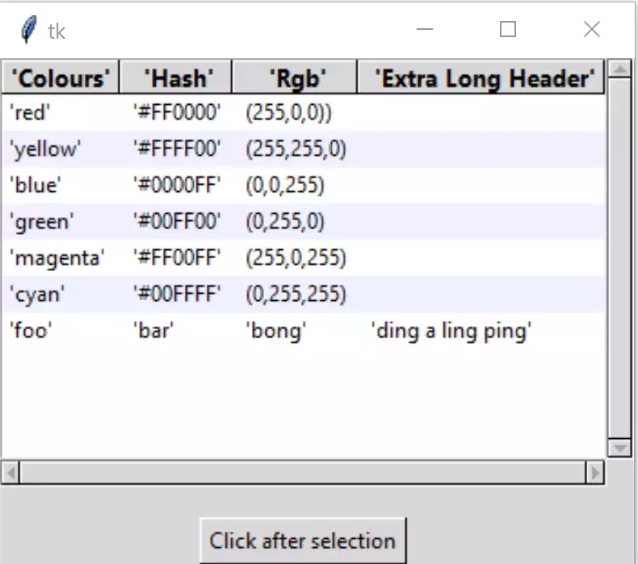

.. _foamy-brew:

==========
Foamy Brew
==========

.. topic:: What to Expect

    An overview of the tkinter themed widgets treeview, notebook and entry.
    Create a small application to show colour values in RGBA and HSV formats,
    this should look like the colour picker in paint.net. Build upon this 
    to produce a YIQ colour picker.
    
    In all cases we start simply then develop by stages. 

.. important:: All images have been made in Webp as it can save up to three
    quarters of the image size. If you cannot see them - sorry - please use 
    another browser.

.. toctree::
    :maxdepth: 3
    
    authors.rst

Treeview
========

One of the widgets introduced in themed tkinter. We can produce a widget 
that shows information in parallel columns. This is particularly
useful when choosing data from tables of information.

.. toctree::
    :maxdepth: 3
    
    treeview/index_treeview

Notebook
========

.. image:: figures/nb_import.webp
    :width: 243
    :height: 200
    :align: center
    :alt: ttk notebook with disable, sizing and import

Not every application sits comfortably with a menu driven system.
The themed widget notebook that creates the tabbed method of layout. 

.. toctree::
    :maxdepth: 3
    
    notebook/index_notebook

Entry
=====

This widget is available in both the basic tkinter and themed tkinter. This 
is used shenever the user has to enter information in real time. The 
validation methods can be used for the combo- and spinboxes as well.

.. toctree::
    :maxdepth: 3
    
    entry/index_entry

Colour Picker
=============

Using a colour picker we can see some of the potential strengths and 
weaknesses of the versatile tkinter Canvas widget.

.. toctree::
    :maxdepth: 3
    
    colour_picker/index_colour

YIQ Colour Picker
=================

.. image:: figures/rgb_yiq_mod.webp
    :width: 339
    :height: 222
    :align: center
    :alt: rgba and yiq scales with gradients, yiq colour space

There are relatively few YIQ colour pickers around, so just for fun let's 
create one. YIQ is one of the easiest colour schemes most people to
understand.

.. toctree::
    :maxdepth: 3
    
    yiq_colour_picker/yiq_index

Sources for Documentation
=========================

.. toctree::
    :maxdepth: 3
    
    source/modules

Indices and tables
==================

* :ref:`genindex`
* :ref:`modindex`
* :ref:`search`
