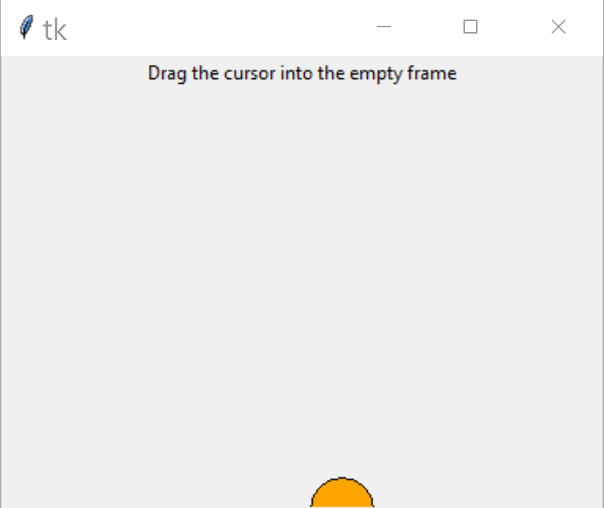
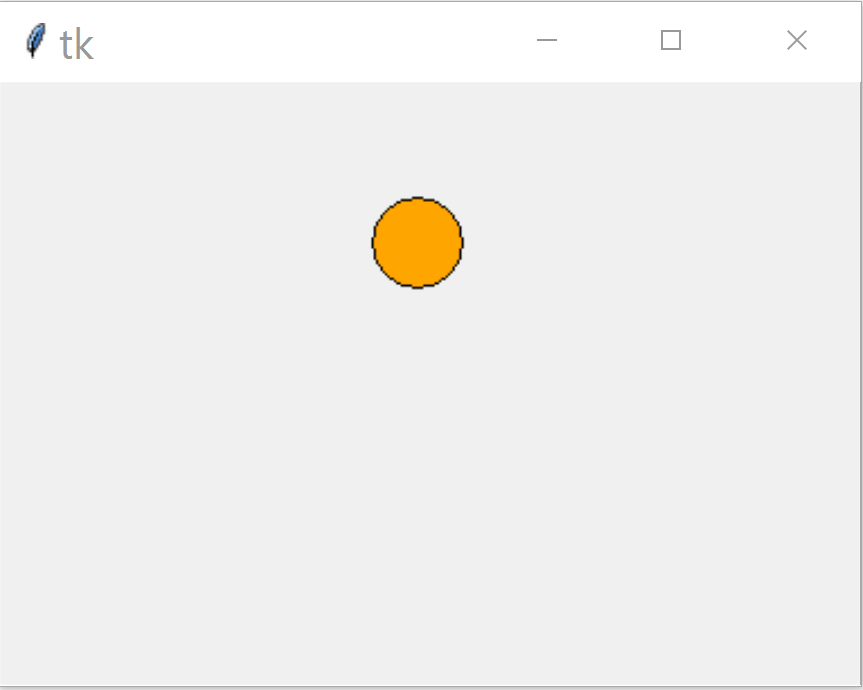
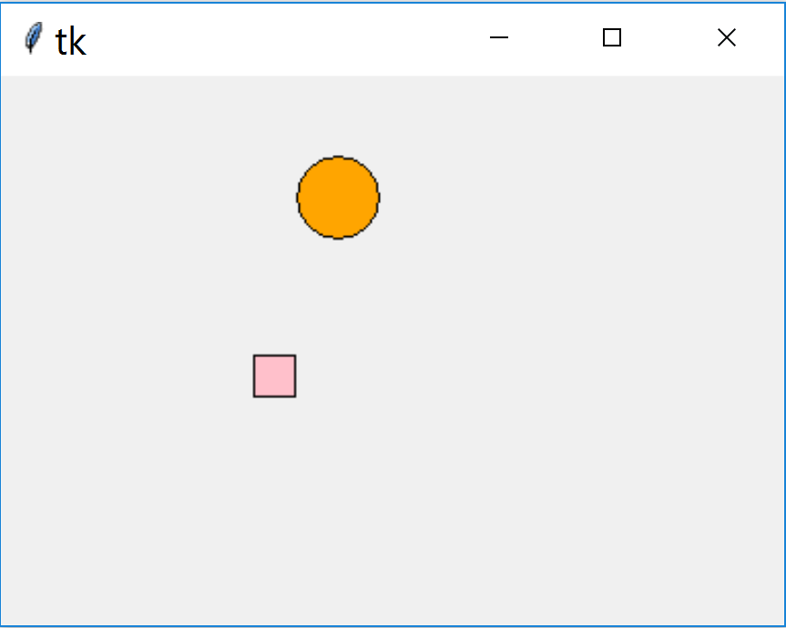
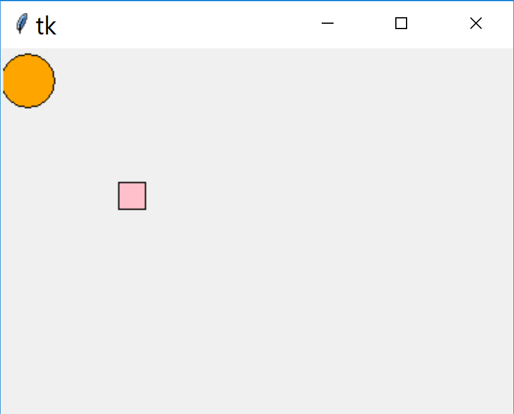
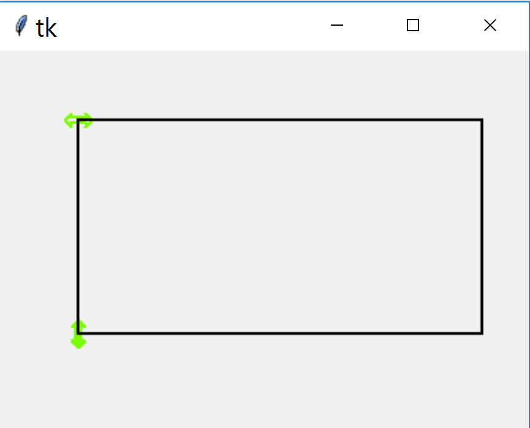

=============
Canvas Coords
=============

On the face of it the coords method is slightly easier, but it often causes 
problems. In order to move an object it must first be selected, then it can
be moved to a new position, then released. Alternatively the mouse can be 
first positioned then clicked whereupon the object will be moved to this 
position. The first example is purely using the Scale widget, this shows the
effect of moving and clicking::

    from tkinter import Tk, Scale
    
    root = Tk()
    
    sc = Scale(root)
    sc.grid()
    
    root.mainloop()

There are some standard points to note, the user presses on the slider which
has feedback to show it is pressed. Movement is limited by the trough, so a
vertical trough only allows movement in the y-direction, a horizontal trough 
allows x-movemnt. Click outside the trough, nothing happens, but clicking 
inside the trough moves the slider. Dragging only occurs when the mouse is
over the object and the mouse button is pressed. The slider looks as though
it is moving, in reality it has been redrawn in a new position.

Drag and Drop
-------------

Our object is to emulate the Scale slider interaction in our canvas 
application. By adding binds to the mouse events functions can be created to 
move a canvas object, this can be a drawn object or an image. There are 
quite a few
Canvas functions we can use, in fact we are spoilt for choice. Let's see 
what can be considered as the bare minimum::

    from tkinter import Tk, Canvas

    def callback(event):
        draw(event.x, event.y)

    def draw(x, y):
        can.coords(circle, x-20, y-20, x+20, y+20)

    root = Tk()
    can = Canvas(root)
    can.bind('<Motion>', callback)
    can.pack()

    circle = can.create_oval(0, 0, 0, 0)
    root.mainloop()

Here the widget is bound to the event ``<Motion>`` tied to the handler 
function callback which draws a circle wherever the mouse moves in the 
canvas. The handler function has an input ``event``, which is necessary to find 
out the mouse position. Event has several attribute options - normally only
``x`` and ``y`` are required. The circle is drawn at the position found from
event the actual drawing being governed by the Canvas function ``coords``. 
Without coords the circle is drawn but not deleted when a new circle is 
drawn, this has the effect of creating a tail. When drawing a circle its
size is determined by a bounding box, in the program this has been made 
when calling coords, which uses the cordinates of the object being moved,
in our case a bounding box.

Normally the object is already drawn on the canvas, and we wish to move it
to another position. Once the object is correctly positioned it needs to be 
dropped. 

Modify the bind from <Motion> to ``<B1-Motion>`` for the left hand 
mouse button to start a handler that moves the given object. The handler 
changes the coordinates directly, but as the circle is not initially drawn 
by coords, set it up when being created, also there is no need to have 
separate callback and draw functions::

    from tkinter import Tk, Canvas

    def callback(event):
        can.coords(circle, event.x-20, event.y-20, event.x+20, event.y+20)

    root = Tk()
    can = Canvas(root)
    can.bind('<B1-Motion>', callback)
    can.pack()

    circle = can.create_oval(0, 0, 40, 40, fill='orange')
    root.mainloop()

Pretty neat eh, move the mouse to your circle then click and drag to a new 
position while keeping the left button pressed. When the mouse button is 
released the circle is dropped at that point. The cursor moves to the 
position given by the coordinates, normally use the centre, otherwise the
top left hand corner of the bounding box is used.

Selecting an Object
-------------------

Say there is more than one object on the canvas then the object to be moved 
needs to be identified. Normally the user has no real idea what the object
is called and does not want to access the program, all they want to do is
move the cursor to the correct object and drag it. Use the Canvas function
``find_closest`` which identifies that object so that ``coords`` can move it::

    from tkinter import Tk, Canvas

    def callback(event):
        for search in can.find_closest(event.x, event.y):
            foundling = can.gettags(search)
            if foundling[0] == 'ring':
                can.coords(search, event.x-20, event.y-20, event.x+20, event.y+20)
            elif foundling[0] == 'square':
                can.coords(search, event.x-10, event.y-10, event.x+10, event.y+10)

    root = Tk()
    can = Canvas(root)
    can.bind('<B1-Motion>', callback)
    can.pack()

    circle = can.create_oval(0, 0, 40, 40, fill='orange', tags='ring')
    square = can.create_rectangle(100, 100, 120, 120, fill='pink', tags='square')
    
    root.mainloop()

Canvas coords can no longer refer to the circle as there is a square to be
moved as well, so the identifier (search) from ``find_closest`` is used 
instead. 

What happens when there are different sized or shaped objects? The object
needs to be identified and the correct parameters applied. We could work 
with the ID but it is not so obvious what is happening so add a tag to each 
object and use that to determine how ``coords`` is called. When ``gettags`` is 
called only the first entry is used, another tag `current` will have been
added by tkinter to the found object.

The movement of the objects can be easily constrained to move horizontally
or vertically, just by constraining the event.x or event.y within coords. So
if we want the square to move horizontally make event.y 110, which correspods 
to the y dimension of the squares centre when initially drawn. In order to 
limit the extent of movement ensure that the event.x and event.y have 
maximum and minimum limits::

    from tkinter import Tk, Canvas

    def callback(event):
        #can.update()
        #can_width = can.winfo_reqwidth()
        #can_height = can.winfo_reqheight()
        
        for search in can.find_closest(event.x, event.y):
            foundling = can.gettags(search)
            if foundling[0] == 'ring':
                event.x = (c0[0] + c1[0])/2
                event.y = min(max(event.y,20), can_height-20 )
                can.coords(search, event.x-20, event.y-20, event.x+20, event.y+20)
            elif foundling[0] == 'square':
                event.y = (s0[1] + s1[1])/2
                event.x = min(max(event.x,10), can_width-10 )
                can.coords(search, event.x-10, event.y-10, event.x+10, event.y+10)

    root = Tk()
    can_width = 380
    can_height = 270
    can = Canvas(root, width=can_width, height=can_height)
    can.bind('<B1-Motion>', callback)
    can.pack()

    c0 = 0, 0
    c1 = 40, 40
    s0 = 100, 100
    s1 = 120, 120
    circle = can.create_oval(c0, c1, fill='orange', tags='ring')
    square = can.create_rectangle(s0, s1, fill='pink', tags='square')
    
    root.mainloop() 

What happens when the canvas is resized by the user? The constraints still 
apply but the relative positions have changed. The original canvas dimension 
still applies to the limits, so it is better to set the canvas size at the 
start then apply this to the limits, rather than follow a change in sizes.

Tie into a Sketch
-----------------

We are now in a position to apply this to a change in sizes of a sketch. As
an example create a rectangle and give it two handles at two of the corners.
If the handles are left as squares or circles they are easy to construct, 
but the user may be puzzled if these are constrained to work in a single 
direction. Make a double headed arrow and use this in coords. As there will
be separate horizontal and vertical parts we require two separate double-
headed arrows, each with a distinct tag - similar to the constrained example.
Apart from the polygon used to draw the double-headed arrows, note that we 
are using an ``activefill`` which fills the arrow with a different colour
to the ``fill``, This gives a positive feedback to the user that the arrow
is ready to be moved.  

Draw a simple rectangle, the top left corner will have the horizontal handle
the bottom left the vertical handle. This means that the top right corner
never changes position. Set up the constants then the bind function callback,
this is where we have most of our programming. When the horizontal arrow is 
moved delete all the construction tagged with square and vertical arrow, 
then redraw using the new x value. In this example everything apart from the
horizontal arrow is deleted. 

The vertical arrow has much the same effect except that the redrawing uses 
the the y value. The bottom right corner has initial x, y values set to our
initial values, but change whenever a handle is repositioned.

.. note:: 
    Click on arrow to show the code, which can be hidden by clicking again 
    on the arrow.

.. container:: toggle

    .. container:: header

        *Show/Hide Code* 04handles_to_rectangle.py

    .. literalinclude:: ../examples/move/04handles_to_rectangle.py

Split Coords Bind
-----------------

.. image:: ../figures/move/05handles_to_rectangle_split.png
    :align: center
    :width: 431
    :height: 345
    :alt: rectangle with 2 handles in tkinter frame

At present coords works from a single bind, which means that it has to find
the correct object and keep using it while the mouse is dragging the 
selected object. If we separate the functions of searching and dragging we
need to easily access the variables so add a dataclass and we can take out
the initialisation variables.

Bind the mouse key being pressed down::

    can.bind('<ButtonPress-1>', click)

Now create the bind function ``click``. When the mouse button is clicked
find the identity of the nearest object, convert this to a tag which is
readily identifiable. Since the identity is found we can eliminate
the ``for`` construct. The bind function is much as before without the find
part. Change the identity to that given by the ``click`` function. Run the
new script and note whether the pick up and dragging of the object is any
better. I had the feeling it was improved.

.. container:: toggle

    .. container:: header

        *Show/Hide Code* 05handles_to_rectangle_split.py

    .. literalinclude:: ../examples/move/05handles_to_rectangle_split.py

It can be seen that using coords involves quite complex code for a simple
example, maybe by using Canvas ``move`` we can improve matters.

