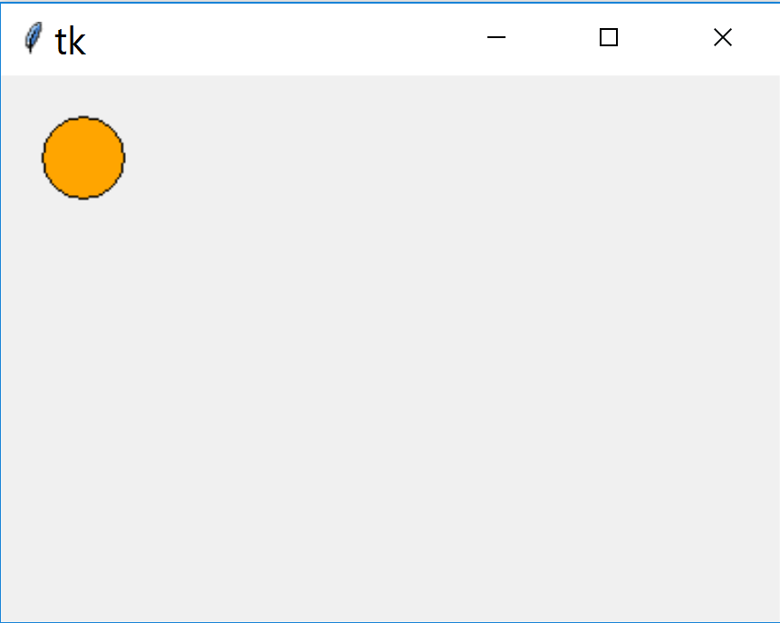
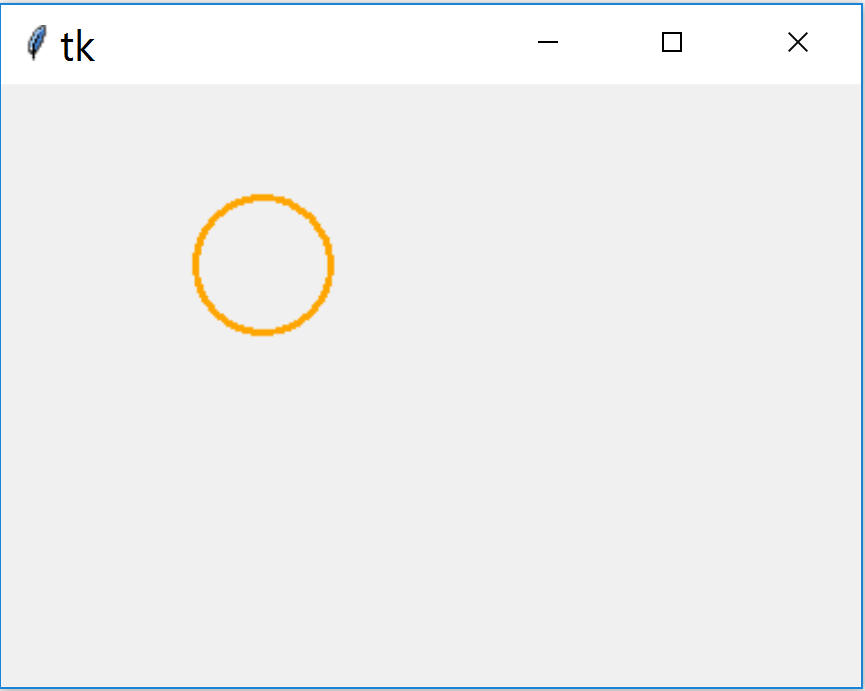
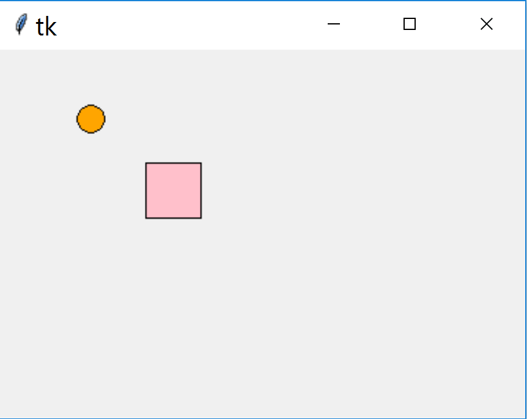
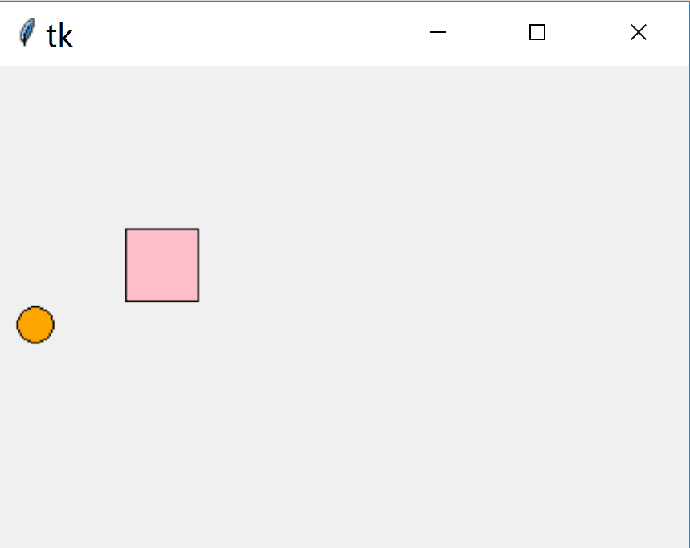
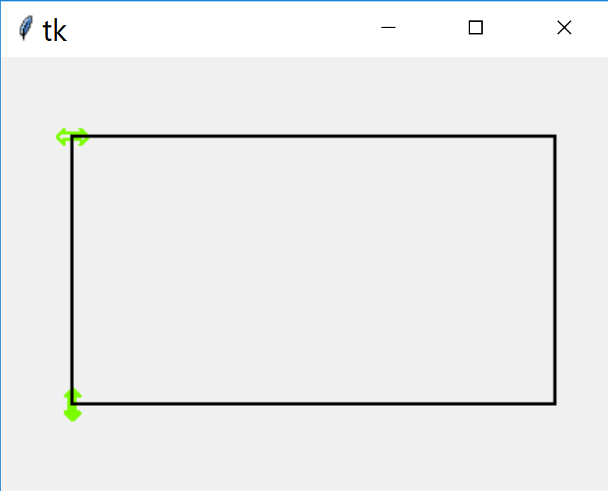
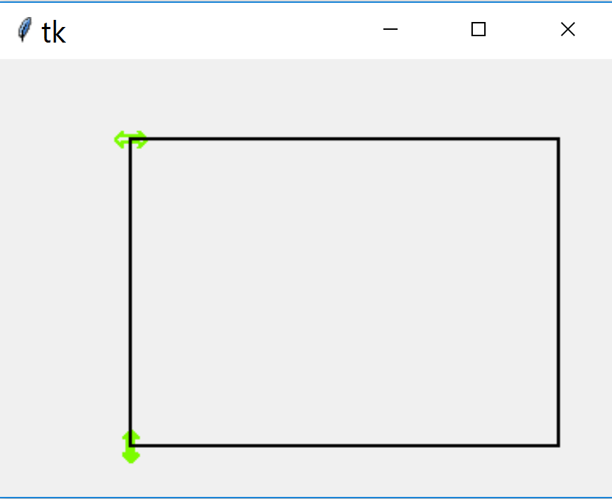

===========
Canvas Move
===========

Essentially the canvas command ``move`` moves the object by an 
amount in the required direction x and/or y after it has been identified. 
This means that the amount of
movement has to be calculated, which in effect means that the start and 
finish positions need to be known. For simple cases this is additional to
that required for ``coords`` but when used as handles on a frame then this
information is already required to adjust the frame.

You can follow the examples by knowing that the original drag scripts using
``coords`` are prefixed by a ``0`` and those prefixed by ``1`` are 
essentially the same scripts using ``move``.

Drag with Move
-----------------------

::

    from tkinter import Tk, Canvas
    
    X = 40
    Y = 40

    def callback(event):
        global X, Y
        drag(event.x-X, event.y-Y)
        X = event.x
        Y = event.y

    def drag(dx, dy):
        can.move(circle, dx, dy)

    root = Tk()
    can = Canvas(root)
    can.bind('<Motion>', callback)
    can.pack()

    circle = can.create_oval(X-20, Y-20, X+20, Y+20, fill='orange')
    root.mainloop()

The first difference to note is that ``move`` works on an existing object, so
the circle is drawn before the cursor is over the canvas. Once the event 
handler is called calculate the amount of movement required, the difference 
between where the cursor is and the object's new position. These differences 
are used in the drag function with ``move``. The object is repositioned to the
cursor. 

Drag and Drop with Move
-----------------------

Apart from changing the bind from ``'<Motion>'`` to ``'<B1-Motion>'`` there 
is no major difference between 10canvas_drag.py and 11canvas_drag_drop.py. 
There is no real need to have
separate callback and drag functions.

The object is picked up by clicking anywhere within the circle and dropped 
to a new position by releasing the mouse button.

.. container:: toggle

    .. container:: header

        *Show/Hide Code* 11canvas_drag_drop.py

    .. literalinclude:: ../examples/move/11canvas_drag_drop.py

Selecting an Object with Move
-----------------------------

When there is more than one object it needs to be selected, just as we have
seen when using ``coords``. The difference with move is that when the objects
change in size and shape no special provision is required, however each shape 
requires its own stored positional data. A comprehensive method might involve
finding the object on pressing the mouse button, use the data when dragging, 
then reset the data when releasing the mouse button.

Let's see if we can set it up to use tags instead. This avoids finding out
the object Id and the additional binds. Use ``find_closest`` to pick up the
object and its Id then find out its tag with ``gettags``, which as noted
before gives our tag and ``current``. Within ``move`` use the tag and the x 
and y amounts to move. Afterwards update the object's position.

.. container:: toggle

    .. container:: header

        *Show/Hide Code* 12canvas_drag_drop2objects.py

    .. literalinclude:: ../examples/move/12canvas_drag_drop2objects.py

It should be simple to constrain and limit the movement of each object. The
variable direction is limited in size then change the value of the x or y 
amount to 0 which prevents movement in that direction.

.. container:: toggle

    .. container:: header

        *Show/Hide Code* 13canvas_drag_drop_constrain.py

    .. literalinclude:: ../examples/move/13canvas_drag_drop_constrain.py

Tie into a Sketch with Move
---------------------------

As noted when using 2 or more objects provided we use tags we can definitely
determine which object has been selected and drive the events in our script.
When a handle is moved it does not need to be deleted and redrawn, in fact
the vertical handle does not affect the horizontal handle, but the rectangle
is changed and must be redrawn. The differences between this script and the
one for coords are minimal, apart from the change from coords to move, with 
their associated attributes, the position of the lower left corner (rectx, 
recty) is changed  before calling coords or after calling move.

.. container:: toggle

    .. container:: header

        *Show/Hide Code* 14handles_to_rectangle.py

    .. literalinclude:: ../examples/move/14handles_to_rectangle.py

Split Move Bind
---------------

As done with coords split out the find nearest part into a button pressed
bind to a click function. As we would be using global variables otherwise,
add a dataclass to pass the variables.

Once again the split seems to work better than when the find nearest is
incorporated into the drag function.

.. container:: toggle

    .. container:: header

        *Show/Hide Code* 15handles_to_rectangle_split.py

    .. literalinclude:: ../examples/move/15handles_to_rectangle_split.py