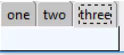
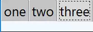

Basic 3 Tab System
==================

.. table:: Comparing Notebooks 

    ================== ==================
      Console            IDE 
    ================== ==================
      |nb_basic|         |nb_basic_ide|
    ================== ==================

The notebook is a container for other widgets and their contents. Let's form 
a notebook with 3 tabs each having a different coloured frame::

    from tkinter import Tk, Frame
    from tkinter.ttk import Notebook, Style
    
    root = Tk()
    s = Style()
    st1.theme_use('default')
    
    test_size = font.Font(family="Times", size=12, weight="bold").measure('Test')
    mult = int(test_size / 30)
    
    nb1 = Notebook(root)
    page1 = Frame(root, background = 'red', height= 20*mult)
    page2 = Frame(root, background = 'yellow', height= 20*mult)
    page3 = Frame(root, background = 'alice blue', height= 20*mult)
    nb1.grid(row=0, column=0)
    nb1.add(page1, text = 'one')
    nb1.add(page2, text = 'two')
    nb1.add(page3, text = 'three')
    root.mainloop()

Note that the notebook itself relies on normal layout management, such as
grid or pack, while each tab has an ``add`` method to include the 
tab's contents. Since the first child of each page often is a frame
the add method only affects the frame, thereafter use the normal layout 
management for that frame. Each frame has been called pageX (where X is an 
integer).

So that each page will look similar the height has been adjusted by a 
multiplier, calculated from the length of "Test" in a known font. On a normal
monitor it will be 30 pixels long, on an Ultra High Definition monitor it
will have a different value - on my monitor it shows 66 pixels, 2.2 times
that on the normal monitor.