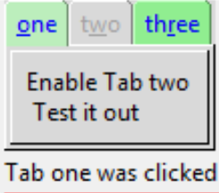

===================
Binding to Notebook
===================

    
    Binding to Tabs is enabled by a Tk Script

When binding to the notebook we normally require a tab specific bind, 
nothing obvious appears in the tkinter documentation. As with many 
programming problems I am indebted to stackoverflow "furas" in this answer
`Bind to a Tab <https://stackoverflow.com/questions/40828166/is-it-possible-to-bind-a-mouse-event-to-a-tab-of-a-notebook>`_.

Normally when binding there is a distint widget or its component available,
and there is no real problem. Alternatively a specialised bind has been 
developed, such as ``<<NotebookTabChanged>>`` which has been shown already.
However the tabs are not so readily accessible unless a Tk script is applied,
this allows the programmer to distinguish which tab has been clicked.

Bind the notebook as normal, then in the event function run the following
Tk script::

    clicked_tab = nb.tk.call(nb._w, "identify", "tab", event.x, event.y)

Using the keywords ``identify`` and ``tab`` the tab is identified and can be
tied into normal activities within the Python script. The normal event values
``x`` and ``y`` give the cursor position, and it would be difficult to 
distinguish which tab was being pressed.

.. container:: toggle

    .. container:: header

        *Show/Hide Code* 06nb_tag_bind.py

    .. literalinclude:: ../examples/notebook/06nb_tag_bind.py
        :emphasize-lines: 5, 38-47, 54-56