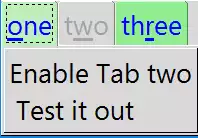

Disabling a Tab
===============

    Page1 Notebook with Page2 Disabled
    
    The tabs have been styled to make the selected tab pale green
    and the normal tab light green.

There are a couple of options such as **forget** and **hide** that remove 
the tab from view, this may be a little too drastic, even if we restore the 
hidden tab by using **add** (**forget** cannot be restored). Gentler on the
user is to disable the tab where the tab is visible but greyed out, within 
the session it is possible to enable the tab. We can add the tab's state
when creating it, later it can be changed back to **normal** using the 
**tab** method.

First of all disable the second tab, we can then enable it by pressing a
button tied to an event::

    nb1.add(page2, text = 'two', underline=1, padding=2, state='disabled')
    .....
    enabler = Button(page1, text='Enable Tab two\n Test it out', 
        command=lambda : nb.tab(1, state='normal'))
    enabler.pack()

Obviously within the logic of the script another event can be used to 
disable the tab. Notice that in the Button command the **tab** function uses
``1`` in the first position which corresponds to the 
second tab (the first tab would have been ``0``). 

Greying out a tab that is already grey is not so logical, use Style to 
change the tab colour. First of all configure ``green.TNotebook.Tab``, just 
using configure the selected tab still is a grey tab, and the normal colour 
is now light green. Map the disabled and selected states, choose a light green 
for the selected background and a grey background for the disabled state. 
When creating the Notebook use the style hook ``green.Notebook`` (without 
``.Tab``)::

    st1.configure('green.TNotebook.Tab', background='light green', foreground='blue')
    st1.map('green.TNotebook.Tab',background=[('disabled','#d9d9d9'),('selected', '#bceebc')])
    
    nb = Notebook(root, style='green.TNotebook') # <-- only Notebook, not TNotebook.Tab

.. container:: toggle

    .. container:: header

        *Show/Hide Code* 03nb_state.py

    .. literalinclude:: ../examples/notebook/03nb_state.py
        :emphasize-lines: 4, 9-14, 19, 25, 29-31