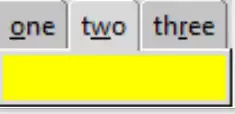

Enabling Keyboard Selection
===========================

    
    Enabling Key board Selection
    
If we wish to enable tab selection using key bindings, first 
``enable_traversal`` this allows tab traversal by <Control> <Tab> for 
forward and <Shift> <Control> <Tab> for reverse direction. 

Specific tabs can be called by altering the add clauses to show which letter
is to be underlined and made into a binding. So we can use the first
letter **o** (counted as 0) of ``o``\ ne, the second letter of t\ ``w``\ o 
which is **w** and third letter of th\ ``r``\ ee which is 
**r**. While modifiying the clause add additional space around the text::

    nb.add(page1, text = 'one', underline=0, padding=2)
    nb.add(page2, text = 'two', underline=1, padding=2)
    nb.add(page3, text = 'three', underline=2, padding=2)
    nb.enable_traversal()

See how the tab name has the relevant hot-key letter underlined, now by 
pressing <alt> <w> we activate the second tab and so on.

.. container:: toggle

    .. container:: header

        *Show/Hide Code* 02nb_bind.py

    .. literalinclude:: ../examples/notebook/02nb_bind.py
        :emphasize-lines: 15-18