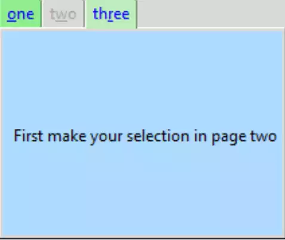
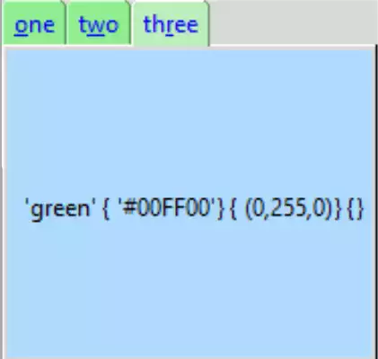

Importing Page Content
======================

    
    The Third Page Adjusted for Size

.. figure:: ../figures/nb_import.webp
    :width: 365
    :height: 300
    :alt: ttk notebook with imported treeview
    :align: center

    Page 2 showing Treeview Imported
    
    Selection made and shown on label below

Unless one is careful the size of the notebook becomes large and unwieldy -
it probably is better to divide the notebook into sections that can be 
written and tested as separate functions or classes. 

Let's use ``tree_function``
as our test case. First check the tree_function for the required variables.
In the **__main__** part of the tree function we already have an example of
how to call the tree function. There is the variable ``out_var``,a StringVar, 
insert this into notebook before calling Tree. 

Instead of the button used to read the output from the tree we can simply 
load the output into a label within the notebook. There should be no need to
change tree itself, all the changes are made to the notebook.

Start by rearranging the notebook so that there are distinct sections made in 
the notebook - first, second and third pages. After importing the 
tree_function by adding a sys.path, keep the first notebook page as 
is, add the definitions of CSV_FILE and CSV_DELIMITER together with 
``OUT_VAR`` StringVar. Call Tree and its variables from the second page, 
then add a Label to the third page to read our OUT_VAR variable::

    from tkinter import Tk, Frame, StringVar
    from tkinter.ttk import Notebook, Button, Style, Label
    import sys
    sys.path.insert(1, '../treeview/')
    from tree_function import Tree
    .........
    # second page
    .........
    CSV_FILE = '../../csv/test.csv'
    CSV_DELIMITER = ';'
    OUT_VAR = StringVar()
    OUT_VAR.set("First make your selection in page two") 
    Tree(page2,OUT_VAR,csv_file,csv_delimiter)
    ........
    # third page
    .........
    lbl = Label(page3, textvariable=OUT_VAR, text="Ready") 
    lbl.grid(column=0, row=0, sticky='nsew', ipadx=5)

    
    The Third Page after the Selection was made in Treeview

Just click on the third page after making your selection. Now change your 
selection and check the third page.

.. container:: toggle

    .. container:: header

        *Show/Hide Code* 05nb_import.py

    .. literalinclude:: ../examples/notebook/05nb_import.py
        :emphasize-lines: 5, 7-9, 54-58, 65-71