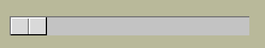

===========
Calibration
===========

Slider Length
-------------

.. figure:: ../figures/default_slider.png
    :align: center
    :width: 270
    :height: 107
    :alt: ttk default theme slider
    
    Slider from ttk Scale when default theme
    
    Slider border shows highlights and shadow as does the central line.

The ``sliderlength`` should be an even number for the default theme. 
This is because the central line is 2 pixels wide, whilst the border
width is 1 pixel wide. The measurements are taken from the left outside edge
to the outside right edge for slider length, and the centre is taken as the 
edge between the shadow and highlight, or the right edge of the dark line.

    
    Finding ttk Scale length at minimum slider position.

Before calibrating the range use this script to find the slider length. All 
we are doing is displaying a horizontal scale which will have the slider in
its minimum position, there is a bind to the release of the mouse click::

    sc.bind('<ButtonRelease-1>', start_s)

Position the slider at its minimum position, carefully 
release the left hand mouse button, which will generate some output. The 
bound function returns the position of the cursor release as ``evt.x`` and 
``evt.y`` which are relative to the Scale local position (since the bind was 
made on the
Scale sc). Given our known x, y position we can interrogate the Scale and find
out which component **'slider'** or **'trough'** we are at, if it is on the 
slider then the function will run. The function deduces the slider 
x-position , then when the ``identify`` function finds the trough the first 
while loop stops. The function then starts a new
while loop, this time increasing the x-value until the trough is once
again identified.

Look at the print output, the first part is the position moving to the 
leftmost slider border, until the trough is reached. Thereafter the 
x-position increases until the rightmost border is found and the trough  
is identified again.

The output from the second while loop will show something like::

    X 0 comp trough
    1 slider
    2 slider
    ....
    29 slider
    30 slider
    31 trough
    X 31 comp trough theme default

The default slider is 30 pixels long (inclusive count). The slider was at 
its minimum travel extent so we have trough at 0 x-value (the border width was 
1). If you try another theme, such as alt, clam and classic, an answer ought 
to be obtained. On a windows box vista and xpnative 
do not react as expected, 
whereas winnative gives an answer, also expect that ttkthemes do not
produce results, although here one can look up the images used in their 
construction and so find the slider length.

When calibrating with various themes the safest method is to save your 
answers for slider length and border width values in dictionaries, rather 
than ask through ``style.lookup()`` since if you insert a default value in 
order to protect later calculations from errors due to null values, the 
default value will invariably be wrong. 

For border width do not try::

    self.bw_val = bw_val = st.lookup(('Horizontal'
            if self.orient=='horizontal' else 'Vertical') +'.Scale.trough',
                    'borderwidth', default=1)

far better::

    theme_bw = {'alt': 0, 'clam': 1, 'classic': 2, 'default': 1,
                    'lime': 6, 'winnative': 0}
    .....
    theme_used = style.theme_use()
    if theme_used in ('alt', 'clam', 'classic', 'default', 'lime', 'winnative'):
        bw_val = theme_bw[theme_used]

and we can do something similar for the slider length. 

If you have a program 
with a good magnifier it is simple to see the border width youself. Some 
quirks may also be seen, such as the vista theme has a border with a 
vertical scale which does not show on the horizontal scale. The vista slider
at minimum travel moves into half the border, while at maximum travel it is 
adjacent to the inner trough border.

.. tip:: If the trough is not rectangular the border width is best 
    determined by checking out the theme's initialisation module that gives 
    the Scale's border dimension. 

If you can adjust the calibration to within a pixel, using measured slider 
lengths and border widths, then that is brilliant.

.. container:: toggle

    .. container:: header

        *Show/Hide Code* 10_slider_size.py

    .. literalinclude:: ../examples/scale/10_slider_size.py

Calibrate the Range
-------------------

.. figure:: ../figures/10calibrate.png
    :align: center
    :width: 556
    :height: 269
    :alt: horizontal calibration 0 - 100 range
    
    Calibrating ttk Scale at maximum slider travel on a 0 to 100 range
    
    Vertical lines instead of values have been inserted at the tickinterval.

.. sidebar:: Vertical Line

    The vertical line might not be on your keyboard, it is Unicode U+007C
    in Windows 10 it is found in Character Map, under <All Programs> /
    <Windows Accessories> / <System Tools>.

We can help the trial and error method by using a calibration script which 
uses a Scale that has a range and display value already installed. The 
calibration technique relies on creating real ticks using the vertical line 
**|** symbol instead of the actual range values. The line height is adjusted 
by changing the rely from 1 to 0.7 so that the vertical line almost meets 
the centre of the slider on the range values::

    item = ttk.Label(fr, text=rv) # text='|'

change to::

    item = ttk.Label(fr, text='|') # text=rv

also from::

    rely=1, anchor='n') # rely=0.7

to::

    rely=0.7, anchor='n') # rely=1

.. sidebar:: Calibration Tool
    
    The script has a few extras which will be explained later. When changing 
    the     Scale ranges all you need do is alter **from_val** (from) and 
    **to_val** (to). Choose suitable **tick_val** (tickinterval), **res_val** 
    (resolution) and **dig_val** (digits). 
    For instance for a range 0 to 100, from_val is 0, to_val is 100. We
    can use tick_val of 10 and the resolution of 1 or 10, then to display
    integers use a dig_val of 0. For a range of -1 to 1, use from_val -1,
    to_val 1, tick_val and res_val both 0.1 and use 2 for dig_val (2 decimal
    places).
    Slider length (**slider_val**) is the main value to be found by trial 
    and error. 

First try to calibrate the range at the ``from_`` position where only the 
trough borderwidth slider width and size of the line are involved. Use the 
slider length obtained in the previous section if possible. Then 
calibrate at the ``to`` position. The to position involves the Scale length
which is being changed to accommodate the value range sizes so make sure that
the changes are reflected in your calculations.

The script parts that should be changed are enclosed in a line of hashes.

A tkinter Scale works with the same settings as the ttk Scale so that one can
see what the Scale looks like when the adjustments are correct. The 
calibration script has a few differences to the previous examples mainly that 
the actual ``x`` values are used as opposed to relative x, which helps in
adjustments.

.. container:: toggle

    .. container:: header

        *Show/Hide Code* 10ttk_range_calibrate.py

    .. literalinclude:: ../examples/scale/10ttk_range_calibrate.py
        :emphasize-lines: 13, 20, 38-39, 45, 47-48, 50-52, 64-65, 68-69, 
                            72, 74, 76-82, 86, 89-93, 96, 98, 101
