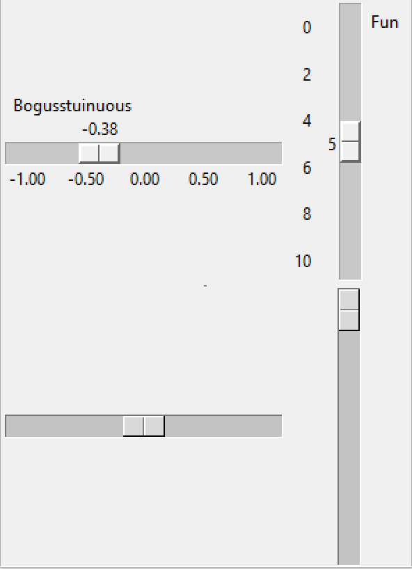

============================
Comparing ttk tkinter Scales
============================

    
    Compare the Scales
    
    Note that tkinter can show a description, slider value and range of values

First of all create scales in tkinter and ttk and compare what is available 
using standard attributes and see what is available in ttk Style. Refer to
`"Tkinter 8.5 reference a GUI for Python" <https://www.hsg-kl.de/faecher/inf/python/tkinter/tkinter.pdf>`_
table 30. Scale Widget Options for the tkinter Scale and table 57. ttk.Scale
Options and table 58, tkinter Scale options not in ttk.Scale. The last table
shows which options are not supported and may need to be thought about, see
following table **To be Coded**.

|

Table: **Attributes for tkinter and ttk Scales**

.. csv-table::
   :file: ../csv_data/comparison_scales.csv
   :header-rows: 1
   :widths: 25, 20, 10, 15, 15
   :delim: ;

.. warning:: Not all ttk Scale widgets react as expected or in the same way
    when querying or setting using Style. 

|

Table: **Methods used in tkinter and ttk Scales**

.. csv-table::
   :file: ../csv_data/methods.csv
   :header-rows: 1
   :widths: 30, 20, 15
   :delim: ;

.. container:: toggle

    .. container:: header

        *Show/Hide Code* 01ttk_tkinter.py

    .. literalinclude:: ../examples/scale/01ttk_tkinter.py
