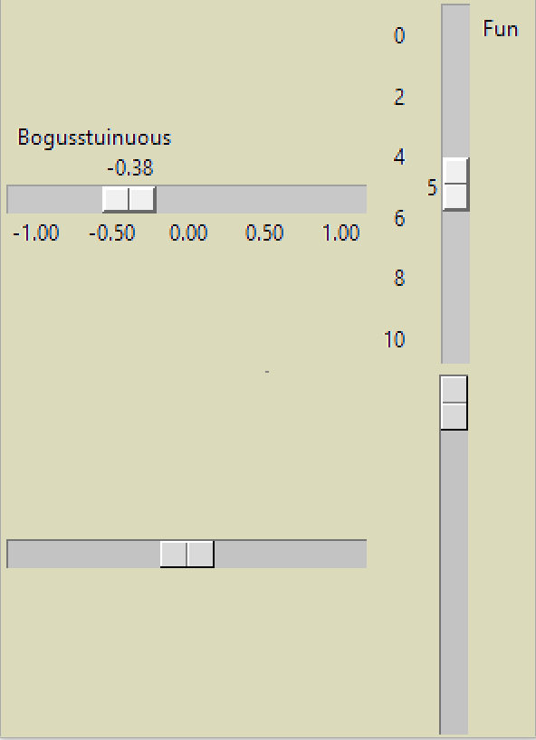

============================
Comparing ttk tkinter Scales
============================

    
    Compare the Scales
    
    Note that tkinter can show a description, slider value and range of values

First of all create scales in tkinter and ttk and compare what is available 
using standard attributes and see what is available in ttk Style. Refer to
`"Tkinter 8.5 reference a GUI for Python" <https://www.hsg-kl.de/faecher/inf/python/tkinter/tkinter.pdf>`_
table 30. Scale Widget Options for the tkinter Scale and table 57. ttk.Scale
Options and table 58. tkinter Scale options not in ttk.Scale. The last table
shows which options are not supported and may need to be thought about, see
section **Scale Options to be Coded** (the link is on the right hand side).

.. container:: toggle

    .. container:: header

        *Show/Hide Code* 01ttk_tkinter.py

    .. literalinclude:: ../examples/scale/01ttk_tkinter.py

Options for tkinter Scale
=========================

The following will show all the attribute options, categorized into those
that are supported within ttk and those not supported or their function
delegated to another widget.

Options included in ttk Scale
-----------------------------

* command
    A function to be called whenever the state of this widget changes. This 
    function will receive one argument, the new value shown on the 
    widget, as a float.

* from\_
    Use this option in combination with the tooption (described below) to 
    constrain the values to a numeric range. For example, from\_=-10 and 
    to=10 would allow only values between -10 and 20 inclusive. See also the 
    increment option below.

* length
    The length of the scale widget. This is the x dimension if the scale is 
    horizontal, or the y dimension if vertical. The default is 100 pixels. 
    For allowable values, see Section 5.1, "Dimensions".

* orient
    Set orient='horizontal' if you want the scale to run along the x 
    dimension, or orient='vertical' to run parallel to the y-axis. Default 
    is vertical.

* style
    The style to be used in rendering this radiobutton; see Section 49, 
    "Using and customizing ttk styles"

* to
    A floatvalue that defines one end of the scale's range; the other end is 
    defined by the from\_ option, discussed above. The to value can be either 
    greater than or less than the from\_ value. For vertical scales, the to
    value defines the bottom of the scale; for horizontal scales, the right 
    end. The default value is 100.

* value
    Use this option to set the initial value of the widget's variable; the 
    default is 0.0.

* variable
    Use this option to associate a control variable with the widget. 
    Typically this will be a tk.DoubleVar instance, which holds a value of 
    type float. You may instead use a tk.IntVar instance, but values stored 
    in it will be truncated as type int.

Also included in ttk
--------------------

* class
    The widget class name. This may be specified when the widget is created, 
    but cannot be changed later. For an explanation of widget classes, see 
    Section 27, "Standardizing appearance"

* cursor
    The cursor that will appear when the mouse is over the scale; see 
    Section 5.8, "Cursors"

* takefocus
    By default, a ttk.Scalewidget will be included in focus traversal; 
    see Section 53, "Focus: routing keyboard input". To remove the widget 
    from focus traversal, use takefocus=False.

Options Configured in Style
---------------------------

* borderwidth
    Width of the 3-d border around the trough and slider. Default is two 
    pixels. For acceptable values, see Section 5.1, "Dimensions"

* sliderlength
    Normally the slider is 30 pixels along the length of the scale. You can 
    change that length by setting the sliderlength style to your desired 
    length; see Section 5.1, "Dimensions"

* width
    Configure this option using the sliderthicknessoption in a style. The 
    width of the trough part of the widget. This is the x dimension for
    vertical scales and the y dimension if the scale has orient='horizontal'.
    Default is 15 pixels.

.. warning:: Only configure the sliderlength for standard themes (alt, aqua,
    clam, classic, default or vista), other themes, such as ttkthemes may
    produce unexpected results.

Scale Options to be Coded
-------------------------

The following have been selected to be of interest as the other unsupported
options are stylistic or pertain to an explanatory label.

* digits
    The way your program reads the current value shown in a scale widget is
    through a control variable.

* resolution
    Normally, the user will only be able to change the scale in whole units. 
    Set this option to some other value to change the smallest increment of 
    the scale's value. For example, if from_=-1.0 and to=1.0, and you set 
    resolution=0.5, the scale will have 5 possible values: -1.0, -0.5, 0.0, 
    +0.5, and +1.0. All smaller movements will be ignored. Use resolution
    =-1 to disable any rounding of values.

* tickinterval
    Normally, no "ticks" are displayed along the scale. By ``ticks`` we mean
    the range of values of the scale. To display the range
    set this option to a number, and numbers will be displayed on
    multiples of that value. For example, if from_=0.0, to=1.0, and 
    tickinterval=0.25, numbers will be displayed along the scale at values 
    0.0, 0.25, 0.50, 0.75, and 1.00. These numbers appear below the scale if 
    horizontal, to its left if vertical. Default is 0, which suppresses the
    display of range values. 

* showvalue
    Normally in tkinter, the current value of the scale is displayed in text 
    form by the slider (above it for horizontal scales, to the left for 
    vertical scales). Set this option to ``False`` to suppress the label.
    The displayed value can be delegated to another widget such as a label or 
    spinbox.

* sliderlength
    After calibrating the theme on the ttk Scale,

Unsupported Scale Options
-------------------------

* font
    Incorporate in a separate ``Label`` widget.

* label
    Incorporate in a separate ``Label`` widget.

* repeatdelay
    This option controls how long button 1 has to be held down in the trough
    before the slider starts moving in that direction repeatedly. Default is 
    repeatdelay=300, and the units are milliseconds.

* repeatinterval
    This option controls how often the slider jumps once button 1 has been 
    held down in the trough for at least repeatdelaymilliseconds. For example,
    repeatinterval=100 would jump the slider every 100 milliseconds.

Scale Tickinterval
==================

As stated tickinterval is a bit of a misnomer, since we are dealing with
range values and not small straight lines, ``tickinterval`` is normally 
larger than the ``resolution``.

.. sidebar:: Number of Ticks

    As the range is equally divided the number of ticks will be the answer 
    the difference between ``from_`` and ``to`` divided by the ``tickinterval`` 
    plus one. So if from_=0.0, to=1.0, and tickinterval=0.25 there are
    :math:`1.0 - 0.0 / 0.25 + 1 = 4 + 1 = 5` ticks.

When a scale is correctly set up the user should see that the centre of the 
slider corresponds to the attributes ``from_`` and ``to`` when the slider is 
pushed to the extreme ends of the trough and the displayed value shows these 
two values. The positioning of the ``ticks`` (value range) should be such 
that the centre of the lowest range value corresponds to the centre of the
slider at its minimum and the highest corresponds to the position of the 
slider centre at its maximum. 

Methods for ttk.Scale
=====================

There are methods common to all ttk widgets as well as some special methods
for ttk.Scale

Common Methods for all ttk Widgets
----------------------------------

* .cget(option)
    This method returns the value for the specified option.

* .configure(option=value, ...)
    To set one or more widget options, use keyword arguments of the form 
    option=value. For example, to set a widget's font, you might use an 
    argument such as "font=('serif', 12)".

    If you provide no arguments, the method will return a dictionary of all 
    the widget's current option values. In this dictionary, the keys will be 
    the option names, and each related value will be a tuple
    (name, dbName, dbClass, default, current)

* .identify(x, y)
    Use this to determine what element is at a given location within the 
    widget. If the point (x, y) relative to the widget is somewhere within 
    the widget, this method returns the name of the element at that position; 
    otherwise it returns an empty string.

* .instate(stateSpec, callback=None, \*args, \**kw)
    The purpose of this to determine whether the widget is in a specified 
    state or combination of states.

    If you provide a callable value as the callback argument, and the widget 
    matches the state or combination of states specified by the stateSpec
    argument, that callable will be called with positional arguments \*args 
    and keyword arguments \**kw. If the widget's state does not match
    stateSpec, the callbackwill not be called.

    If you don't provide a callback argument, the method will return True if 
    the widget's state matches stateSpec, False otherwise.

    For the structure of the stateSpec argument, see Section 46.1, 
    "Specifying widget states in ttk"

Special Methods of ttk Scale
----------------------------

* .get()
    Returns the current value shown on the widget.

* .set(newValue)
    Change the widget's current value to newValue.

Methods for tkinter Scale
-------------------------

The methods .get() and .set() also exist in tkinter. The following are
special for tkinter.

* .coords(value=None)
    Returns the coordinates, relative to the upper left corner of the widget, 
    corresponding to a given value of the scale. For value=None, you get the 
    coordinates of the center of the slider at its current position. To find 
    where the slider would be if the scale's value were set to some value x, 
    use value=x.

* .identify(x, y)
    Given a pair of coordinates (x, y)relative to the top left corner of the 
    widget, this method returns a string identifying what functional part of 
    the widget is at that location. The return value may be any of these:

'slider' The slider.
'trough1' For horizontal scales, to the left of the slider; for vertical 
scales, above the slider.
'trough2' For horizontal scales, to the right of the slider; for vertical 
scales, below the slider.
'' Position (x, y)is not on any of the above parts.

Horizontal and Vertical Scales
==============================

Allowances should be made for the value lengths, so **-1.00** will be longer 
than **1.00** in a horizontal Scale. If there is a set of negative range 
values then this set will be longer than the corresponding positive set. 
Vertical Scales will not have this problem, but the distances between lines 
and their height must be known. On the face of it the vertical Scale should 
be easier to set up.

