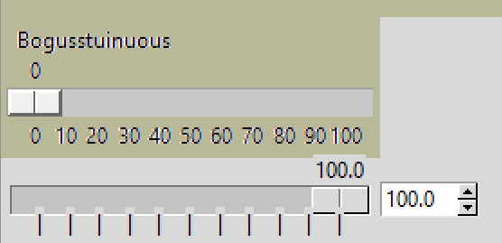
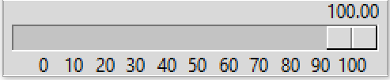

=====================
Horizontal ttk.Scales
=====================

Current Value ttk.Scales
========================

Command Option
--------------

    
    Adding Current Value
    
    Using ``command`` to show current values.

Some parts of these scripts are common to both vertical and horizontal scales.

The example 01ttk_tkinter.py can be used as a basis with which to start. The 
most obvious shortcoming is that there is no value shown for the cursor 
position. Use the method ``get()`` to obtain this value and place it in a
Label. The problem with this method is that as it stands it only gives the 
first position of the cursor. If a button is used to query the scale then
the current cursor position will be shown. Compared to the tkinter option
this method is not dynamic enough. Our problem lies with the command sequence,
so get() is doing its job, but the Scale needs to be first redrawn then the 
Label text updated. We can use the ``command`` option, then update the Label
from the relevant function.

.. container:: toggle

    .. container:: header

        *Show/Hide Code* 02ttk_tkinter_value.py

    .. literalinclude:: ../examples/scale/02ttk_tkinter_value.py
        :emphasize-lines: 4-5, 7-8, 27, 33

The simplest method of displaying the current value is to place the result in
a Label. Later on in Colour Picker a Spinbox is used, which allows the slider
to position itself according to the Spinbox entry and not just positioned by
the cursor, in this case a FloatVar or IntVar is used. It is also possible 
to position the current value just above the slider.

Bind to Mouse Button
--------------------

There may be occasions when the ``command`` option is required for other 
actions than showing the current value. In this case bind to the mouse cursor
the result is much the same as with command. The bind can be when the mouse
is pressed or preferably when the mouse is released when using the method 
``get()``. This is because get() is delayed, so when using the normal 
button pressed bind "<Button-1>" and the slider is moved
the true value is not shown until the mouse clicks on the slider for the
next move. However if the button released mode "<ButtonRelease-1>" is used
the value is accurate when the mouse button is released. This is still not as
dynamic as the tkinter option and will be addressed later.

When binding we can pick up the current x-position of the cursor, note the
x-position values at the two extremes. The vertical scale shows the current
y-position. If we have a bind then the x-position given is for the cursor 
rather than the centre of the slider.

.. container:: toggle

    .. container:: header

        *Show/Hide Code* 03ttk_tkinter_bind.py

    .. literalinclude:: ../examples/scale/03ttk_tkinter_bind.py
        :emphasize-lines: 6, 10, 29-30, 36-37
   
Placing Range Values
====================

Values of Scale Elements
------------------------

Before we can accurately place the range values we need to know the slider
position. The class name for the horizontal scale is 'Horizontal.TSlider', 
the component names are 'trough' and 'slider', and the relevant element names 
are 'borderwidth' and 'sliderlength'. For instance we can query the trough
borderwidth element directly::

    >>> Style.lookup('Horizontal.Scale.trough','borderwidth')
    ## --> 1

while::

    >>> Style.lookup('Horizontal.Scale.slider', 'sliderlength')
    ## --> ''

the last was not particularly useful.

If we specify the values using a ``Style.configure()`` method then be aware
that the changes relate to the actual pixel size even in dpi unaware IDEs. 
When confirming the option ``length`` using ``cget()`` then the length
corresponds to the length in pixels but the display size is for a dpi unaware
situation in Idle and PyScripter.

Range Values
------------

When we later use ColourPicker and YIQColourPicker there are standard ranges
0 to 100 for HSV and YIQ, 0 to 255 for RGB and 0 to 360 for HSV. As these 
ranges start from 0 and finish with 100 or more in all cases, some of the
special cases are not encountered. The range values are made of Labels that 
use the ``place()`` layout manager, which are incorporated into the Scale 
widget using a custom class. The placement is made easier as the text is 
placed centrally over each "tick", therefore provided the ticks have been
positioned correctly the range values should look properly positioned, 
irrespective of size. Class allows us to incorporate extra options not
available to a ttk.Scale. 

Some special ranges should be checked against the tkinter.Scale and the 
script adjusted as necessary. 

The slider can only travel a reduced amount compared to the trough length.
The range labels will be placed outside the scale using a relative position
so that if the size is adjusted the range will follow the scale changes. As
a starting point assume that the tickinterval includes the lowest and highest
values together with the intermediate values spaced out evenly. Use ``range``
to set the range positions::

    for i in range(from_val, to_val + 1, tick_val):
        print('tick', i)

now display the range values::

        item = ttk.Label(root, text=i)
        item.place(in_=scth, bordermode='outside',
                    relx=slider_val / len_val / 2 +
                    i / sc_range * (1 - slider_val / len_val),
                    rely=1, anchor='n')

.. topic:: Place Layout Manager

    For those not altogether familiar with the ``Place`` layout manager.
    
    .. image:: ../figures/place_manager.png
        :align: center
        :width: 299
        :height: 175
        :alt: placing 4 labels around widget
    
    Four labels are placed around a widget. The first Label has the text "N"
    above the widget and placed in the middle of the widget. The Label runs 
    inside the parent of the widget, root in our case and has the text "N":: 
    
        l0 = Label(root, text='N')
    
    We wish to place it outside the selected widget, which is called by the
    ``_in`` parameter which ties to the widget where the label is positioned, 
    we want the Label to be on the ouside so specify bordermode='outside'::

        l0.place(in_=but,  bordermode='outside', ....
    
    Now to position the Label. Using relx and rely which vary from 0 to 1 and
    relate to the relative size of the tied in widget. We want ``N``
    to be in the centre of the widget (relx 0.5) and at the furthest 
    position away from the uppermost side. Use rely as 0 and anchor the Label 
    on its lower side ('s')::
    
        l0.place(in_=but,  bordermode='outside', relx=0.5, rely=0, anchor='s')
    
    We can see that by using bordermode='outside' the width of the widget
    plus its padding is included in our rely calculation, if the Label text is 
    sitting over the widget border simply make the padding larger.
    
    .. container:: toggle

        .. container:: header

            *Show/Hide Code* 03ttk_tkinter_bind.py

        .. literalinclude:: ../examples/scale/06place_layout.py

This gives a reasonably good correlation, but may be slightly innaccurate at
the lowest values. A better estimate needs to account for the sizes of the 
cursor at the two extremes and the trough border thickness. The travel of the 
slider is from the border thickness plus half the slider length to the length
of the trough minus the border thickness minus half the slider length. This
reduced length is what is available for the range values starting from halfway
along the ``to`` text and halfway along the ``from_`` text.

The number of ticks remains the same - so no change to the ``for`` loop.
However the first tick starts at a slightly different position::

    ((slider_val - from_size) / 2 + bw_val) / len_val

similarly the last value should be modified::

    1 - (slider_val / 2 * bw_val) / len_val

provided the range is large enough to have a tickinterval equal to or larger
than one unit then this script should be good enough and the only slight
problem is the setting of the slider length value. The problem lies with
how tkinter/ttk treats this variable in a dpi unaware environment the length
it seem to use was the dpi aware value, all other pixel measurements used
dpi unaware values. When running in dpi aware mode there seem to be problems.

.. container:: toggle

    .. container:: header

        *Show/Hide Code* 05ttk_tkinter_get.py

    .. literalinclude:: ../examples/scale/05ttk_tkinter_get.py
        :emphasize-lines: 4-14, 25, 29-34, 39, 41, 43-50

If you should try a range such as -1 to 1 then expect the ``range`` in the 
``for`` loop to give an error. This can be solved by using numpy ``arange``.
The relative positions of the minimum and maximum tick values can be made 
into variables::

    rel_min = ((slider_val - from_size) / 2 + bw_val) / len_val
    rel_max = 1 - ((slider_val - to_size) / 2 - bw_val) / len_val

Create a numpy array of the data in our range::

    data = np.arange(from_val, to_val+tick_val, tick_val)

as can be seen the construction is similar to the range. To ensure the maximum
value is included we can add the tick value to ``to_val``. While the data is 
an array round the values, then convert to a tuple::

    data = np.round(data,1)
    range_vals = tuple(data)
    len_rvs = len(range_vals)

numpy ``round`` does not round to the floor but rounds to the nearest digit. 

The tick placement was changed slightly to accomodate the negative values
and small tick intervals::

    for i, rv in enumerate(range_vals):
        item = ttk.Label(root, text=rv)
        item.place(in_=scth, bordermode='outside',
                relx=(rel_min + i / (len_rvs - 1) * (rel_max - rel_min)) ,
                rely=1, anchor='n')

.. container:: toggle

    .. container:: header

        *Show/Hide Code* 06ttk_tkinter_range.py

    .. literalinclude:: ../examples/scale/06ttk_tkinter_range.py
        :emphasize-lines: 2, 4, 13-14, 21, 25-27, 41-42, 44-52, 54

Moving Current Value
====================

The tkinter Scale has the ability to display a moving Label with the current
scale value. One might think of a Canvas with a moving value, but we shall 
use an ordinary Label positioned according to the ``place`` layout manager.
Assume that we can obtain the current Scale value. The main unknown is the 
position of the display Label for any given Scale output, this should 
correspond to the centre
of the slider offset to be above the Scale. Since we already know ``rel_min``
and ``rel_max`` it should be easy to calculate.

Just as with the
range values use a relative ``x`` value. As the cursor moves so the current 
value in the display value should change - you can always see what is 
required by moving the tkinter Scale. We could link the display label through
a tkinter variable, but without special programming the display would show
a float number with umpteen decimal places. To keep the display label 
updated use the ``command`` option on the
Scale, this calls up a function that calculates the relative ``x`` and 
simultaneously sets the display labels position and actual display value. 
Every slider movement triggers the function, so a continuously moving and 
changing display results. Link the SpinBox and
Scale through a tkinter variable, then adjust the Spinbox's size to limit the
its display. 

A simple function is used to calculate the relative x position::

    def convert_to_relx(curr_val):
        return ((curr_val - from_val) * (rel_max - rel_min) / (to_val - from_val) \
            + rel_min)

The second function changes the display label::

    def display_value(value):
        rel_x = convert_to_relx(float(value))
        disp_lab.place_configure(relx=rel_x)
        disp_lab.configure(text=f'{float(value):.{dig_val}f}')

.. note:: There are several methods to format text, the latest configuration 
    for Python 3.6 and above is the preferred method. Value (Scale actual 
    value) needs to be converted to a float. The ``digits`` option, dig_val 
    is related to the number of decimal places shown. As we are replacing
    a number in the float format the variable ``dig_val`` is placed in curly
    brackets.

.. container:: toggle

    .. container:: header

        *Show/Hide Code* 07ttk_tkinter_shift_value.py

    .. literalinclude:: ../examples/scale/07ttk_tkinter_shift_value.py
        :emphasize-lines: 17, 36-38, 40-45, 47-48, 50-51, 53, 67, 70-73, 75-77

Adjusting the Length
--------------------

    
    Before the length is adjusted
    
    Using adjustable window size.

If we properly select the layout manager options then the Scale will change
its length as the window size is altered. Check what happens when the window
is expanded sideways. The displayed value seems to react reasonably, but the
range values do not adjust so well, in particular look at the highest and
lowest values, as the window expands so the placement becomes less accurate.
We need to sense that the window size is changing and redraw the range with
new length sizes. If the length is adjusted from the script then our current
calculations are good enough.

If we bind to the event ``Configure`` this seems to fit the bill.

* Configure

    The user changed the size of a widget, for example by dragging a corner 
    or side of the window.

As the slider moves only the displayed value changes, whereas when the window
is adjusted both the displayed value and the range values change in position. 
If the changes are made without a dwell time anywhere the previous values are 
overwritten and do not stay on the screen, however if there is a dwell time
between the movement and new writing then the old value remains.

    
    After the length is adjusted
    
    Using adjustable window size and binding to configure.

The Scale length is altered by the window sizing, all other values remain 
constant, so when recalculating the new Scale length must be found::

    len_val = scth['length']

or::

    len_val = scth.cget(length)

.. container:: toggle

    .. container:: header

        *Show/Hide Code* 08ttk_tkinter_update_size.py

    .. literalinclude:: ../examples/scale/08ttk_tkinter_update_size.py
        :emphasize-lines: 20-27, 29-31, 38-39, 51, 61, 66-68, 70, 73, 82, 87,
                            92, 94

Calculate the Length
--------------------

    
    Script estimates size

There is an alternative to adjusting the Scale length after it is drawn, as
above, we should be able to estimate the required length. We already have
the range values as a tuple, so we can measure the individual tick values
then allow for the empty space between ticks::

    data = np.arange(from_val, to_val+tick_val, tick_val)
    data = np.round(data,1)
    range_vals = tuple(data)
    
    vals_size = def_font.measure(str(i)) for i in range_vals]
    data_size = sum(vals_size)
    
    len_rvs = len(range_vals)
    space_size = len_rvs * def_font.measure('0')
    
    min_len = int(ceil((data_size+space_size) / 50.0)) * 50

This code needs to be positioned before the Scale length (len_val) is used 
for calculation.

.. container:: toggle

    .. container:: header

        *Show/Hide Code* 09ttk_tkinter_estimate_size.py

    .. literalinclude:: ../examples/scale/09ttk_tkinter_estimate_size.py
        :emphasize-lines: 13, 31-35, 37-42, 49, 57, 60, 79, 84-85, 94, 96, 101

Calibration
===========

    
    Calibrating ttk Scale at maximum slider travel on a 0 to 100 range
    
    Vertical lines have been inserted at ticks on range with tickinterval 
    set at 10.

.. sidebar:: Calibration Tool
    
    The script has a few extras which will be explained later. When changing 
    the     Scale ranges all you need do is alter **from_val** (from) and 
    **to_val** (to). Choose suitable **tick_val** (tickinterval), **res_val** 
    (resolution) and **dig_val** (digits). 
    For instance for a range 0 to 100, from_val is 0, to_val is 100. We
    can use tick_val of 10 and the resolution of 1 or 10, then to display
    integers use a dig_val of 0. For a range of -1 to 1, use from_val -1,
    to_val 1, tick_val and res_val both 0.1 and use 2 for dig_val (2 decimal
    places).
    The trough border width can be queried, it normally is one. Slider length 
    (**slider_val**) is the main value to be found by trial and error. 

We can help the trial and error method by using a calibration script which 
uses a Scale that has a range and display value already installed. The 
calibration technique relies on creating real ticks using the vertical line 
**|** symbol instead of the actual range values. The line height is adjusted 
by changing the rely from 1 to 0.7 so that the vertical line almost meets 
the centre of the slider::

    item = ttk.Label(fr, text=rv) # text='|'

change to::

    item = ttk.Label(fr, text='|') # text=rv

also from::

    rely=1, anchor='n') # rely=0.7

to::

    rely=0.7, anchor='n') # rely=1

.. sidebar:: Vertical Line

    The vertical line might not be on your keyboard, it is Unicode U+007C
    in Windows 10 it is found in Character Map, under <All Programs> /
    <Windows Accessories> / <System Tools>.

First try to calibrate the range at the ``from_`` position where only the 
trough borderwidth slider width and size of the line are involved. Then 
calibrate at the ``to`` position. The to position involves the Scale length
which is being changed to accommodate the value range sizes so make sure that
the changes are reflected in your calculations.

The parts that should be changed are enclosed in a line of hashes.

A tkinter Scale works with the same settings as the ttk Scale so that one can
see what the Scale looks like when the adjustments are correct. The 
calibration script has a few differences to the previous examples mainly that 
the actual ``x`` values are used as opposed to relative x.

Slider Length
-------------

    
    Slider from ttk Scale when default theme
    
    Slider border shows highlights and shadow as does the central line.

The ``sliderlength`` should be an even number for the default theme (and most
others). This is because the central line is 2 pixels wide, whilst the border
width is 1 pixel wide. The measurements are taken from the left outside edge
to the outside right edge for slider length, and the centre is taken as the 
edge between the shadow and highlight, or the right edge of the dark line.
 
Automatic Range
---------------

Two aids in the script help in automating any range changes. In the first 
where the range values, replaced by the numpy arange function, we either add 
``1`` to the ``to_val`` (to) or if the ``tick_val`` (tickinterval) is less 
than 1 then add tick_val to the to_val::

    data = np.arange(from_val, (to_val+1 if tick_val >=1 else to_val+tick_val), tick_val)

The second is more complicated, in most ranges 
both the ``from`` and ``to`` range values are shown, but in the case of 0 to 
255, as used in RGB displays, the highest value ``to`` is not always displayed, 
especially as the Scale becomes too long if tick intervals are smaller than
10 or 20. Normally the highest shown value will require an ``x`` value which 
will coincide with the slider's maximum position, when using a range such as 
0 to 255 the slider's maximum position will still be at the ``to`` value, 
but the highest range value shown will be the second to last in our range 
of values and its ``x`` position will be correspondingly less than the 
slider's maximum position.

In all cases the ``from`` value (x_min) is shown, so no change is required here,
only the x_max or the position of the last displayed tick needs to change::

    if range_vals[-1] == to_val:
        pass 
    else:
        max_rv = range_vals[-1]
        mult_x = ((max_rv-from_val)*x_max/(to_val-from_val))

In the actual range placement the relative x computation becomes an actual x
placement, which helps in calibration::

    x=(x_min + i / (len_rvs - 1) *
        ((x_max if range_vals[-1] == to_val else mult_x) - x_min)),

Resolution
----------

The resolution affects how the cursor moves if the Scale is clicked in the
trough either before or after the slider. The default value is 1 pixel, even
when the range is running from -1 to 1 with 0.1 tickintervals. However with
higher ranges the resolution can be changed. Whilst setting the resolution 
it is found that when an amount is added to the Scale that the actual value 
is overstepped by 1 pixel. Likewise when an amount is subtracted from the 
Scale's actual value it understeps by 1 pixel.

To work resolution bind the ttk Scale to the left mouse button. Ignore the 
calculations if the resolution or tickinterval is less than 1. Only work 
with mouse clicks in the trough, ignore those on the slider itself::

    scth.bind("<Button-1>", resolve)
    
    def resolve(evt):
        if res_val < 1 or tick_val < 1:
            pass
        else:
            value = scth.get()
            curr_x = convert_to_actx(value)
            if evt.x < curr_x - slider_val / 2:
                scth.set(value - res_val + 1)
            elif evt.x > curr_x + slider_val / 2:
                scth.set(value + res_val - 1)

.. container:: toggle

    .. container:: header

        *Show/Hide Code* 10ttk_range_calibrate.py

    .. literalinclude:: ../examples/scale/10ttk_range_calibrate.py
        :emphasize-lines: 13, 20, 38-39, 45, 47-48, 50-52, 64-65, 68-69, 
                        72, 74, 76-82, 86, 89-93, 96, 98, 101

Run Scale as Class
==================

    
    Horizontal ttk Scale as class
    
    Slider shown at maximum travel on a 0 to 100 range.

In order to load an external module the script needs to be either a function 
or class, class suits our needs better because we can use inheritance and 
the script can use more than one method. Base the class on the 
10ttk_range_calibrate.py calibration script. This changes the Scale length
by first estimating the range size, rather than change the window size and
adjusting the Scale length that way.

Inheritance from ttk Scale
--------------------------

All the existing options available on the ttk Scale become available, without
extra programming. Any options with their default values need to be
in the normal list that follows the __init__ statement, then repeated  
as a self variable. The super statement repeats all the ttk variables, after 
the super statement equate the remaining variables to self variables::

    class  TtkScale(Scale):
        def __init__(self, parent, length, from_=0, to=255, orient='horizontal',
                    variable=0, digits=None, tickinterval=None, sliderlength=32,
                    command=None, style=None, showvalue=True, resolution=1):

        self.from_ = from_
        self.to = to
        self.variable = variable
        self.length = length
        self.command = command
        self.parent = parent

        super().__init__(parent, length=length, from_=from_, to=to, orient=orient,
                        variable=variable, command=command, style=style)

        self.digits = digits
        self.tickinterval = tickinterval
        self.showvalue = showvalue
        self.resolution = resolution
        self.sliderlength = sliderlength

When determining the cursor position for ``resolution`` it is easier to work 
in actual ``x`` position rather than a relative position, so add a 
conversion method. Base it on convert_to_relx, just multiply rel_max and 
rel_min by the Scale length len_val.

There were no other major changes compared to the calibration script other 
than changing over to a class.

.. container:: toggle

    .. container:: header

        *Show/Hide Code* 11ttk_horiz_scale_class.py

    .. literalinclude:: ../examples/scale/11ttk_horiz_scale_class.py