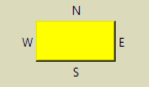

====================
Place Layout Manager
====================

For those not altogether familiar with the ``Place`` layout manager.
    

    
Four labels are placed around a widget. The first Label has the text "N"
above the widget and placed in the middle of the widget. The Label runs 
inside the parent of the widget, root in our case and has the text "N":: 
    
    lab0 = Label(root, text='N')
    
Place the Label outside the selected widget, which is called by the
``_in`` parameter which ties it to the widget where the label is positioned, 
the Label is to be on the ouside, so specify bordermode='outside'::

    lab0.place(in_=but,  bordermode='outside', ....
    
Now to position the Label. Using relx and rely which vary from 0 to 1 and
relate to the relative size of the tied in widget. We want ``N``
to be in the centre of the widget (relx 0.5) and at the furthest 
position away from the uppermost side. Use rely as 0 and anchor the Label 
on its lower side ('s')::
    
    lab0.place(in_=but,  bordermode='outside', relx=0.5, rely=0, anchor='s')
    
By using **bordermode='outside'** the width of the widget
plus its padding is included in our rely calculation, if the Label text is 
sitting on the widget border simply make the padding larger.

.. container:: toggle

    .. container:: header

        *Show/Hide Code* 06place_layout.py

    .. literalinclude:: ../examples/scale/06place_layout.py