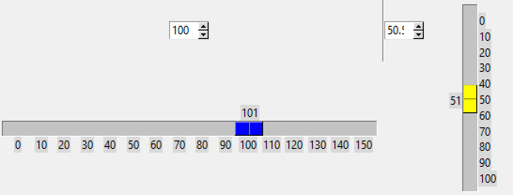

===================
Vertical ttk Scales
===================

Vertical Scaling
================

    
    Calibrating ttk vertical Scale at minimum slider travel on a 0 to 100 range
    
    Horizontal lines have been inserted at ticks on range with tickinterval 
    set at 10. The Scale needs to be adjusted as shown here.

For the most part these should be similar to horizontal Scales,except that 
the ``y`` value is used instead of the ``x`` value. There will be a 
difference when estimating the length, as the range values and displayed 
values are displayed horizontally and the range values are separated by their
height rather than their width.

Base the vertical script on the calibration script 10ttk_range_calibrate.py.
The calibrating line is an ``Em Dash`` U2014.

Be careful when positioning the range and display values, also ensure that 
the padding added to the layout manager is wide enough for the display 
values. Make sure that the minimum value is at the top
and increases to the maximum value at the bottom.

.. container:: toggle

    .. container:: header

        *Show/Hide Code* 12vert_range_calibrate.py

    .. literalinclude:: ../examples/scale/12vert_range_calibrate.py

Vertical Scale Class
====================

Once the calibration script has been run in vertical mode the conversion to
a class is straightforward. 

.. container:: toggle

    .. container:: header

        *Show/Hide Code* 13vert_scale_class.py

    .. literalinclude:: ../examples/scale/13vert_scale_class.py

General Scale Class
===================

    
    Scale class horizontal and vertical
    
    Running the general Scale class

Once we have both the horizontal and vertical Scales written as a class, it
is straightforward to write a general class that can work with both 
orientations, The name is without a preceding number so that it can be used 
as an external module in a script.

In `Roll your own <https://tkinterttkstyle.readthedocs.io/en/latest/06roll_your_own.html>`_ 
and `The Third Theme <https://tkinterttkstyle.readthedocs.io/en/latest/10lime_theme.html>`_
we can replace the Scale widget with the new widget, the Labels with the 
range values are also replaced. This highlights the problem with different
themes the ``sliderlength`` changes and this is critical when placing the
range.

.. container:: toggle

    .. container:: header

        *Show/Hide Code* gen_scale_class.py

    .. literalinclude:: ../examples/scale/gen_scale_class.py