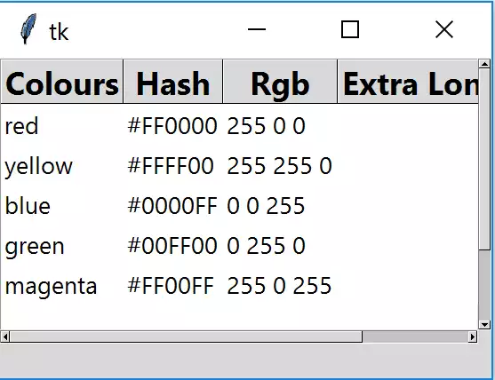

Adding Scrollbars
=================

    Treeview with Scrollbars Activated
    
    Adjust the window size to see the scrollbars activate.

Sometimes there is too much data to display in the current window, then it is
necessary to use Scrollbars. Import 
Scrollbar in ttk, insert them just after the Treeview clause. 
Configure Treeview to take the scrollbars then give equal weight to both 
rows and columns, this ensures that any changes are equally divided between
the orientations. Both the scrollbars require a **sticky** directive only for 
their orientation - we want them to become longer, not fatter.

Make sure that the scrollbars are positioned one row and one column 
after the Treeview grid, and that the label is one row lower than the 
horizontal scrollbar::

    from tkinter.ttk import Frame, Treeview, Style, Label, Scrollbar
    .........
    vsb = Scrollbar(fr0,orient="vertical", command=tree.yview)
    vsb.grid(column=1, row=0, sticky='ns')
    hsb = Scrollbar(fr0,orient="horizontal", command=tree.xview)
    hsb.grid(column=0, row=1,  sticky='ew')
    
    tree.configure(xscrollcommand=hsb.set,yscrollcommand=vsb.set)
    fr.grid_columnconfigure(0, weight=1)
    fr.grid_rowconfigure(0, weight=1)
    ......
    lbl = Label(fr0, textvariable=lvar, text="Ready") 
    lbl.grid(column=0, row=2, sticky='nsew')

Duplicate the changes for the vertical scrollbar. The horizontal scrollbar 
will probably stay greyed out and not accessible. Most examples on the 
internet will show vertical scrollbars as they operate without too much 
trouble. Horizontal scrollbars seem to be a problem. Keep the grid system
for the treeview and scrollbars, but change the frame to a pack managed 
layout, also ensure that the header is configured with ``stretch=False`` and
leave out the stretch option in the data configuration. Now when the 
window is compressed the scrollbars activate. (I know this seems to be just
hocus pocus and not completely obvious but it seems to work)::

    fr.pack(fill='both', expand=False)

.. container:: toggle

    .. container:: header

        *Show/Hide Code* 06tree_scrollbars.py

    .. literalinclude:: ../examples/treeview/06tree_scrollbars.py
        :emphasize-lines: 9, 79, 86-93, 123

To enable the horizontal scrollbars using the grid method throughout, root is
instructed to expand by adding::

    root.grid_columnconfigure(0, weight=1)
    root.grid_rowconfigure(0, weight=1)

Remember to change the LabelFrame to the grid method.