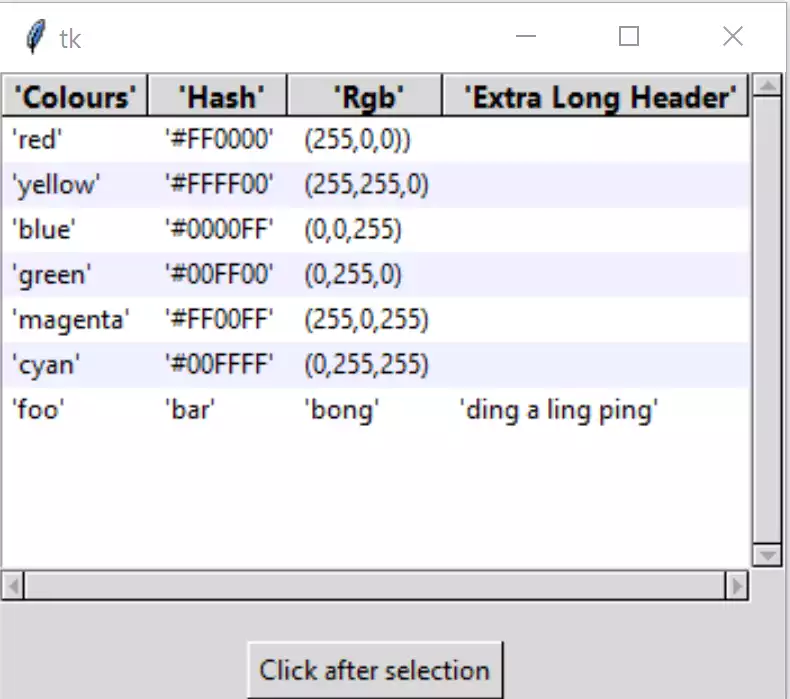

Convert to Function
===================

Often we require the treeview to be loaded by an import, rather than 
explicitly write it out as a script. As the overall script is not too 
complex it should easily be converted into a function rather than a class.

We can leave the imports as they are, while root and frame can be placed 
inside ``if __name__ == "__main__"``. As the style is referenced by treeview
it remains where it is. The csv_file and csv_delimiter variables will be moved
to ``if __name__ == "__main__"``. The frame will be renamed to ``page1`` to
reflect treeview's use in a notebook. If the treeview is being called by 
another program the calling program will be calling Tk() and driving it 
using root.mainloop(), so transfer root = Tk() and root.mainloop() to our
conditional part. If we need our fixed_map function we need to give the Style
alias to the function and when we call it. Finally we have to call our 
function::

    def Tree(fr,csv_file,csv_delimiter=','):
    .........
    if __name__ == "__main__":
        root = Tk()
        csv_file = '../csv/test.csv'
        csv_delimiter = ';'
        page1 = Frame(root)
        page1.pack(fill='both', expand=False) 
        Tree(page1,csv_file,csv_delimiter) 
        root.mainloop()

The file is named **tree_function** as it cannot start with a number if 
being imported.

.. container:: toggle

   .. container:: header

       *Show/Hide Code* tree_function.py

   .. literalinclude:: ../examples/treeview/tree_function.py
      :emphasize-lines: 37,134-143

.. note:: Almost every line has been changed due to indentation, only those
    lines that have a content change or have been transposed have been
    highlighted.

We will be using **tree_function** in the chapter on Notebook. 
