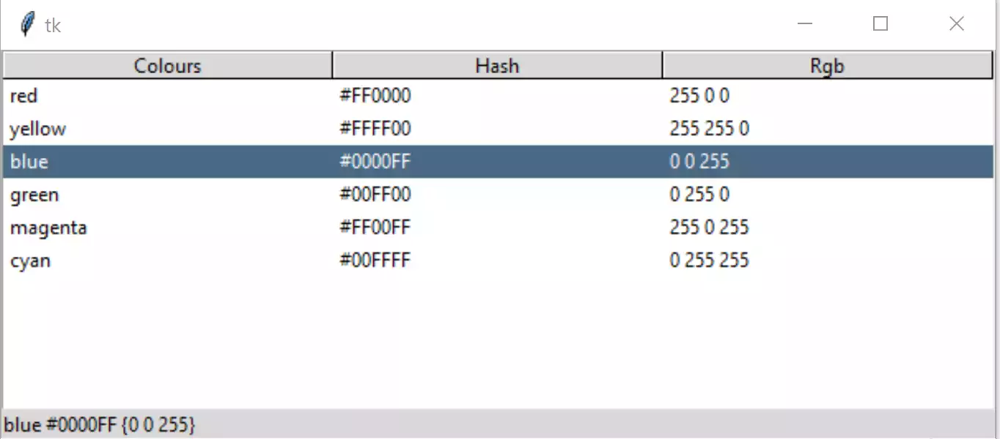

Data Selection
==============

    
    Row Selected - Result Displayed

The basic script should bring up a simple treeview, notice that a line is 
highlighted when a row in the data area is pressed. Using a standard
theme this is automatic.

Let's make this selection create an output, for that we need a function that 
is bound to an event, that in turn changes a label. Normally we bind to 
<<TreeviewSelect>>, alternatively bind to <ButtonRelease-1>.

.. topic:: Events - Responding to Stimuli

    Many widgets have built in responses to stimuli, such as the user 
    clicking a widget with the left hand mouse button. When a user stimulus
    is needed then bind this event from the widget to the required action.
    
    * Event
        Is typically a user action that the application needs to know about.
    
    * Event Handler
        The function that gets called when the required event occurs.
    
    * Binding
        The application sets up the event handler on making the event.
    
    Generic events are enclosed in single chevrons ``<...>`` such as
    ``<ButtonRelease-1>``, specialised events are enclosed in double chevrons
    ``<<...>>`` such as ``<<TreeviewSelect>>`` (not all widgets have a select
    action, but most could respond to mouse button release).
    
    A more comprehensive explanation is given in
    `"Tkinter 8.5 reference a GUI for Python" <https://www.hsg-kl.de/faecher/inf/python/tkinter/tkinter.pdf>`_

We will be importing a couple of additional items from tkinter and ttk, 
``Label`` and ``StringVar``, Label will display the selected row from the
StringVar::

    from tkinter import Tk, StringVar
    from tkinter.ttk import Frame, Treeview, Style, Label

.. topic:: Selecting an Item in Treeview

    The event handler uses only two lines to find and select the selected
    data, let's unpick this a bit. The first line uses the inbuilt widget
    function ``focus()``, this gives us the ``tagOrId`` of the item that has
    focus - in other words treeview automatically assigns a unique identifier
    to each row and we are picking up on this. The next line uses ``item``, 
    an inbuilt treeview function, we are retrieving the values from our row.
    
    If we had used an alternative method that uses ``evt`` (event variable),
    we would have needed to find the name of the item, then query this item
    to find the dictionary to show us the row values::

        sender = evt.widget
        itm = sender.selection()[0]
        rowdata = sender.item(itm)
    
    So the focus function replaces the fist two steps. You can experiment
    with the above, and find that if you print rowdata it will print the
    row dictionary, where you will find the key ``values``, along with ``text``
    and ``image``.

Create a function ``select_item`` where we pick up "values" from the dictionary,
place this function just after ``s.theme_use('default')``. This function is
our Event Handler. By selecting a row in the tree's data we have given it 
``focus``, (focus is a state) we then use cur_item as an alias for the unique 
item identifier for the selected row, the StringVar ``lvar`` is now set from 
the dictionary ``tree.item(cur_item)``::

    def select_item(evt):
        cur_item = tree.focus()
        lvar.set(tree.item(cur_item)['values'])

Bind this function to the Treeview Select event, place this just after the
Treeview definition, we are referencing select_item (no variable), the event
handler itself requires the variable ``evt`` to pass the event::

    tree.bind("<<TreeviewSelect>>", select_item)

Lastly create a label using the textvariable ``lvar``::

    lvar = StringVar()
    lbl = Label(fr0, textvariable=lvar, text="Ready") 
    lbl.grid(column=0, row=1, sticky='nsew')

Test this - you should see that only one line is selected even when making a 
multiple choice. Note that the rgb tuple displays although without commas 
separating the values.

.. sidebar:: Script Changes

    Changes to the original script are highlighted.

Check that the script looks like the following. (Click on the arrow to show/
hide the script). 

.. container:: toggle

    .. container:: header

        *Show/Hide Code* 02tree_select.py

    .. literalinclude:: ../examples/treeview/02tree_select.py
        :emphasize-lines: 5,6,12-15,33,43-46