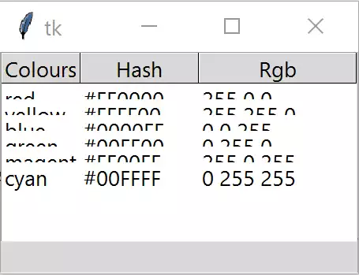
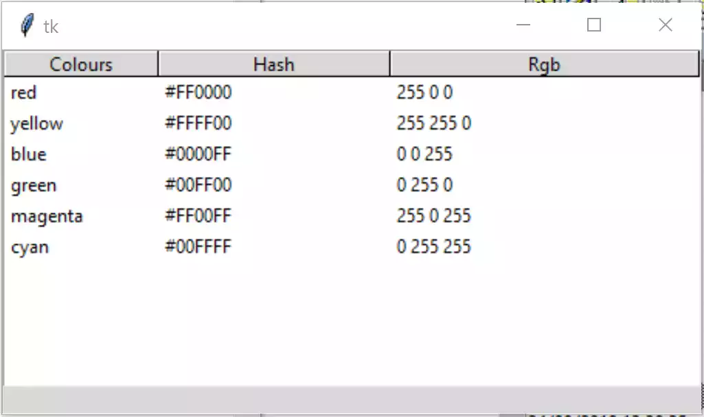
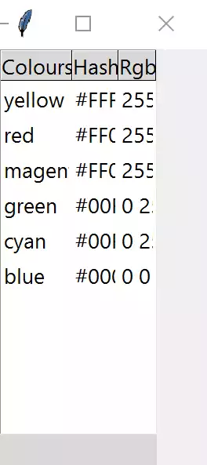
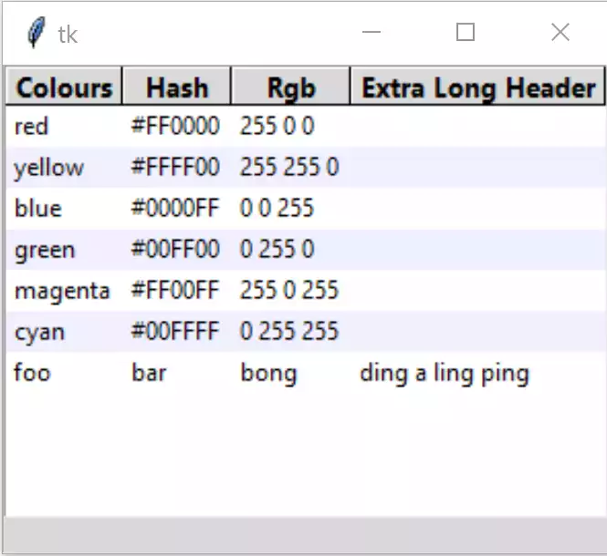


Set Header and Column Widths
============================

You will notice that the header and column sizes are not set, therefore they
display a default width of 200 for an IDE or 450 in Idle (python 3.7).
See what happens when stretch is set to 'yes', add a *tree.column* 
clause just after the tree.heading clause when creating the headings::

    tree.column(col,stretch=True)

By itself this had no discernable effect, measure the header widths and set
these manually - first change the for clause to enumerate to give a row 
variable::

    for ix,col in enumerate(tree_columns):
        tree.heading(col, text=col.title(),
            command=lambda c=col: sort_by(tree, c, 0))
        tree.column(col,width=100+ix*50,stretch=False)

Measure again and we see that the columns changed but the values were 220, 
340 and 450. Is this a display problem or are these the actual values? Add a
print statement just after tree.column(..::

    print(tree.column(col)) 

This should return::

    {'width': 100, 'minwidth': 20, 'stretch': 0, 'anchor': 'w', 'id': 'Colours'}
    {'width': 150, 'minwidth': 20, 'stretch': 0, 'anchor': 'w', 'id': 'Hash'}
    {'width': 200, 'minwidth': 20, 'stretch': 0, 'anchor': 'w', 'id': 'RGB'}

Use an IDE such as Thonny or Spyder then the result will have the 
correct widths, but the rows would be unreadable since the row heights were
too small. So Idle and running python from the console has a width problem
but the row height is better (Python 3.7 in Windows).

    Tree width on Thonny (Windows Python3.7)
    
    Width seems correct but row height is a problem

    Tree width on Idle or command line (Windows Python3.7)
    
    Width seems too large but row height is better

Since there is no property of rowheight in Treeview (``height`` is the overall 
height of the widget in rows), we are forced to use ``rowheight`` in Style.
Add the following line just after st1.theme_use('default')::

    st1.configure('Treeview', rowheight=45)

This sorts out the row problem, but looking at the magenta row we see that
width of 100 is not large enough. Staying with our IDE let's automatically
adjust the widths. Change the column line to make it remove the manual 
settings and stretch::

    tree.column(col, stretch=True)

None of the columns were larger than 200 so this did not show any adjustment.
Measure the width. Import ``font`` from tkinter and change 
the column attributes::

    from tkinter import Tk, StringVar, font
    ....
    tree.column(col, width=font.Font().measure(col.title()) + 10,stretch=True)

Both the IDE and console measured wrongly, but because Idle and the console 
incorrectly displayed much larger widths it did not look too bad. The 
measured width for the column ``Colours`` was 67 in the IDE, but Idle had 
200. 

.. note:: 10 pixels have been added to our measure to give a clearance
    between columns.

Set up the header and column styles. Add the following after the
generic Treeview style configuration, to change the style property:: 

    st1.configure('font.Treeview', font=("DejaVu Sans Mono",'10'))
    st1.configure('font.Treeview.Heading', font=("DejaVu Sans Mono",'12'))
    .....
    tree = Treeview(fr0, column=tree_columns, show='headings',style='font.Treeview')

.. note:: the font DejaVu is normally supplied in Linux but must be imported 
    into Windows or Mac.

This had no effect on the measured width. 

Thinking about this it would seem logical to use the default fonts provided
by tkinter. The column can use TkDefaultFont and the header TkHeadingFont.
The width requires a different command ``nametofont`` when taking the 
measurement with TkDefaultFont or TkHeadingFont::

    st1.configure('font.Treeview', font='TkDefaultFont')
    st1.configure('font.Treeview.Heading', font='TkHeadingFont')
    .....
    tree.column(col,width=font.nametofont('TkHeadingFont').measure(col.title()) + 10,
                stretch=False)

The appearances of the IDE and Idle displays now look similar, but notice 
that the measurements are different, the IDE had 91 for ``Colours`` while
Idle had 41. This bodes well. The IDE is accurate, so continue to work with 
this. 

    
    Tree width with TkHeadingFont on Thonny (Windows Python3.7)
    
    Heading correct but data is truncated

Now tackle the truncated data. There will be several data entries, store the 
largest value and compare. Add the following just after the data insertion::

    for indx, val in enumerate(item):
        ilen = font.nametofont('TkDefaultFont').measure(val)
        if tree.column(tree_columns[indx], width=None) < ilen + 10:
            tree.column(tree_columns[indx], width=ilen + 10)

Add an extra entry to the header data ``'Extra long header'``, and an extra 
column of data ``('foo', 'bar', 'bong', 'ding a ling ping pong')``.

.. sidebar:: Checking TkDefaultFont and TkHeadingFont

    Using the following script to determine the actual fonts used::

        from tkinter import Tk, font
        Tk()
        default_font = font.nametofont('TkDefaultFont')
        print (default_font.actual())

It was noticed that Windows 10 had used Segoe UI 9 font for both the heading 
and default fonts. In the IDE widths and height look reasonable, but 
switching to the command line the spacing between rows looks too large. 
Provided there is a valid font, TkDefaultFont will do, we can test the font
metrics for linespace, this varies according to the type of IDE. For instance
Windows TkDefaultFont Idle has a linespace of 15 and Thonny 37.::

    fact = font.Font(font="TkDefaultFont").metrics('linespace')
    st1.configure('fact.Treeview', rowheight=fact,
                  font=font.nametofont("TkDefaultFont"))

When the Treeview style is configured change the rowheight to the linespace
size and the font is changed to that required.

Replace the rowheight statement with the above test. Since we require cross 
platform compatability our column font should always be TkDefaultFont and
the heading should be TkHeadingFont. In my Windows 10 box this gives the same
font for both - since in most cases the columns will be wider than the 
headings we can chance our arm and use a user specified font for the heading.
This can be based on TkDefaultFont, using the same family as the data, 
increase the size by 1 and use a ``bold`` weight:: 

    st1.configure('font.Treeview', font='TkDefaultFont')
    # determine Heading font based on TkDefaultFont
    st1.configure('font.Treeview', font='TkDefaultFont')
    def_font = font.nametofont('TkDefaultFont')
    font_family = def_font.actual()['family']
    font_size = def_font.actual()['size'] + 1
    st1.configure('font.Treeview.Heading', font=(font_family,font_size,'bold'))
    .......
    tree.column(col,width=font.Font(family=font_family,size=font_size,weight='bold').measure(col.title()) + 10,
                stretch=False)

    
    Treeview with Adjusted Width, Height and Bold Header

There are some optional commented lines used for testing.

.. container:: toggle

    .. container:: header

        *Show/Hide Code* 05tree_widths_height.py

    .. literalinclude:: ../examples/treeview/05tree_widths_height.py
        :emphasize-lines: 7, 29-38, 64, 74, 80, 89-93, 101-107