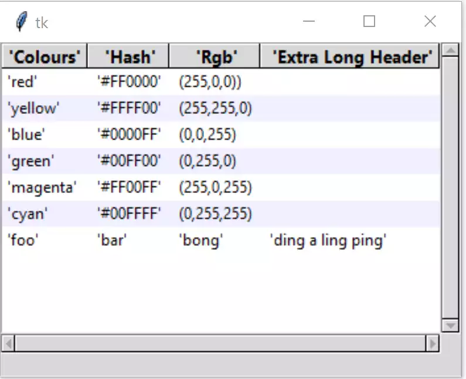

Importing CSV Files
===================

    
    The same Treeview but with imported data
    
    Notice that the strings are quoted

The next task is to make the treeview more generalised, by using csv 
files. This means that our python script is no longer tied to any one 
set of data.

Import the module csv, open and read the csv file, we need to know the
delimiter (data separator) and that the first line of the csv file is our 
header data::

    import csv
    ........
    tree_data = []
    csv_file = '../csv/test.csv'
    csv_delimiter = ';'
    ........
    with open(csv_file, newline='', encoding='utf-8-sig') as csvfile:
        treeCsv = csv.reader(csvfile, delimiter=csv_delimiter)
      
        for ix, row in enumerate(treeCsv):
            if ix == 0:
                tree_columns = row
            else:
                tree_data.append(row)

We need a couple of new variables, the name of ``csvfile`` and what delimiter
we are using, by default a comma. Insert these where we had the header and 
data list and tuple. Change tree_data to be an empty list. Construct a csv 
file, strings have to be quoted, and numbers normally have to use decimal 
points (otherwise the delimiter should be a semicolon). Since we have rgb 
values separated by commas we need semicolons as delimiters anyway.

Comment out the column names and data.

After all that you should have the following:-

.. container:: toggle

   .. container:: header

       *Show/Hide Code* 07tree_csv.py

   .. literalinclude:: ../examples/treeview/07tree_csv.py
      :emphasize-lines: 10, 76-78, 81-88

You should find that the first row of the csv file corresponds to our column
names, and the succeeding rows are the data, each row ordered as our columns.