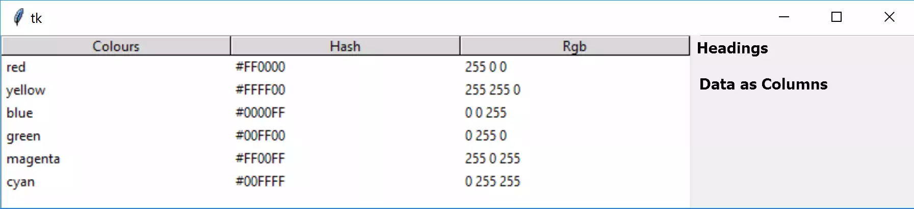

Inserting Data
==============

    
    Treeview, default theme, displayed in Idle

.. note::
    We are using treeview exclusively as a method to display column and
    row data similar to a database table and not as a heirarchical set of 
    data as in a file system.

Treeview has two display areas, the first is for column headings the second 
is for data, in other words the first row is the header, subsequent rows 
are the data. The display can be compared to a database table rather than a 
spreadsheet table.  Normally the first column (**Colours** in our example) 
has unique values (no two items are exactly the same), other columns can 
duplicate data, or be unique. If we had inserted into the first column the 
colours with capitalised first letters, then the values for **Hash** and 
**Rgb** would have been duplicated, for say **red** and **Red**, but we still
would have unique values for **Colour**.

As a starting point use the **'default'** theme, so that all operating systems 
look similar::

    from tkinter import Tk
    from tkinter.ttk import Frame, Treeview, Style
    
    root = Tk()
    s = Style()
    s.theme_use('default')

create a list to contain the heading data, which will be composed of 
colours and their properties::

    tree_columns = ['Colours', 'Hash', 'RGB']

Next create a 2D tuple containing the data, for the moment restrict 
ourselves to the primary and secondary colours::

    tree_data = (('red', '#FF0000', (255,0,0)),
               ('yellow', '#FFFF00', (255,255,0)),
               ('blue', '#0000FF', (0,0,255)),
               ('green', '#00FF00', (0,255,0)),
               ('magenta', '#FF00FF', (255,0,255)),
               ('cyan', '#00FFFF', (0,255,255)))

Now start creating the widget, notice that ``column`` is using the 
column names found in ``tree_columns`` and headings should be shown::

    fr0 = Frame(root)
    fr0.grid(column=0, row=0, sticky='nsew')
    
    tree = Treeview(fr0, column=tree_columns, show='headings')
    tree.grid(column=0, row=0, sticky='nsew')

Now load the headings and data::

    for col in tree_columns:
        tree.heading(col, text=col.title())
    
    for item in tree_data:
        itemID = tree.insert('', 'end', values=item)
   
    root.mainloop()

.. note:: RGB values

    Colours in tkinter are represented by hash values whereas rgb tuples 
    can be used in PIL. When working with tuples these are separated
    with commas rather than just spaces.

.. sidebar:: Treeview Scripts

    All Treeview scripts can be found in the examples/treeview directory. 
    Each section of treeview are listed sequentially starting with 01tree.py.

Check that the script looks like the following. (Click on the arrow to show/
hide the script)

.. container:: toggle

    .. container:: header

        *Show/Hide Code* 01tree.py

    .. literalinclude:: ../examples/treeview/01tree.py

.. warning:: 
    If the data is all squashed up vertically and cannot be read, open the
    script with Idle or PyScripter or run directly from the OS prompt. The
    problem in Windows lies with the use of Ultra High Definition monitor 
    with a change in pixel size. The problem is addressed in the chapter on 
    "Set Header and Column Widths" :ref: `Set Header and Column Widths`.