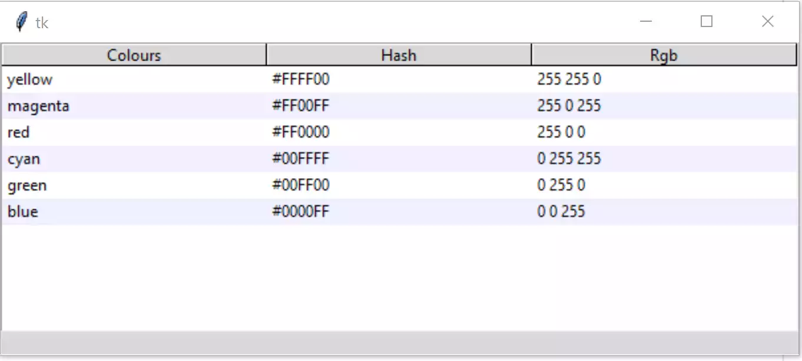

Sorting Rows by Column
======================

    
    The Column is Clicked to Sort and Reverse Sort
    
    See how the header background changes colour when clicked

Say we now wish to add the capability of sorting the rows according to which
heading has been clicked, the sort has to maintain all row data, so this is 
slightly more complicated than a normal sort. A *sort_by* function is made 
and placed just after the function *select_item*. Clicking on the header 
selects which column's data will be used for sorting::

    def sort_by(tree, col, descending):
        # When a column is clicked on sort tree contents .
        # grab values to sort
        data = [(tree.set(child, col), child) for child in tree.get_children('')]

        # reorder data
        data.sort(reverse=descending)
        for indx, item in enumerate(data):
            tree.move(item[1], '', indx)

        # switch the heading so that it will sort in the opposite direction
        tree.heading(col, command=lambda col=col: sort_by(tree, col, int(not descending)))

When inserting the headings we will need to add a command option, this 
has been extended by a lambda function so that the command can give the
necessary column information to the ``sort_by``::

    #insert headings
    for col in tree_columns:
        tree.heading(col, text=col.title(),
            command=lambda c=col: sort_by(tree, c, 0))

If you test this it will sort correctly but the zebra stripes will not be 
ordered in alternate rows. Add the following lines to the sort_by function.::

    # reconfigure tags after ordering
    list_of_items = tree.get_children('')
    for i in range(len(list_of_items)):
        tree.tag_configure(list_of_items[i], background=backg[i%2])

Click on the column headers and the zebra stripes will remain in one 
position while the columns change. 

.. container:: toggle

    .. container:: header

        *Show/Hide Code* 04tree_sort.py

    .. literalinclude:: ../examples/treeview/04tree_sort.py
        :emphasize-lines: 34-50, 75