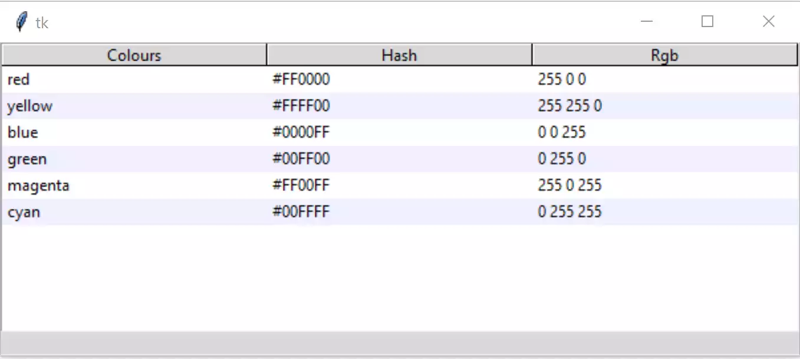

Using Tags
==========

    
    Creating Alternating Stripes

It is relatively straightforward to create alternate row colours (zebra 
stripes). The data remains as before, each row is tagged which allows us to 
change the row properties. 

Create the tags while we are inserting data, at this point we need to 
know whether we have an odd or even row. To do this change the *for* clause
to *enumerate* which gives us the row number, now add a tag with its 
identifier and configure its background according to whether it is an even 
or odd row::

    # insert data
    for ix, item in enumerate(tree_data):
        item_ID = tree.insert('', 'end', values=item)
        tree.item(item_ID, tags=item_ID)
        tree.tag_configure(item_ID, background=backg[ix%2])

Insert a list of the row background colours, just after the data block::

    backg = ["white","#f0f0ff"]

The result should be a data set with alternate coloured rows (zebra stripes). 

.. important:: Python 3.7 seems to have difficulty displaying the background 
    colours using tags. There is a workaround for this, use if the zebra 
    stripes do not show. Add the function ``fixed-map()`` and the style
    mapping on lines 24-25.

.. container:: toggle

    .. container:: header

        *Show/Hide Code* 03tree_tag_stripes.py

    .. literalinclude:: ../examples/treeview/03tree_tag_stripes.py
        :emphasize-lines: 9-19, 25-26, 43, 57, 59-60