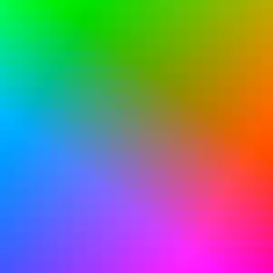
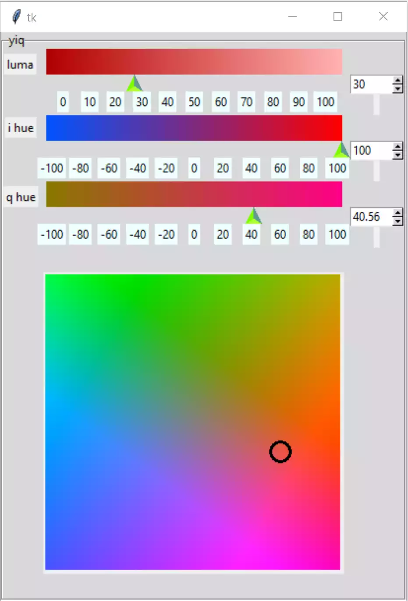

=====================
Adding a Colour Space
=====================

    
    YIQ Colour Space, Y constant 50

The hsv colour wheel was easily determined from the fact that hue at 100%
value and 100% saturation corresponded to all the primary, secondary and 
tertiary colours. In the yiq colour space the primary colours depend upon
all three components. But we do know that the hue changes only with the I 
and Q components, therefore it makes sense to use I and Q as our variables
and fix Y, somewhat arbitrarily, on 50%.

Like the colour wheel there is no real need for a scale, it will show up on 
the gradients. In Wikipedia the y axis was flipped so that the axis follows 
mathematical convention with increasing y going vertically upwards.

.. _colour-space:

.. container:: toggle

    .. container:: header

        *Show/Hide Code* 02yiq_colour_space.py

    .. literalinclude:: ../examples/yiq/02yiq_colour_space.py

Now change 01basicyiq.py into 03yiqspaceadded.py whilst importing the
image created from 02yiq_colourspace.py. Add the function for a circle,  
insert the canvas for the colour space, together with its cursor - include 
the activeoutline option. See that it all fits together.

Now start making the cursor interactive. As we are dealing with a square
colour space there is no requirement for special functions to convert x,y 
to I,Q and back again. When calling the cursor function door_bell, keep the 
Y component at the current value, rather than 50 (which was used to draw the 
space). Now add the binds for the cursor and their functions.

Change the bind functions to reflect cartesian coordinates. Ensure the
cursor stays inside the canvas, convert the x and y coordinates to the I and
Q values.

    
    Colour Space and Cursor Inserted - Showing Red

.. container:: toggle

    .. container:: header

        *Show/Hide Code* 03yiqspaceaddedlist.py

    .. literalinclude:: ../examples/yiq/03yiqspaceaddedlist.py

.. note:: Check on the Gradient Appearance

    Move the scale cursors around and look at the gradients. If they look
    too grey now is the time to change them to become yiq gradients.