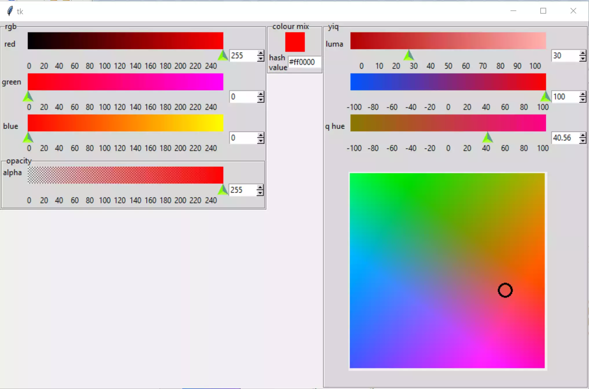

======================
Combining RGB with YIQ
======================

    
    RGB and YIQ Combined

Going along the same pathline as for hsv, now add the rgb colour
system, then tie the two parts together. So in essence add 07entryscalemod
to 03yiqspaceadded to make 04rgbandyiq, removing duplicate files and 
renaming sb_okay and its references in the YIQ part.

Check that the layout is correct, adjust the LabelFrame references and grid
layout for opacity. Now add the function overlord, copied from 12rgbandhsv
changing the references to hsv as we go. Add the function rgb_to_yiq. All
the handles require a reference to overlord. Test that all these work, now
add references in the handles for I and Q and overlord to the colour space, 
so the cursor moves when the scales are adjusted::

    X = i * 3 / 2 + 150*self.e
        Y = q * 3 / 2 + 150*self.e
        ring_radius = self.ring_radius
        for s in self.canYiq.find_withtag("ring"):
            self.canYiq.coords(
                s,
                X - ring_radius,
                Y - ring_radius,
                X + ring_radius,
                Y + ring_radius)

Whoops - forgot to change the labels to themed ones, delete the references 
to background and height.

    
    RGB and YIQ Combined 

There are one or two advantages that YIQ/YUV has over rgb and hsv, we can
optically get an accurate grey just by selecting the Y component(I and Q 
both 0), further the complementary colour is -1.0 times the I and Q 
components, and Y becomes 100-Y. For general purposes YIQ or YUV are easier 
to understand what is going on than with most other colour systems. 

.. container:: toggle

    .. container:: header

        *Show/Hide Code* 04rgbandyiqlist.py

    .. literalinclude:: ../examples/yiq/04rgbandyiqlist.py

