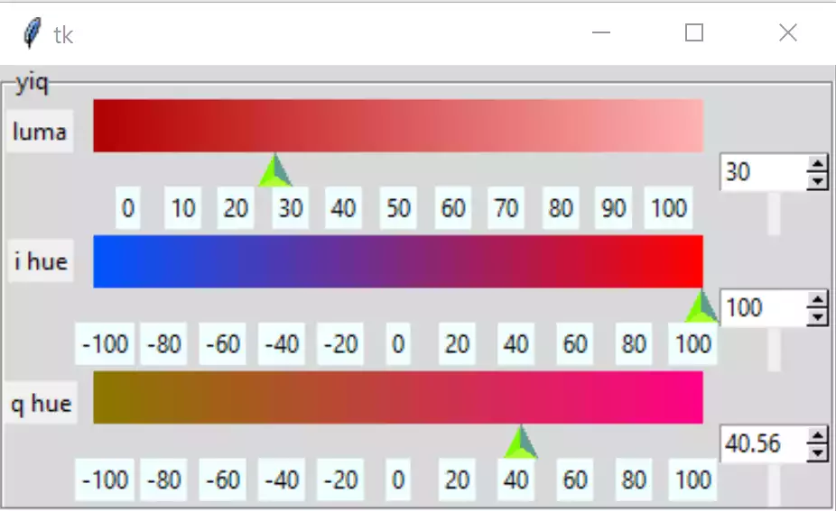
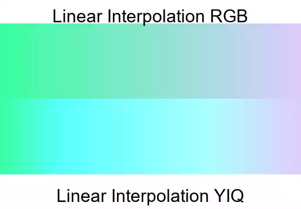
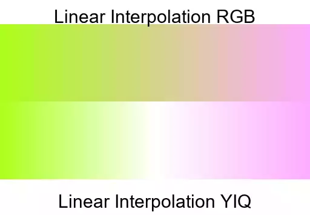
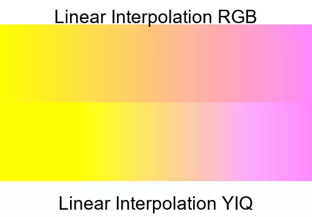

==========================
Making a YIQ Colour Picker
==========================

    
    Basic YIQ

According to Wikipedia the component Y gives the brightness or luma 
information, the I and Q components together describe the hue or chrominance. 
Y can have values 0 to 1, whereas I and Q vary between ±0.5957 and ±0.5226 
respectively. The shown colour space lies between -1 and 1, so it is 
in reality scaled up.

Using a similar system to HSV if the IQ components are laid out on a colour
space we can use a ring to show our selection. Bear in mind yiq reacts
more like rgb, in that all 3 components affect the other gradients. As y 
becomes smaller it becomes darker, but it only achieves black when the other 
two are zero.

We need a conversion between YIQ and RGB and back again. The limits for I 
and Q lie at ±0.599 and ±0.5251 respectively, colorsys uses these limits. 
Purloining colorsys' equations we have normalised/denormalised inputs and 
outputs, start by scaling the I and Q values  to ±1 (later on changed to ±100). 
We can base the YIQ basic format on the HSV basic script.

First remove the function hsv_to_rgb and insert yiq_to_rgb. The generate_gradient
function is crucial for all three gradients, it uses rgb start and finishing
colours then creates the gradient in rgb. 

.. table:: Comparing RGB to YIQ Gradients

    +---------+---------+-----------+
    | |yiq1|  | |yiq2|  | |yiq3|    |
    +---------+---------+-----------+

The rgb gradients are generally greyer across the centre, yiq gradients 
are  more colourful. First of all use the rgb interpolation, if this is not
good enough, particularly when we are using the colour space, then we can 
change to yiq interpolation.

Continuing with the changes to 08basichsv.py, change the references of hsv
to yiq within HsvSelect - now YiqSelect. We still want red to show after
initialisation, remember that our colour space goes from -1 to 1 therefore 
adjust the I and Q values. Within the handle functions integers are no 
longer needed. 

The function to validate the spinboxes requires editing, since we need to 
add lower limits, and the input is a float. Testing this caused problems 
with an empty spinbox as a DoubleVar could not accept an empty input, 
changing back to StringVar satisfied this error but required a change to all 
the read values, as they had to be converted to floats. The validation 
prevented a negative sign being the first part of the spinbox until a number 
had been formed then it could be changed to a negative number.

The spinbox carried over the increment property, but ttk scale did not have 
a resolution property, both properties do much the same job in the older 
tkinter widgets. Also the scale ticks are not showing properly, so a bit of 
spadework will be required. If we leave the scales at 0 to 1 and -1 to 1
then we need to redesign our ticks and invent a resolution function, since
the numbers are arbitrary, let's change them to 0 to 100 and -100 to 100,
while still using normalised values for calculation purposes.

Looking at build, within YIQSelect, we have a lot of similar looking widgets
these are ripe to apply a multiple list approach, which should reduce the
size appreciably. The handle functions are almost the same apart from not
making the gradient for the selected component. If we allow all the gradients
to be redrawn then we simplify the code. See what the effect when rgba is 
joined with yiq.

The approach when using a loop over lists is that widgets that are referenced 
elsewhere require their own list. Widgets, such as static labels, are built 
in the loop but not specially saved saved in a list. The themed scale could 
also be treated in this way, but spinboxes required their own list due to 
the binding. Some options remained constant others had to be changed 
according to the loop number and an attribute list. Saved widgets can then
be referenced in the program as a numbered access to that list. Say we had
a list of rgba canvases **self.rgbcans**, if we wished to update the green 
canvas we needed to refer to ``self.rgbcans[1]`` as it is the second canvas
in our list.

.. container:: toggle

    .. container:: header

        *Show/Hide Code* 01basicyiqlist.py

    .. literalinclude:: ../examples/yiq/01basicyiqlist.py
